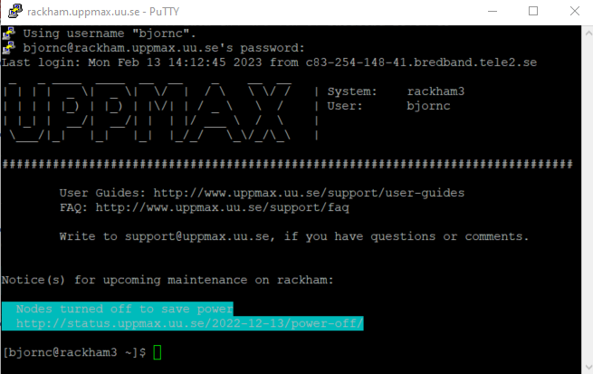
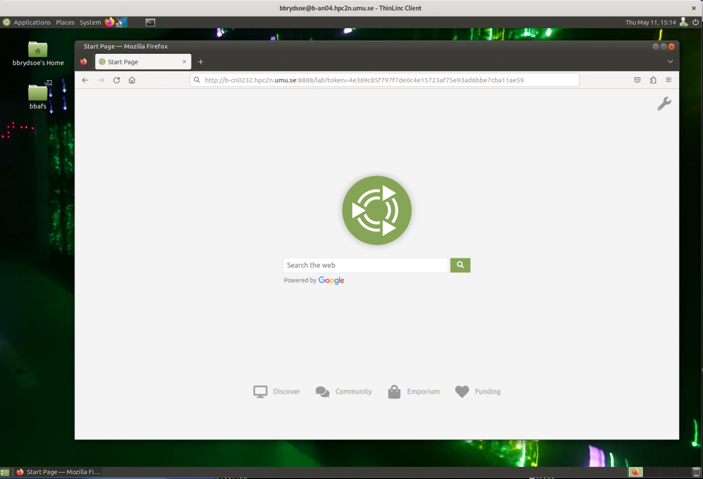

Loading IDEs
============

There are several popular IDEs that are commonly used for interactive work with Python. Here we will show how to load ``Jupyter``, ``VScode``, and ``Spyder``. 

Jupyter
-------

Jupyter is web application that (among other things) allows literature programming for Python. That is, Jupyter allows to create documents where Python code is shown and run and its results shown, surrounded by written text (e.g. English).

Additionally, Jupyter allows to share files and hence includes a file manager.

Jupyter is:

- started and run on a server, for example, an interactive node

- displayed in a web browser, such as firefox.

Jupyter can be slow when using a remote desktop website (e.g. ``rackham-gui.uppmax.uu.se`` or ``kebnekaise-tl.hpc2n.umu.se``).

- For HPC2N, as JupyterLab it is only accessible from within HPC2N’s, and there is no way to improve any slowness

- For UPPMAX, one can use a locally installed ThinLinc client to speed up Jupyter. See the UPPMAX `documentation on ThinLinc on how to install the ThinLinc client locally <https://docs.uppmax.uu.se/software/thinlinc/>`_ 

- For LUNARC, you can run Jupyter either in compute nodes through Anaconda or through the LUNARC HPC desktop. The latter is recommended. There is information about `Jupyter at LUNARC in their documentation <https://lunarc-documentation.readthedocs.io/en/latest/guides/applications/Python/#jupyter-lab>`_. 

- For NSC, you can start Thinlinc and run Jupyter on a login node, or use a browser on your local computer with SSH tunneling which could be faster. 

UPPMAX
######

UPPMAX procedure step 1: login to a remote desktop
^^^^^^^^^^^^^^^^^^^^^^^^^^^^^^^^^^^^^^^^^^^^^^^^^^

Login to a remote desktop:

- Login to the remote desktop website at ``rackham-gui.uppmax.uu.se``
- Login to your local ThinLinc client

UPPMAX procedure step 2: start an interactive session
^^^^^^^^^^^^^^^^^^^^^^^^^^^^^^^^^^^^^^^^^^^^^^^^^^^^^

Start a terminal. Within that terminal,
start an interactive session from the login node
(change to the correct NAISS project ID)

**For Rackham**

.. code-block:: sh

   $ interactive -A <naiss-project-id>  -t 4:00:00

**For Snowy**

.. code-block:: sh

   $ interactive -M snowy -A <naiss-project-id>  -t 4:00:00

UPPMAX procedure step 3: start Jupyter in the interactive session
^^^^^^^^^^^^^^^^^^^^^^^^^^^^^^^^^^^^^^^^^^^^^^^^^^^^^^^^^^^^^^^^^

Within your terminal with the interactive session,
load a modern Python module:

.. code-block:: sh

   module load python/3.11.8

Then, start ``jupyter-notebook`` (or ``jupyter-lab``):

.. code-block:: sh

   jupyter-notebook --ip 0.0.0.0 --no-browser

Leave this terminal open.

UPPMAX procedure step 4: connect to the running notebook
^^^^^^^^^^^^^^^^^^^^^^^^^^^^^^^^^^^^^^^^^^^^^^^^^^^^^^^^

The terminal will display multiple URLs.

If you use the remote desktop website:

- start ``firefox`` on the remote desktop
- browse to the first URL, which will be similar to ``file://domus/h1/[username]/.local/share/jupyter/runtimejpserver-[number]-open.html``

In both cases, you can access Jupyter from your local computer

- start ``firefox`` on your local computer
- browse to the second URL, which will be **similar** to
  ``http://r486:8888/?token=5c3aeee9fbfc75f7a11c4a64b2b5b7ec49622231388241c2``

On own computer
'''''''''''''''

- If you use ssh to connect to Rackham, you need to forward the port of the interactive node to your local computer.
    - On Linux or Mac this is done by running in another terminal. Make sure you have the ports changed if they are not at the default ``8888``.

.. code-block:: sh

   $ ssh -L 8888:r486:8888 username@rackham.uppmax.uu.se

    - If you use Windows it may be better to do this in the PowerShell instead of a WSL2 terminal.
    - If you use PuTTY - you need to change the settings in "Tunnels" accordingly (could be done for the current connection as well).

[SSH port forwarding](https://uplogix.com/docs/local-manager-user-guide/advanced-features/ssh-port-forwarding)

On your computer open the address you got but replace r486 with localhost i.e. you get something like this

``http://localhost:8888/?token=5c3aeee9fbfc75f7a11c4a64b2b5b7ec49622231388241c2``
or
``http://127.0.0.0:8888/?token=5c3aeee9fbfc75f7a11c4a64b2b5b7ec49622231388241c2``

   This should bring the jupyter interface on your computer and all calculations and files will be on Rackham.

.. warning::

   **Running Jupyter in a virtual environment**

   You could also use ``jupyter`` (``-lab`` or ``-notebook``) in a virtual environment.

   If you decide to use the --system-site-packages configuration you will get ``jupyter`` from the python modules you created your virtual environment with.
   However, you **won't find your locally installed packages** from that jupyter session. To solve this reinstall jupyter within the virtual environment by force:

   .. code-block:: console

      $ pip install -I jupyter

   and run:

   .. code-block:: console

      $ jupyter-notebook
   Be sure to start the **kernel with the virtual environment name**, like "Example", and not "Python 3 (ipykernel)".

HPC2N
#####

Since the JupyterLab will only be accessible from within HPC2N's domain, it is by far easiest to do this from inside ThinLinc, so **this is highly recommended**. You can find information about using ThinLinc at `HPC2N's documentation <https://docs.hpc2n.umu.se/tutorials/jupyter/>`_ 

1. At HPC2N, you currently need to start JupyterLab on a specific compute node. To do that you need a submit file and inside that you load the JupyterLab module and its prerequisites (and possibly other Python modules if you need them - more about that later).

To see the currently available versions, do

``module spider JupyterLab``

You then do

``module spider JupyterLab/<version>``

for a specific <version> to see which prerequisites should be loaded first.

**Example, loading ``JupyterLab/4.0.5``**

``module load GCC/12.3.0 JupyterLab/4.0.5``

2. Making the submit file

Something like the file below will work. Remember to change the project id after the course, how many cores you need, and how long you want the JupyterLab to be available:

.. code-block:: slurm

   #!/bin/bash
   #SBATCH -A hpc2n2024-142
   # This example asks for 1 core
   #SBATCH -n 1
   # Ask for a suitable amount of time. Remember, this is the time the Jupyter notebook will be available! HHH:MM:SS.
   #SBATCH --time=05:00:00

   # Clear the environment from any previously loaded modules
   module purge > /dev/null 2>&1

   # Load the module environment suitable for the job
   module load GCC/12.3.0 JupyterLab/4.0.5

   # Start JupyterLab
   jupyter lab --no-browser --ip $(hostname)

Where the flags used to the Jupyter command has the following meaning (you can use ``Jupyter --help`` and ``Jupyter lab --help``> to see extra options):

- **lab**: This launches JupyterLab computational environment for Jupyter.
- **--no-browser**: Prevent the opening of the default url in the browser.
- **--ip=<IP address>**: The IP address the JupyterLab server will listen on. Default is 'localhost'. In the above example script I use ``$(hostname)`` to get the content of the environment variable for the hostname for the node I am allocated by the job.

**Note** again that the JupyterLab is *only* accessible from within the HPC2N domain, so it is easiest to work on the ThinLinc.

3. Submit the above submit file. Here I am calling it ``MyJupyterLab.sh``

``sbatch MyJupyterLab.sh``

4. Get the URL from the SLURM output file.

Wait until the job gets resources allocated. Check the SLURM output file; when the job has resources allocated it will have a number of URLs inside at the bottom.

The SLURM output file is as default named ``slurm-<job-id>.out`` where you get the ``<job-id>`` when you submit the SLURM submit file (as in item 3. here).

**NOTE**: Grab the URL with the *hostname* since the localhost one requires you to login to the compute node and so will not work!

The file will look **similar** to this:

.. admonition:: 
   :class: dropdown

   .. code-block:: sh
      b-an03 [~]$ cat slurm-24661064.out
      [I 2024-03-09 15:35:30.595 ServerApp] Package jupyterlab took 0.0000s to import
      [I 2024-03-09 15:35:30.617 ServerApp] Package jupyter_lsp took 0.0217s to import
      [W 2024-03-09 15:35:30.617 ServerApp] A `_jupyter_server_extension_points` function was not found in jupyter_lsp. Instead, a `_jupyter_server_extension_paths` function was found and will be used for now. This function name will be deprecated in future releases of Jupyter Server.
      [I 2024-03-09 15:35:30.626 ServerApp] Package jupyter_server_terminals took 0.0087s to import
      [I 2024-03-09 15:35:30.627 ServerApp] Package notebook_shim took 0.0000s to import
      [W 2024-03-09 15:35:30.627 ServerApp] A `_jupyter_server_extension_points` function was not found in notebook_shim. Instead, a `_jupyter_server_extension_paths` function was found and will be used for now. This function name will be deprecated in future releases of Jupyter Server.
      [I 2024-03-09 15:35:30.627 ServerApp] jupyter_lsp | extension was successfully linked.
      [I 2024-03-09 15:35:30.632 ServerApp] jupyter_server_terminals | extension was successfully linked.
      [I 2024-03-09 15:35:30.637 ServerApp] jupyterlab | extension was successfully linked.
      [I 2024-03-09 15:35:30.995 ServerApp] notebook_shim | extension was successfully linked.
      [I 2024-03-09 15:35:31.020 ServerApp] notebook_shim | extension was successfully loaded.
      [I 2024-03-09 15:35:31.022 ServerApp] jupyter_lsp | extension was successfully loaded.
      [I 2024-03-09 15:35:31.023 ServerApp] jupyter_server_terminals | extension was successfully loaded.
      [I 2024-03-09 15:35:31.027 LabApp] JupyterLab extension loaded from /hpc2n/eb/software/JupyterLab/4.0.5-GCCcore-12.3.0/lib/python3.11/site-packages/jupyterlab
      [I 2024-03-09 15:35:31.027 LabApp] JupyterLab application directory is /cvmfs/ebsw.hpc2n.umu.se/amd64_ubuntu2004_skx/software/JupyterLab/4.0.5-GCCcore-12.3.0/share/jupyter/lab
      [I 2024-03-09 15:35:31.028 LabApp] Extension Manager is 'pypi'.
      [I 2024-03-09 15:35:31.029 ServerApp] jupyterlab | extension was successfully loaded.
      [I 2024-03-09 15:35:31.030 ServerApp] Serving notebooks from local directory: /pfs/stor10/users/home/b/bbrydsoe
      [I 2024-03-09 15:35:31.030 ServerApp] Jupyter Server 2.7.2 is running at:
      [I 2024-03-09 15:35:31.030 ServerApp] http://b-cn1520.hpc2n.umu.se:8888/lab?token=c45b36c6f22322c4cb1e037e046ec33da94506004aa137c1
      [I 2024-03-09 15:35:31.030 ServerApp]     http://127.0.0.1:8888/lab?token=c45b36c6f22322c4cb1e037e046ec33da94506004aa137c1
      [I 2024-03-09 15:35:31.030 ServerApp] Use Control-C to stop this server and shut down all kernels (twice to skip confirmation).
      [C 2024-03-09 15:35:31.039 ServerApp]

       To access the server, open this file in a browser:
           file:///pfs/stor10/users/home/b/bbrydsoe/.local/share/jupyter/runtime/jpserver-121683-open.html
       Or copy and paste one of these URLs:
           http://b-cn1520.hpc2n.umu.se:8888/lab?token=c45b36c6f22322c4cb1e037e046ec33da94506004aa137c1
           http://127.0.0.1:8888/lab?token=c45b36c6f22322c4cb1e037e046ec33da94506004aa137c1
      [I 2024-03-09 15:35:31.078 ServerApp] Skipped non-installed server(s): bash-language-server, dockerfile-language-server-nodejs, javascript-typescript-langserver, jedi-language-server, julia-language-server, pyright, python-language-server, python-lsp-server, r-languageserver, sql-language-server, texlab, typescript-language-server, unified-language-server, vscode-css-languageserver-bin, vscode-html-languageserver-bin, vscode-json-languageserver-bin, yaml-language-server

 
To access the server, go to

``file:///.local/share/jupyter/runtime/jpserver-<newest>-open.html``

from a browser within the ThinLinc session. <newest> is a number that you find by looking in the directory ``.local/share/jupyter/runtime/`` under your home directory.

Or, to access the server you can copy and paste the URL from the file that is SIMILAR to this:

.. code-block:: sh

   http://b-cn1520.hpc2n.umu.se:8888/lab?token=c45b36c6f22322c4cb1e037e046ec33da94506004aa137c1

**NOTE** of course, do not copy the above, but the similar looking one from the file you get from running the batch script!!!

5. Start a webbrowser within HPC2N (ThinLinc interface). Open the html or put in the URL you grabbed, including the token:

After a few moments JupyterLab starts up:

.. figure:: ../img/jupyterlab_started.png
   :width: 450
   :align: center

You shut it down from the menu with "File" > "Shut Down"

LUNARC
######

NSC
^^^

VScode
######

Spyder
######

