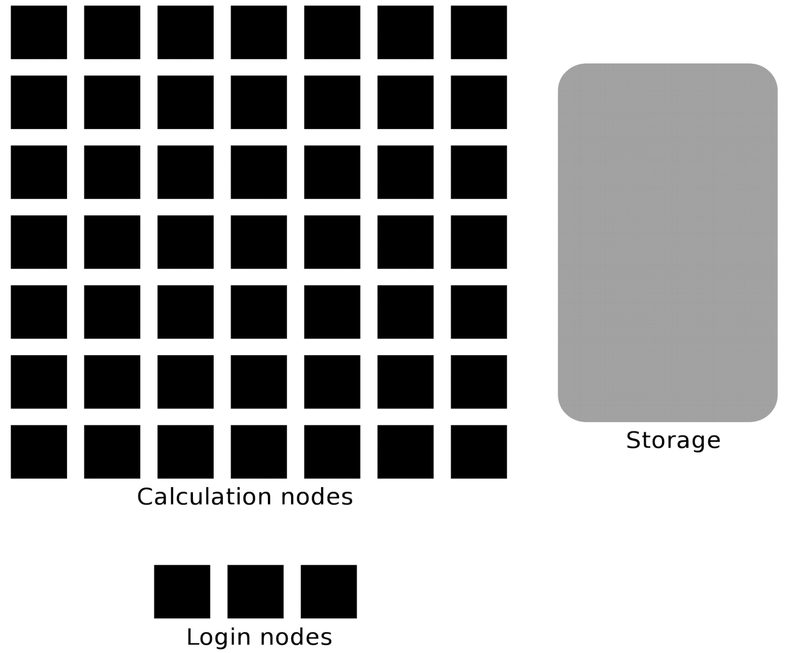

Running Python in batch mode
============================

.. questions::

   - What are the UPPMAX, HPC2N, LUNARC, and NSC clusters?
   - What is a batch job?
   - How to make a batch job?
 
.. objectives:: 

   - Short overview of the HPC systems
   - Short introduction to SLURM scheduler
   - Show structure of a batch script
   - Try example

Briefly about the cluster hardware and system at UPPMAX, HPC2N, LUNARC, and NSC
-------------------------------------------------------------------------------

**What is a cluster?**

- Login nodes and calculations/compute nodes

- A network of computers, each computer working as a **node**.
     
- Each node contains several processor cores and RAM and a local disk called scratch.

.. figure:: ../img/node.png
   :align: center

- The user logs in to **login nodes**  via Internet through ssh or Thinlinc.

  - Here the file management and lighter data analysis can be performed.

- The **calculation nodes** have to be used for intense computing. 

- Beginner's guide to clusters: https://www.hpc2n.umu.se/documentation/guides/beginner-guide

Common features
###############

- Intel CPUs
- Linux kernel
- Bash shell

.. role:: raw-html(raw)
    :format: html

.. list-table:: Hardware
   :widths: 25 25 25 25 25
   :header-rows: 1

   * - Technology
     - Kebnekaise
     - Rackham
     - Snowy
     - Bianca
     - Cosmos
     - Tetralith  
   * - Cores per calculation node
     - 28 (72 for largemem part + 8 nodes with 128)
     - 20
     - 16
     - 16
     - 48 (AMD) and 32 (Intel) 
     - 32   
   * - Memory per calculation node
     - 128-3072 GB 
     - 128-1024 GB
     - 128-4096 GB
     - 128-512 GB
     - 256-512 GB 
     - 96-384 GB  
   * - GPU
     - NVidia V100 + NVidia A100, :raw-html:` ` AMD MI100, NVidia H100, :raw-html:` ` Nvidia A600, and 10 NVidia L40S
     - None
     - Nvidia T4 
     - 2 NVIDIA A100
     - NVidia A100
     - NVidia T4 

Running your programs and scripts on UPPMAX, HPC2N, LUNARC, and NSC
--------------------------------------------------------------------

Any longer, resource-intensive, or parallel jobs must be run through a **batch script**.

The batch system used at UPPMAX, HPC2N, LUNARC, and NSC is called SLURM. 

SLURM is an Open Source job scheduler, which provides three key functions

- Keeps track of available system resources
- Enforces local system resource usage and job scheduling policies
- Manages a job queue, distributing work across resources according to policies

In order to run a batch job, you need to create and submit a SLURM submit file (also called a batch submit file, a batch script, or a job script).

Guides and documentation at: 

- HPC2N: http://www.hpc2n.umu.se/support 
- UPPMAX: http://docs.uppmax.uu.se/cluster_guides/slurm/
- LUNARC: https://lunarc-documentation.readthedocs.io/en/latest/manual/manual_intro/
- NSC: https://www.nsc.liu.se/support/batch-jobs/   

Workflow
########

- Write a batch script

  - Inside the batch script you need to load the modules you need (Python, Python packages, any prerequisites, ... )
  - Possibly activate an isolated/virtual environment to access own-installed packages
  - Ask for resources depending on if it is a parallel job or a serial job, if you need GPUs or not, etc.
  - Give the command(s) to your Python script

- Submit batch script with ``sbatch <my-python-script.sh>`` 

Common file extensions for batch scripts are ``.sh`` or ``.batch``, but they are not necessary. You can choose any name that makes sense to you. 

Useful commands to the batch system
-----------------------------------

- Submit job: ``sbatch <jobscript.sh>``
- Get list of your jobs: ``squeue -u <username>``
- Check on a specific job: ``scontrol show job <job-id>``
- Delete a specific job: ``scancel <job-id>``
- Useful info about a job: ``sacct -l -j <job-id> | less -S``
- Url to a page with info about the job (Kebnekaise only): ``job-usage <job-id>``
         
Example Python batch scripts
---------------------------- 

Serial code
###########

.. hint:: 

   Type along!

This first example shows how to run a short, serial script. The batch script (named ``run_mmmult.sh``) can be found in the directory /HPC-Python/Exercises/examples/
, where 
 is hpc2n, uppmax, lunarc, or nsc. The Python script is in /HPC-Python/Exercises/examples/programs and is named ``mmmult.py``. 

1. The batch script is run with ``sbatch run_mmmult.sh``. 
2. Try type ``squeue -u <username>`` to see if it is pending or running. 
3. When it has run, look at the output with ``nano slurm-<jobid>.out``. 

.. tabs::

   .. tab:: UPPMAX

        Short serial example script for Rackham. Loading Python 3.11.8. Numpy is preinstalled and does not need to be loaded. 

        .. code-block:: bash

            #!/bin/bash -l 
            #SBATCH -A naiss2024-22-1442 # Change to your own after the course
            #SBATCH --time=00:10:00 # Asking for 10 minutes
            #SBATCH -n 1 # Asking for 1 core
            
            # Load any modules you need, here Python 3.11.8. 
            module load python/3.11.8 
            
            # Run your Python script 
            python mmmult.py   
            

   .. tab:: HPC2N

        Short serial example for running on Kebnekaise. Loading SciPy-bundle/2023.07 and Python/3.11.3  
       
        .. code-block:: bash

            #!/bin/bash
            #SBATCH -A hpc2n2024-142 # Change to your own
            #SBATCH --time=00:10:00 # Asking for 10 minutes
            #SBATCH -n 1 # Asking for 1 core
            
            # Load any modules you need, here for Python/3.11.3 and compatible SciPy-bundle
            module load GCC/12.3.0 Python/3.11.3 SciPy-bundle/2023.07
            
            # Run your Python script 
            python mmmult.py    
            
   .. tab:: LUNARC

        Short serial example for running on Cosmos. Loading SciPy-bundle/2023.11 and Python/3.11.5  
       
        .. code-block:: bash

            #!/bin/bash
            #SBATCH -A lu2024-2-88 # Change to your own
            #SBATCH --time=00:10:00 # Asking for 10 minutes
            #SBATCH -n 1 # Asking for 1 core
            
            # Load any modules you need, here for Python/3.11.5 and compatible SciPy-bundle
            module load GCC/13.2.0 Python/3.11.5 SciPy-bundle/2023.11
            
            # Run your Python script 
            python mmmult.py    
            
   .. tab:: NSC

        Short serial example for running on Tetralith. Loading SciPy-bundle/2022.05 and Python/3.10.4 
       
        .. code-block:: bash

            #!/bin/bash
            #SBATCH -A naiss2024-22-1493 # Change to your own
            #SBATCH --time=00:10:00 # Asking for 10 minutes
            #SBATCH -n 1 # Asking for 1 core
            
            # Load any modules you need, here for Python/3.10.4 and compatible SciPy-bundle
            module load buildtool-easybuild/4.8.0-hpce082752a2 GCC/11.3.0 OpenMPI/4.1.4 Python/3.10.4 SciPy-bundle/2022.05
            
            # Run your Python script 
            python mmmult.py                
            
   .. tab:: mmmult.py 
   
        Python example code
   
        .. code-block:: python
        
            import timeit
            import numpy as np
            
            starttime = timeit.default_timer()
            
            np.random.seed(1701)
            
            A = np.random.randint(-1000, 1000, size=(8,4))
            B = np.random.randint(-1000, 1000, size =(4,4))
            
            print("This is matrix A:\n", A)
            print("The shape of matrix A is ", A.shape)
            print()
            print("This is matrix B:\n", B)
            print("The shape of matrix B is ", B.shape)
            print()
            print("Doing matrix-matrix multiplication...")
            print()
            
            C = np.matmul(A, B)
            
            print("The product of matrices A and B is:\n", C)
            print("The shape of the resulting matrix is ", C.shape)
            print()
            print("Time elapsed for generating matrices and multiplying them is ", timeit.default_timer() - starttime)

            
        
Serial code + self-installed package in virt. env.
##################################################

.. hint::

   Don't type along! We will go through an example like this with your self-installed virtual environment later. 

.. tabs::

   .. tab:: UPPMAX

        Short serial example for running on Rackham. Loading python/3.11.8 + using any Python packages you have installed yourself with venv.  

        .. code-block:: bash
        
            #!/bin/bash -l 
            #SBATCH -A naiss2024-22-1442 # Change to your own after the course
            #SBATCH --time=00:10:00 # Asking for 10 minutes
            #SBATCH -n 1 # Asking for 1 core
            
            # Load any modules you need, here for python 3.11.8 
            module load python/3.11.8
            
            # Activate your virtual environment. 
            source /proj/hpc-python-fall/<user-dir>/<path-to-virtenv>/<virtenv>/bin/activate  
            
            # Run your Python script (remember to add the path to it 
            # or change to the directory with it first)
            python <my_program.py>

   .. tab:: HPC2N

        Short serial example for running on Kebnekaise. Loading SciPy-bundle/2023.07, Python/3.11.3, matplotlib/3.7.2 + using any Python packages you have installed yourself with virtual environment.  
       
        .. code-block:: bash

            #!/bin/bash
            #SBATCH -A hpc2n2024-142 # Change to your own 
            #SBATCH --time=00:10:00 # Asking for 10 minutes
            #SBATCH -n 1 # Asking for 1 core
            
            # Load any modules you need, here for Python/3.11.3 and compatible SciPy-bundle
            module load GCC/12.3.0 Python/3.11.3 SciPy-bundle/2023.07 matplotlib/3.7.2
            
            # Activate your virtual environment. 
            source /proj/nobackup/hpc-python-fall-hpc2n/<user-dir>/<path-to-virt-env>/bin/activate
            
            # Run your Python script  (remember to add the path to it 
            # or change to the directory with it first)
            python <my_program.py>

   .. tab:: LUNARC

        Short serial example for running on Cosmos. Loading SciPy-bundle/2023.11, Python/3.11.5, matplotlib/3.8.2 + using any Python packages you have installed yourself with virtual environment.  
       
        .. code-block:: bash

            #!/bin/bash
            #SBATCH -A lu2024-2-88 # Change to your own 
            #SBATCH --time=00:10:00 # Asking for 10 minutes
            #SBATCH -n 1 # Asking for 1 core
            
            # Load any modules you need, here for Python/3.11.5 and compatible SciPy-bundle
            module load GCC/13.2.0 Python/3.11.5 SciPy-bundle/2023.11 matplotlib/3.8.2
            
            # Activate your virtual environment. 
            source <path-to-virt-env>/bin/activate
            
            # Run your Python script  (remember to add the path to it 
            # or change to the directory with it first)
            python <my_program.py>

   .. tab:: NSC

        Short serial example for running on Tetralith. Loading SciPy-bundle, Python/3.11.5, JupyterLab (containing some extra packages) + using any Python packages you have installed yourself with virtual environment.  
       
        .. code-block:: bash

            #!/bin/bash
            #SBATCH -A naiss2024-22-1493 # Change to your own 
            #SBATCH --time=00:10:00 # Asking for 10 minutes
            #SBATCH -n 1 # Asking for 1 core
            
            # Load any modules you need, here for Python/3.11.5 and compatible SciPy-bundle
            module load buildtool-easybuild/4.8.0-hpce082752a2 GCC/13.2.0 Python/3.11.5 SciPy-bundle/2023.11 JupyterLab/4.2.0
            
            # Activate your virtual environment. matplotlib is not available for this Python version on Tetralith, so that would for instance need to be installed in a virtual environment
            source /proj/hpc-python-fall-nsc/<user-dir>/<path-to-virt-env>/bin/activate
            
            # Run your Python script  (remember to add the path to it 
            # or change to the directory with it first)
            python <my_program.py>

            

Job arrays
##########

This is a very simple example of how to run a Python script with a job array. 

.. hint::

   Do not type along! You can try it later during exercise time if you want! 
   
.. tabs:: 

   .. tab:: hello-world-array.py   
      
      .. code-block:: python 

         # import sys library (we need this for the command line args)
         import sys

         # print task number
         print('Hello world! from task number: ', sys.argv[1])

   .. tab:: UPPMAX

      .. code-block:: bash 

         #!/bin/bash -l
         # This is a very simple example of how to run a Python script with a job array
         #SBATCH -A naiss2024-22-1442 # Change to your own after the course
         #SBATCH --time=00:05:00 # Asking for 5 minutes
         #SBATCH --array=1-10   # how many tasks in the array 
         #SBATCH -c 1 # Asking for 1 core    # one core per task 
         #SBATCH -o hello-world-%j-%a.out

         # Set a path where the example programs are installed. 
         # Change the below to your own path to where you placed the example programs
         MYPATH=/proj/hpc-python-fall/<userdir>/HPC-python/Exercises/examples/programs/

         # Load any modules you need, here for Python 3.11.8
         ml uppmax
         ml python/3.11.8

         # Run your Python script
         srun python $MYPATH/hello-world-array.py $SLURM_ARRAY_TASK_ID

   .. tab:: HPC2N 

      .. code-block:: bash 

         #!/bin/bash
         # This is a very simple example of how to run a Python script with a job array
         #SBATCH -A hpc2n2024-142 # Change to your own!
         #SBATCH --time=00:05:00 # Asking for 5 minutes
         #SBATCH --array=1-10   # how many tasks in the array 
         #SBATCH -c 1 # Asking for 1 core    # one core per task 
         #SBATCH -o hello-world-%j-%a.out

         # Set a path where the example programs are installed. 
         # Change the below to your own path to where you placed the example programs
         MYPATH=/proj/nobackup/hpc-python-fall-hpc2n/<your-dir>/HPC-python/Exercises/examples/programs/

         # Load any modules you need, here for Python 3.11.3 
         ml GCC/12.3.0 Python/3.11.3

         # Run your Python script
         srun python $MYPATH/hello-world-array.py $SLURM_ARRAY_TASK_ID

   .. tab:: LUNARC

      .. code-block:: bash 

         #!/bin/bash
         # This is a very simple example of how to run a Python script with a job array
         #SBATCH -A lu2024-2-88 # Change to your own!
         #SBATCH --time=00:05:00 # Asking for 5 minutes
         #SBATCH --array=1-10   # how many tasks in the array 
         #SBATCH -c 1 # Asking for 1 core    # one core per task 
         #SBATCH -o hello-world-%j-%a.out

         # Set a path where the example programs are installed. 
         # Change the below to your own path to where you placed the example programs
         MYPATH=<path-to-your-files>/HPC-python/Exercises/examples/programs/

         # Load any modules you need, here for Python 3.11.5
         ml GCC/13.2.0 Python/3.11.5

         # Run your Python script
         srun python $MYPATH/hello-world-array.py $SLURM_ARRAY_TASK_ID

   .. tab:: NSC

      .. code-block:: bash

         #!/bin/bash
         # This is a very simple example of how to run a Python script with a job array
         #SBATCH -A naiss2024-22-1493 # Change to your own!
         #SBATCH --time=00:05:00 # Asking for 5 minutes
         #SBATCH --array=1-10   # how many tasks in the array
         #SBATCH -c 1 # Asking for 1 core    # one core per task
         #SBATCH -o hello-world-%j-%a.out

         # Set a path where the example programs are installed.
         # Change the below to your own path to where you placed the example programs
         MYPATH=/proj/nobackup/hpc-python-fall-nsc/<your-dir>/HPC-python/Exercises/examples/programs/

         # Load any modules you need, here for Python 3.11.5
         ml buildtool-easybuild/4.8.0-hpce082752a2 GCC/13.2.0 Python/3.11.5 SciPy-bundle/2023.11 JupyterLab/4.2.0

         # Run your Python script
         srun python $MYPATH/hello-world-array.py $SLURM_ARRAY_TASK_ID

MPI code
########

We will talk more about parallel code in the session "Parallel computing with Python" tomorrow. This is a simple example of a batch script to run an MPI code. 

.. code-block::

   #!/bin/bash
   # The name of the account you are running in, mandatory.
   #SBATCH -A NAISSXXXX-YY-ZZZ
   # Request resources - here for eight MPI tasks
   #SBATCH -n 8
   # Request runtime for the job (HHH:MM:SS) where 168 hours is the maximum. Here asking for 15 min. 
   #SBATCH --time=00:15:00 

   # Clear the environment from any previously loaded modules
   module purge > /dev/null 2>&1

   # Load the module environment suitable for the job, it could be more or
   # less, depending on other package needs. This is for a simple job needing 
   # mpi4py. Remove # from the relevant center line 
   # Rackham: here mpi4py are not installed and you need a virtual env.
   # module load python/3.11.8 python_ML_packages/3.11.8-cpu openmpi/4.1.5
   # python -m venv mympi4py
   # source mympi4py/bin/activate
   # pip install mpi4py
   # Kebnekaise
   # ml GCC/12.3.0 Python/3.11.3 SciPy-bundle/2023.07 OpenMPI/4.1.5 mpi4py/3.1.4 
   # Cosmos
   # ml GCC/13.2.0 Python/3.11.5 SciPy-bundle/2023.11 OpenMPI/4.1.6 mpi4py/3.1.5 
   # Tetralith
   # ml buildtool-easybuild/4.8.0-hpce082752a2 GCC/11.3.0 OpenMPI/4.1.4 Python/3.10.4 SciPy-bundle/2022.05 

   # And finally run the job - use srun for MPI jobs, but not for serial jobs 
   srun ./my_mpi_program

         
GPU code
######## 

We will talk more about Python on GPUs in the section "Using GPUs with Python". 

.. hint:: 

   Type along! 

.. tabs::

   .. tab:: UPPMAX

        Short GPU example for running ``compute.py`` on Snowy.         
       
        .. code-block:: bash

            #!/bin/bash -l
            #SBATCH -A naiss2024-22-1442
            #SBATCH -t 00:10:00
            #SBATCH --exclusive
            #SBATCH -n 1
            #SBATCH -M snowy
            #SBATCH --gres=gpu=1
            
            # Load any modules you need, here loading python 3.11.8 and the ML packages 
            module load uppmax
            module load python/3.11.8
            module load python_ML_packages/3.11.8-gpu 
            
            # Run your code
            python compute.py 
            

   .. tab:: HPC2N

        Example with running ``compute.py`` on Kebnekaise.        
       
        .. code-block:: bash

            #!/bin/bash
            #SBATCH -A hpc2n2024-142 # Change to your own
            #SBATCH --time=00:10:00  # Asking for 10 minutes
            # Asking for one V100 card
            #SBATCH --gpus=1
            #SBATCH -C v100
            
            # Remove any loaded modules and load the ones we need
            module purge  > /dev/null 2>&1
            module load GCC/12.3.0 OpenMPI/4.1.5 Python/3.11.3 SciPy-bundle/2023.07 numba/0.58.1    
            
            # Run your Python script
            python compute.py
           
   .. tab:: LUNARC

        Example with running ``compute.py`` on Kebnekaise.        
       
        .. code-block:: bash

            #!/bin/bash
            #SBATCH -A lu2024-2-88 # Change to your own
            #SBATCH --time=00:10:00  # Asking for 10 minutes
            # Asking for one GPU
            #SBATCH -p gpua100 
            #SBATCH --gres=gpu:1
            
            # Remove any loaded modules and load the ones we need
            module purge  > /dev/null 2>&1
            module load GCC/12.3.0  Python/3.11.3 OpenMPI/4.1.5 SciPy-bundle/2023.07 numba/0.58.1    
            
            # Run your Python script
            python compute.py
           
   .. tab:: NSC

        Example with running ``compute.py`` on Kebnekaise. Note that you need the virtual environment from the previous section, "Install packages", in order to use numba on NSC     
       
        .. code-block:: bash

            #!/bin/bash
            #SBATCH -A naiss2024-22-1493 # Change to your own
            #SBATCH --time=00:10:00  # Asking for 10 minutes
            #SBATCH -n 1
            #SBATCH -c 32
            # Asking for one GPU 
            #SBATCH --gpus-per-task=1
            
            # Remove any loaded modules and load the ones we need
            module purge  > /dev/null 2>&1
            module load buildtool-easybuild/4.8.0-hpce082752a2 GCC/13.2.0 Python/3.11.5 SciPy-bundle/2023.11 JupyterLab/4.2.0
            
            # Load a virtual environment where numba is installed
            # Use the one you created previously under "Install packages" 
            # or you can create it with the following steps: 
            # ml buildtool-easybuild/4.8.0-hpce082752a2 GCC/13.2.0 Python/3.11.5 SciPy-bundle/2023.11 JupyterLab/4.2.0
            # python -m venv mynumba
            # source mynumba/bin/activate
            # pip install numba
            #
            source <path-to>/mynumba 

            # Run your Python script
            python compute.py

   .. tab:: compute.py

        This Python script can (just like the batch scripts for UPPMAX and HPC2N), be found in the ``/HPC-Python/Exercises/examples`` directory, under the subdirectory ``programs`` - if you have cloned the repo or copied the tarball with the exercises.

        .. code-block:: python 

           from numba import jit, cuda
           import numpy as np
           # to measure exec time
           from timeit import default_timer as timer

           # normal function to run on cpu
           def func a):
               for i in range(10000000):
                   a[i]+= 1

           # function optimized to run on gpu
           @jit(target_backend='cuda')
           def func2(a):
               for i in range(10000000):
                   a[i]+= 1
           if __name__=="__main__":
               n = 10000000
               a = np.ones(n, dtype = np.float64)

               start = timer()
               func(a)
               print("without GPU:", timer()-start)

               start = timer()
               func2(a)
               print("with GPU:", timer()-start)

Exercises
---------

.. challenge:: Run the first serial example script (the one that was used to run mmmult.py) from further up on the page for this short Python code (sum-2args.py) instead 
    
    .. code-block:: python
    
        import sys
            
        x = int(sys.argv[1])
        y = int(sys.argv[2])
            
        sum = x + y
            
        print("The sum of the two numbers is: {0}".format(sum))
        
    Remember to give the two arguments to the program in the batch script.

.. solution:: Solution for HPC2N
    :class: dropdown
    
          This batch script is for Kebnekaise. Adding the numbers 2 and 3. 
          
          .. code-block:: bash
 
            #!/bin/bash
            #SBATCH -A hpc2n2024-142 # Change to your own
            #SBATCH --time=00:05:00 # Asking for 5 minutes
            #SBATCH -n 1 # Asking for 1 core
            
            # Load any modules you need, here for Python 3.11.3
            module load GCC/12.3.0  Python/3.11.3
            
            # Run your Python script 
            python sum-2args.py 2 3 

.. solution:: Solution for UPPMAX
    :class: dropdown
    
          This batch script is for UPPMAX. Adding the numbers 2 and 3. 
          
          .. code-block:: bash
 
            #!/bin/bash -l
            #SBATCH -A naiss2024-22-1442 # Change to your own after the course
            #SBATCH --time=00:05:00 # Asking for 5 minutes
            #SBATCH -n 1 # Asking for 1 core
            
            # Load any modules you need, here for python 3.11.8
            module load python/3.11.8
            
            # Run your Python script 
            python sum-2args.py 2 3 

.. solution:: Solution for LUNARC
    :class: dropdown
    
          This batch script is for Cosmos. Adding the numbers 2 and 3. 
          
          .. code-block:: bash
 
            #!/bin/bash
            #SBATCH -A lu2024-2-88 # Change to your own
            #SBATCH --time=00:05:00 # Asking for 5 minutes
            #SBATCH -n 1 # Asking for 1 core
            
            # Load any modules you need, here for Python 3.11.5
            module load GCC/13.2.0  Python/3.11.5
            
            # Run your Python script 
            python sum-2args.py 2 3 

.. solution:: Solution for NSC
    :class: dropdown

          This batch script is for Tetralith. Adding the numbers 2 and 3.

          .. code-block:: bash

            #!/bin/bash
            #SBATCH -A naiss2024-22-1493 # Change to your own
            #SBATCH --time=00:05:00 # Asking for 5 minutes
            #SBATCH -n 1 # Asking for 1 core

            # Load any modules you need, here for Python 3.11.5
            module load buildtool-easybuild/4.8.0-hpce082752a2 GCC/13.2.0 Python/3.11.5 SciPy-bundle/2023.11 JupyterLab/4.2.0

            # Run your Python script
            python sum-2args.py 2 3

.. challenge:: Continuation of the Pandas and matplotlib example from "Load and run".  

   This is the same example that was shown in the section about loading and running Python, but now changed slightly to run as a batch job. The main difference is that here we cannot open the plot directly, but have to save to a file instead. You can see the change inside the Python script.

   **NOTE** We will not talk about pandas and matplotlib otherwise. You will learn more about them tomorrow.

   **NOTE** the exercise is to write a batch script that runs the pandas/matplotlib example from "Load and run" 

   Reminder, this is how it was run directly, after loading the following (do ``ml purge`` first if you have other modules loaded): 
  
   - Rackham
     
     .. code-block:: 

        ml python/3.11.8

   - Kebnekaise

     .. code-block:: 

        ml GCC/12.3.0 Python/3.11.3 SciPy-bundle/2023.07 matplotlib/3.7.2 Tkinter/3.11.3

   - Cosmos

     .. code-block:: 

        ml GCC/13.2.0 Python/3.11.5 SciPy-bundle/2023.11 matplotlib/3.8.2 Tkinter/3.11.5

   - Tetralith

     .. code-block::

        ml buildtool-easybuild/4.8.0-hpce082752a2  GCC/11.3.0  OpenMPI/4.1.4 matplotlib/3.5.2 SciPy-bundle/2022.05 Tkinter/3.10.4

   .. tabs::

      .. tab:: Directly - remember to change so it does not open the plot 

         Remove the # if running on Kebnekaise, Cosmos, or Tetralith

         .. code-block:: python

            import pandas as pd
            #import matplotlib
            import matplotlib.pyplot as plt

            #matplotlib.use('TkAgg')

            dataframe = pd.read_csv("scottish_hills.csv")
            x = dataframe.Height
            y = dataframe.Latitude
            plt.scatter(x, y)
            plt.show()

.. admonition:: The Python script changes to work from a batch script 
   :class: dropdown

       Remove the # if running on Kebnekaise, Cosmos, or Tetralith. The script below can be found as ``pandas_matplotlib-batch-rackham.py`` or ``pandas_matplotlib-batch-kebnekaise.py`` or ``pandas_matplotlib-batch-cosmos.py`` or ``pandas_matplotlib-batch-tetralith.py`` in the ``Exercises/examples/programs`` directory.

       .. code-block::
 
          import pandas as pd
          #import matplotlib
          import matplotlib.pyplot as plt

          #matplotlib.use('TkAgg')

          dataframe = pd.read_csv("scottish_hills.csv")
          x = dataframe.Height
          y = dataframe.Latitude
          plt.scatter(x, y)
          plt.savefig("myplot.png")

.. solution:: Solution: batch script for Rackham
   :class: dropdown 

      .. code-block:: bash

         #!/bin/bash -l
         #SBATCH -A naiss2024-22-1442
         #SBATCH --time=00:05:00 # Asking for 5 minutes
         #SBATCH -n 1 # Asking for 1 core

         # Load any modules you need, here for Python 3.11.8
         ml python/3.11.8

         # Run your Python script
         python pandas_matplotlib-batch-rackham.py

.. solution:: Solution: batch script for Kebnekaise
   :class: dropdown    

      .. code-block:: bash

         #!/bin/bash
         #SBATCH -A hpc2n2024-142
         #SBATCH --time=00:05:00 # Asking for 5 minutes
         #SBATCH -n 1 # Asking for 1 core

         # Load any modules you need, here for Python 3.11.3
         ml GCC/12.3.0 Python/3.11.3 SciPy-bundle/2023.07 matplotlib/3.7.2 Tkinter/3.11.3

         # Run your Python script
         python pandas_matplotlib-batch-kebnekaise.py

.. solution:: Solution: batch script for Cosmos
   :class: dropdown

      .. code-block:: bash

         #!/bin/bash
         #SBATCH -A lu2024-2-88
         #SBATCH --time=00:05:00 # Asking for 5 minutes
         #SBATCH -n 1 # Asking for 1 core

         # Load any modules you need, here for Python 3.11.5
         ml GCC/13.2.0 Python/3.11.5 SciPy-bundle/2023.11 matplotlib/3.8.2 Tkinter/3.11.5 

         # Run your Python script
         python pandas_matplotlib-batch-cosmos.py

.. solution:: Solution: batch script for Tetralith
   :class: dropdown 

      .. code-block:: bash

         #!/bin/bash
         #SBATCH -A naiss2024-22-1493
         #SBATCH --time=00:05:00 # Asking for 5 minutes
         #SBATCH -n 1 # Asking for 1 core

         # Load any modules you need, here for Python 3.10.4
         ml buildtool-easybuild/4.8.0-hpce082752a2 GCC/11.3.0 OpenMPI/4.1.4 Python/3.10.4 SciPy-bundle/2022.05 matplotlib/3.5.2 Tkinter/3.10.4

         # Run your Python script
         python pandas_matplotlib-batch-tetralith.py

Submit with ``sbatch <batch-script.sh>``.

The batch scripts can be found in the directories for hpc2n, uppmax, lunarc, and nsc, under ``Exercises/examples/``, and is named ``pandas_matplotlib-batch.sh`` .

.. keypoints::

   - The SLURM scheduler handles allocations to the calculation nodes
   - Interactive sessions was presented in last slide
   - Batch jobs runs without interaction with user
   - A batch script consists of a part with SLURM parameters describing the allocation and a second part describing the actual work within the job, for instance one or several Python scripts.
   
      - Remember to include possible input arguments to the Python script in the batch script.

