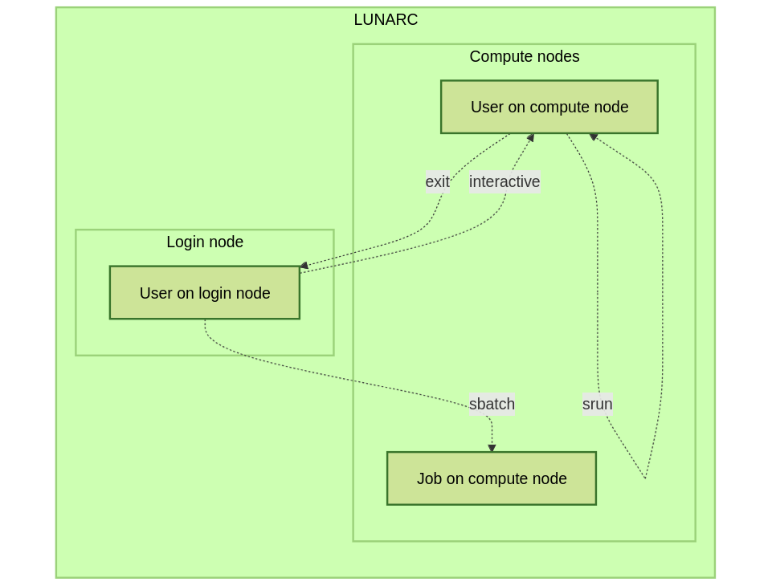

Interactive work on the compute nodes
=====================================

.. admonition:: Learning objectives

   - Understand what the batch system is 
   - Understand what an interactive session is
   - Understand why one may need an interactive session
   - How to work with an interactive session (single + multiple cores)
   - Run an interactive-friendly Python script
   - Run an interactive-unfriendly Python script
   - How to load IDEs
       - Jupyter
       - VScode
       - spyder
   - On-demand desktop       

.. questions:: 
   
   - What is the batch system? 
   - Imagine you are developing a Python script in a line-by-line fashion. How to do so best?
       - Why not do so on the login node?
       - Why not do so by using ``sbatch``?
   - What is the drawback of using an interactive node?

.. admonition:: Compute allocations in this workshop 

   - Rackham: ``uppmax2025-2-296``
   - Kebnekaise: ``hpc2n2025-076``
   - Cosmos: ``lu2025-7-34``
   - Tetralith: ``naiss2025-22-403``  
   - Daradel: ``naiss2025-22-403``

.. admonition:: Storage space for this workshop 

   - Rackham: ``/proj/hpc-python-uppmax``
   - Kebnekaise: ``/proj/nobackup/hpc-python-spring``
   - Cosmos: ``/lunarc/nobackup/projects/lu2024-17-44``
   - Tetralith: ``/proj/hpc-python-spring-naiss``
   - Dardel: ``/cfs/klemming/projects/snic/hpc-python-spring-naiss``

.. admonition:: Reservation

   Include with ``#SBATCH --reservation==<reservation-name>``. On UPPMAX it is "magnetic" and so follows the project ID without you having to add the reservation name. 

   **NOTE** as there is only one/a few nodes reserved, you should NOT use the reservations for long jobs as this will block their use for everyone else. Using them for short test jobs is what they are for. 

   - UPPMAX 
       - uppmax2025-2-296_1 for cpu on Thursday
       - uppmax2025-2-296_2 for gpu on Thursday
       - uppmax2025-2-296_3 for cpu on Friday
       - uppmax2025-2-296_4 for gpu on Friday 
   - HPC2N
       - hpc-python-fri for cpu on Friday
       - hpc-python-mon for cpu on Monday
       - hpc-python-tue for gpu on Tuesday

Introduction
------------

Some users develop Python code in a line-by-line fashion. 

- These users typically want to run a (calculation-heavy) script frequently, to test if the code works.
- However, scheduling each new line is too slow, as it can take minutes (or sometimes hours) before the new code is run through the batch system.
- Instead, there is a way to directly work with such code: use an interactive session.

Some other users want to run programs that (1) use a lot of CPU and memory, and (2) need to be persistent/available.
One good example is Jupyter. 

- Running such a program on a login nodes would harm all other users on the login node.
- Running such a program on a computer node using ``sbatch`` would not allow a user to connect to it.
- In such a case: use an interactive session.

.. admonition:: About Jupyter

   - For HPC2N, using Jupyter on HPC2N is possible, through a batch job. 
   - For UPPMAX, using Jupyter is easier. 
   - For LUNARC, using Jupyter (<https://lunarc-documentation.readthedocs.io/en/latest/guides/applications/Python/#jupyter-lab>) works best using the LUNARC HPC Desktop. Go to the Applications menu, hover over Applications - Python, and select Jupyter Lab from the menu that pops up to the right.
   - For NSC, using Jupyter is easiest done through ThinLinc, but can also be used via an SSH tunnel. 

.. admonition:: In this session we will talk about 

   - the batch system in general
   - handy options to the batch system 
   - interactive/salloc
   - Jupyter
   - VScode
   - Spyder
   - Open-on-demand desktop 

An interactive session is a session with direct access to a compute node. Or alternatively: an interactive session is a session, in which there is no queue before a command is run on a compute node.

Briefly about the cluster hardware and system at UPPMAX, HPC2N, LUNARC, NSC, and PDC
------------------------------------------------------------------------------------

**What is a cluster?**

- Login nodes and calculations/compute nodes

- A network of computers, each computer working as a **node**.

- Each node contains several processor cores and RAM and a local disk called scratch.

.. figure:: ../img/node.png
   :align: center

- The user logs in to **login nodes**  via Internet through ssh or Thinlinc.

  - Here the file management and lighter data analysis can be performed.

.. figure:: ../img/nodes.png
   :align: center

- The **calculation nodes** have to be used for intense computing.

- Beginner's guide to clusters: https://www.hpc2n.umu.se/documentation/guides/beginner-guide

Common features
###############

- Intel CPUs
- Linux kernel
- Bash shell

.. role:: raw-html(raw)
    :format: html

.. list-table:: Hardware
   :widths: 25 25 25 25 25 25 25 25
   :header-rows: 1

   * - Technology
     - Kebnekaise
     - Rackham
     - Snowy
     - Bianca
     - Cosmos
     - Tetralith  
     - Dardel 
   * - Cores per calculation node
     - 28 (Intel Skylake), 72 (largemem), 128/256 (AMD Zen3/Zen4)
     - 20
     - 16
     - 16
     - 48 (AMD) and 32 (Intel) 
     - 32   
     - 128  
   * - Memory per calculation node
     - 128-3072 GB 
     - 128-1024 GB
     - 128-4096 GB
     - 128-512 GB
     - 256-512 GB 
     - 96-384 GB  
     - 256-2048 GB
   * - GPU
     - NVidia V100, A100, A6000, L40s, H100, A40, AMD MI100
     - None
     - Nvidia T4 
     - 2 NVIDIA A100
     - NVidia A100
     - NVidia T4 
     - 4 AMD Instinct™ MI250X á 2 GCDs

Running your programs and scripts on UPPMAX, HPC2N, LUNARC, NSC, and PDC 
------------------------------------------------------------------------

Any longer, resource-intensive, or parallel jobs must be run through a **batch script**.

   - Demanding work (CPU or Memory intensive) should be done on the compute nodes.
   - If you need live interaction you should start an "interactive session"
   - On Cosmos (LUNARC) and Dardel (PDC) (and soon at HPC2N) it can be done graphically with the Desktop-On-Demand tool ``GfxLauncher``.
   - Otherwise the terminal approach will work in all centers.

The batch system used at UPPMAX, HPC2N, LUNARC, NSC, and PDC is called SLURM.

SLURM is an Open Source job scheduler, which provides three key functions

- Keeps track of available system resources
- Enforces local system resource usage and job scheduling policies
- Manages a job queue, distributing work across resources according to policies

In order to run a batch job, you need to create and submit a SLURM submit file (also called a batch submit file, a batch script, or a job script) *or* give the commands for an interactive job.

Guides and documentation at:

- HPC2N: http://www.hpc2n.umu.se/support
- UPPMAX: http://docs.uppmax.uu.se/cluster_guides/slurm/
- LUNARC: https://lunarc-documentation.readthedocs.io/en/latest/manual/manual_intro/
- NSC: https://www.nsc.liu.se/support/batch-jobs/
- PDC: https://support.pdc.kth.se/doc/run_jobs/job_scheduling/ 

The different way HPC2N, UPPMAX, LUNARC, NSC, and PDC provide for an interactive session
-----------------------------------------------------------------------------------

Example, HPC2N vs. UPPMAX vs. LUNARC (NSC is similar to LUNARC, PDC is similar to UPPMAX *or* can be similar to HPC2N): 

.. mermaid:: ../mermaid/interactive_node_transitions.mmd 

Here we define an interactive session as a session with direct access to a compute node.
Or alternatively: an interactive session is a session, in which there is no queue before a command is run on a compute node.

This differs between the centers :

- HPC2N: the user remains on a login node. 
  All commands can be sent directly to the compute node using ``srun``
- UPPMAX: the user is actually on a computer node.
  Whatever command is done, it is run on the compute node
- LUNARC: the user is actually on a computer node if the correct menu option is chosen. Whatever command is done, it is run on the compute node
- NSC: the user is actually on a computer node if the correct menu option is chosen. Whatever command is done, it is run on the compute node  
- PDC: the user remains on a login node and can submit jobs to the compute node with ``srun`` *or* (recommended) the user login to the compute node with ssh after the job is allocated. Any commands are then run directly on the compute node. 

Start an interactive session
----------------------------

To start an interactive session, 
one needs to allocate resources on the cluster first.

The command to request an interactive node differs per HPC cluster:

+---------+-----------------+-------------+-------------+
| Cluster | ``interactive`` | ``salloc``  | GfxLauncher |
+=========+=================+=============+=============+
| HPC2N   | Works           | Recommended | Possible    |
+---------+-----------------+-------------+-------------+
| UPPMAX  | Recommended     | Works       | N/A         |
+---------+-----------------+-------------+-------------+
| LUNARC  | Works           | N/A         | Recommended | 
+---------+-----------------+-------------+-------------+
| NSC     | Recommended     | N/A         | N/A         | 
+---------+-----------------+-------------+-------------+ 
| PDC     | N/A             | Recommended | Possible    |
+---------+-----------------+-------------+-------------+

Start an interactive session in the simplest way
################################################

To start an interactive session in the simplest way, as shown here:

.. tabs::

   .. tab:: UPPMAX

      Use:

      .. code-block:: console

         interactive -A [project_name]

      Where ``[project_name]`` is the UPPMAX project name,
      for example ``interactive -A uppmax2025-2-296``.

      The output will look similar to this:

      .. code-block:: console

          [richel@rackham4 ~]$ interactive -A uppmax2025-2-296
          You receive the high interactive priority.
          You may run for at most one hour.
          Your job has been put into the devcore partition and is expected to start at once.
          (Please remember, you may not simultaneously have more than one devel/devcore job, running or queued, in the batch system.)

          Please, use no more than 8 GB of RAM.

          salloc: Pending job allocation 9093699
          salloc: job 9093699 queued and waiting for resources
          salloc: job 9093699 has been allocated resources
          salloc: Granted job allocation 9093699
          salloc: Waiting for resource configuration
          salloc: Nodes r314 are ready for job
           _   _ ____  ____  __  __    _    __  __
          | | | |  _ \|  _ \|  \/  |  / \   \ \/ /   | System:    r314
          | | | | |_) | |_) | |\/| | / _ \   \  /    | User:      richel
          | |_| |  __/|  __/| |  | |/ ___ \  /  \    | 
           \___/|_|   |_|   |_|  |_/_/   \_\/_/\_\   | 

          ###############################################################################

                        User Guides: https://docs.uppmax.uu.se/

                        Write to support@uppmax.uu.se, if you have questions or comments.

          [richel@r314 ~]$ 

      Note that the prompt has changed to show that one is on an interactive node.
      
   .. tab:: HPC2N

      .. code-block:: console
          
         salloc -A [project_name]

      Where ``[project_name]`` is the HPC2N project name,
      for example ``salloc -A hpc2n2025-076``.

      This will look similar to this (including asking for resources - time is required):

      .. code-block:: console

          b-an01 [~]$ salloc -n 4 --time=00:10:00 -A hpc2n2025-076
          salloc: Pending job allocation 20174806
          salloc: job 20174806 queued and waiting for resources
          salloc: job 20174806 has been allocated resources
          salloc: Granted job allocation 20174806
          salloc: Waiting for resource configuration
          salloc: Nodes b-cn0241 are ready for job
          b-an01 [~]$ module load GCC/12.3.0 Python/3.11.3
          b-an01 [~]$ 

   .. tab:: LUNARC 

      .. code-block:: console 

         interactive -A [project_name]

      Where ``[project_name]`` is the LUNARC project name,
      for example ``interactive -A lu2025-7-34``.  

      This will look similar to this (including asking for resources - time is required): 

      .. code-block:: console

         [bbrydsoe@cosmos3 ~]$ interactive -A lu2025-7-34 -n 4 -t 00:10:00
         Cluster name: COSMOS
         Waiting for JOBID 988025 to start

      The terminal will refresh for the new connection: 

      .. code-block:: console

         [bbrydsoe@cn137 ~]$ module load GCC/13.2.0 Python/3.11.5
         [bbrydsoe@cn137 ~]$ 

   .. tab:: NSC 

      .. code-block:: console 

         interactive -A [project_name]

      Where ``[project_name]`` is the NSC project name,
      for example ``interactive -A naiss2025-22-403``.  

      This will look similar to this: 

      .. code-block:: console

         [x_birbr@tetralith1 ~]$ interactive -A naiss2025-22-403 
         salloc: Pending job allocation 40137281
         salloc: job 40137281 queued and waiting for resources
         salloc: job 40137281 has been allocated resources
         salloc: Granted job allocation 40137281
         salloc: Waiting for resource configuration
         salloc: Nodes n302 are ready for job
         [x_birbr@n302 ~]$ module load buildtool-easybuild/4.8.0-hpce082752a2 GCC/13.2.0 Python/3.11.5
         [x_birbr@n302 ~]$

   .. tab:: PDC 

      .. code-block:: console 

         
         
Indeed, all you need is the UPPMAX/NSC project name, as well as time for HPC2N/LUNARC.

However, this simplest way may have some defaults settings that do not fit you. 

- session duration is too short
- the session has too few cores available

You can add more resources the same way as for batch jobs.

There is some information here: <https://uppmax.github.io/R-python-julia-matlab-HPC/python/interactivePython.html#start-an-interactive-session-in-a-more-elaborate-way>.

End an interactive session
--------------------------

You leave interactive mode with ``exit``. 

Check to be in an interactive session
-------------------------------------

.. admonition:: For UPPMAX, LUNARC, and NSC 

   You check if you are in an interactive session with: 

   .. code-block:: console

      hostname

   If the output contains the words ``rackham``, ``cosmos``, or ``tetralith`` you are on the login node. 

   If the output contains: 

   - ``r[number].uppmax.uu.se``, where ``[number]`` is a number, you are on a compute node at UPPMAX (rackham).
   - ``cn[number]``, where ``[number]`` is a number, you are on a compute node at LUNARC (cosmos). 
   - ``n[number]``, where ``[number]`` is a number, you are on a compute node at NSC (tetralith). 

.. admonition:: For HPC2N 

   You check if you are in an interactive session with: 

   .. code-block:: console

      srun hostname

   - If the output is ``b-cn[number].hpc2n.umu.se``, where ``[number]`` is a number, you are more-or-less on a compute node.

   - If the output is ``b-an[number]``, where ``[number]`` is a number, you are still on a login node.

   Do NOT do 

   .. code-block:: console

      hostname

   for HPC2n as it will always show that you are on a login node

Check that the number of cores booked is correct
------------------------------------------------

You can do this with 

.. code-block:: 

   $ srun hostname

And then you will get one line of output per core booked. 

Running a Python script in an interactive session
-------------------------------------------------

.. tabs::

   .. tab:: UPPMAX/LUNARC/NSC

      To run a Python script in an interactive session, first load the Python modules:

      .. code-block:: console

         module load [python/version + any prerequisites]

      To run a Python script on 1 core, do:

      .. code-block:: console

         python [my_script.py]

      where `[my_script.py]` is the Python script (including the path if it is ot in the current directory), for example ``srun python ~/my_script.py``.

      To run a Python script on each of the requested cores, do:

      .. code-block:: console

         srun python [my_script.py]

      where `[my_script.py]` is the Python script (including the path if it is noth in the current directory), for example ``srun python ~/my_script.py``.
      
   .. tab:: HPC2N

      To run a Python script in an interactive session, first load the Python modules + prerequisites:

      .. code-block:: console

         module load GCC/12.3.0 Python/3.11.3

      To run a Python script on each of the requested cores, do:

      .. code-block:: console

         srun python [my_script.py]

      where `[my_script.py]` is the Python script (including the path if it is noth in the current directory), for example ``srun python ~/my_script.py``.

Not all Python scripts are suitable for an interactive session.
This will be demonstrated by two Python example scripts.

Our first example Python script is called `sum-2args.py <https://raw.githubusercontent.com/UPPMAX/HPC-python/refs/heads/main/Exercises/examples/programs/sum-2args.py>`_:
it is a simple script that adds two numbers from command-line arguments:
 
.. code-block:: python

    import sys
  
    x = int(sys.argv[1])
    y = int(sys.argv[2])
  
    sum = x + y
  
    print("The sum of the two numbers is: {0}".format(sum))

Our second example Python script is called `add2.py <https://raw.githubusercontent.com/UPPMAX/HPC-python/refs/heads/main/Exercises/examples/programs/add2.py>`_:
it is a simple script that adds two numbers from user input:
 
.. code-block:: python

    # This program will add two numbers that are provided by the user

    # Get the numbers
    a = int(input("Enter the first number: ")) 
    b = int(input("Enter the second number: "))

    # Add the two numbers together
    sum = a + b

    # Output the sum
    print("The sum of {0} and {1} is {2}".format(a, b, sum))

.. challenge:: 

   - Why is/is it not a good script for interactive?

Exercises
---------

- Go to the program directory in your cloned HPC-Python repository
    - cd <path-to-your-area-under-the-storage-dir>/HPC-python/Exercises/examples/programs
- There you'll find the two programs that we will use:

 ``sum-2args.py`` and ``add2.py``

- After loading a Python module (potentially with prerequisites), run the two programs.

.. code-block:: console

   python sum-2args.py 3 14

.. code-block:: console

   python add2.py

- Add numbers according to prompts.

- If this works you are good to go for the interactive session exercises!

Exercise 1: start an interactive session
########################################

In this example we will start a session with 2 cores

.. tabs::

   .. tab:: UPPMAX

      On UPPMAX, ``interactive`` is recommended:

      .. code-block:: console

         interactive -A uppmax2025-2-296 -p core -n 2
      
   .. tab:: HPC2N

      .. code-block:: console
          
         salloc -A hpc2n2025-076 -n 2 -t 00:30:00

   .. tab:: LUNARC

      .. code-block:: console

         interactive -A lu2025-7-34 -t 00:30:00 -n 2

   .. tab:: NSC

      .. code-block:: console

         interactive -A naiss2025-22-403 -n 2

Exercise 2: check to be in an interactive session
#################################################

.. tabs::

   .. tab:: UPPMAX/LUNARC/NSC

      Use:

      .. code-block:: console

         hostname

   .. tab:: HPC2N

      Use:

      .. code-block:: console

         srun hostname

      Misleading would be to use:

      .. code-block:: console

         hostname

      This will always show that you are on a login node

Exercise 3: check to have booked the expected amount of cores
#############################################################

.. tabs::

   .. tab:: Exercise 3: confirm to have booked two cores

      Confirm to have booked two cores. 

   .. tab:: UPPMAX/LUNARC/NSC

      Use:

      .. code-block:: console

         srun hostname

   .. tab:: HPC2N

      Use:

      .. code-block:: console

         srun hostname

Exercise 4.1. Running the first Python script in an interactive session on all cores
####################################################################################

Running `sum-2args.py` in an interactive session

.. exercise:: HPC2N, UPPMAX, LUNARC, and NSC

   Run the script using ``srun``:
         
   .. code-block:: console
      
   b-an01 [~]$ srun python sum-2args.py 3 4
   The sum of the two numbers is: 7
   The sum of the two numbers is: 7
   b-an01 [~]$             

   Similar to ``srun hostname``, this script is run once per node and works as expected.
                        
Exercise 4.2. Running a second Python script in an interactive session on all cores
###################################################################################

Running `add2.py` in an interactive session

.. exercise:: HPC2N, UPPMAX, LUNARC, NSC

   Run the script using ``srun``:

   .. code-block:: console 
         
      b-an01 [~]$ srun python add2.py 
      2
      3
      Enter the first number: Enter the second number: The sum of 2 and 3 is 5
      Enter the first number: Enter the second number: The sum of 2 and 3 is 5
      
   As you can see, it is possible, but it will not show any interaction it otherwise would have. At least not at HPC2N. Is it different elsewhere? 

Exercise 5: exit
################

Exit the interactive mode 

.. tabs::

   .. tab:: UPPMAX, LUNARC, NSC

      Use:

      .. code-block:: console

         exit

      The prompt should change to contain the name of the login node (contain rackham, cosmos, or tetralith), which indicates you are back on a login node.
      
   .. tab:: HPC2N

      Use:

      .. code-block:: console

         exit

      The prompt will remain the same.

Conclusion
----------

.. keypoints::

   You have:

   - seen how to use a compute node interactively,
     which differs between HPC2N, UPPMAX, LUNARC, and NSC (particularly between HPC2N and the others) 
   - checked if we are in an interactive session
   - checked if we have booked the right number of cores
   - run Python scripts in an interactive session,
     which differs between HPC2N and the others
   - seen that not all Python scripts 
     can be run interactively on multiples cores
   - exited an interactive session

