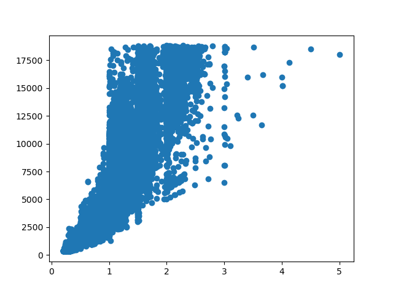

<!-- From https://docs.readthedocs.com/platform/stable/guides/cross-referencing-with-sphinx.html#explicit-targets -->
(matplotlib)=

# `matplotlib`


> [The `matplotlib` logo](https://matplotlib.org/stable/gallery/misc/logos2.html)

:::{admonition} Learning outcomes
:class: note

At the end of this sessions, learners ...

- understand why `matplotlib` is important
- have run Python code that uses `matplotlib`
- have run Python code that uses `matplotlib` to display data from a `pandas` table

:::

## Why `matplotlib` is important


## Exercises

## Exercise 1: a minimal plot

- Use the documentation of the HPC cluster you work on

:::{admonition} Answer: where is your documentation?
:class: dropdown

Sorted by HPC cluster:

<!-- markdownlint-disable MD013 --><!-- Tables cannot be split up over lines, hence will break 80 characters per line -->
HPC center |HPC cluster|HPC cluster-specific documentation
-----------|-----------|------------------------------------------------------------
C3SE       |Alvis      |[Documentation](https://www.c3se.chalmers.se)
UPPMAX     |Bianca     |[Documentation](https://docs.uppmax.uu.se)
LUNARC     |COSMOS     |[Documentation](https://lunarc-documentation.readthedocs.io)
PDC        |Dardel     |[Documentation](https://support.pdc.kth.se)
HPC2N      |Kebnekaise |[Documentation](https://docs.hpc2n.umu.se)
UPPMAX     |Pelle      |[Documentation](https://docs.uppmax.uu.se)
NSC        |Tetralith  |[Documentation](https://www.nsc.liu.se)
<!-- markdownlint-enable MD013 -->
:::

- In that documentation, find the software module to load the package.
  If you know how, you may also use the module system

:::{admonition} Answer: where is the `matplotlib` documentation?
:class: dropdown

<!-- markdownlint-disable MD013 --><!-- Tables cannot be split up over lines, hence will break 80 characters per line -->

HPC cluster|HPC cluster-specific `matplotlib` documentation
-----------|-------------------------------------------------------------------------------------------------------------------
Alvis      |[`matplotlib` documentation](https://www.c3se.chalmers.se/documentation/module_system/modules/#to-search-for-keywords-in-a-module-such-as-extensions-in-bundles) [No relevant documentation]
Bianca     |[`matplotlib` documentation](https://docs.uppmax.uu.se/software/python_bundles/#matplotlib)
COSMOS     |[`matplotlib` documentation](https://lunarc-documentation.readthedocs.io/en/latest/manual/manual_modules/#loading-packages) [No relevant documentation]
Dardel     |[`matplotlib` documentation](https://support.pdc.kth.se/doc/basics/quickstart/#the-lmod-module-system) [No relevant documentation]
Kebnekaise |[`matplotlib` documentation](https://docs.hpc2n.umu.se/software/libs/matplotlib/)
Pelle      |[`matplotlib` documentation](https://docs.uppmax.uu.se/software/python_bundles/#matplotlib)
Tetralith  |[`matplotlib` documentation](https://www.nsc.liu.se/software/catalogue/tetralith/modules/python.html)

<!-- markdownlint-enable MD013 -->

:::

- Load the software module to use `matplotlib`

:::{admonition} Answer: how to load the `matplotlib` software module
:class: dropdown


<!-- markdownlint-disable MD013 --><!-- Tables cannot be split up over lines, hence will break 80 characters per line -->

HPC cluster|How to load Matplotlib
-----------|-------------------------------------------------------------------------------------------------------------------
Alvis      |`module load matplotlib/3.9.2-gfbf-2024a`
COSMOS     |`module load matplotlib/3.8.2` (avoid version `3.9.2`!)
Dardel     |`module load PDC/23.12 cray-python/3.11.5 matplotlib/3.8.2-cpeGNU-23.12`
Kebnekaise |`module load matplotlib/3.8.2`
Pelle      |`module load matplotlib/3.9.2-gfbf-2024a` :-)
Tetralith  |?`module load Python/3.10.4-env-hpc1-gcc-2022a-eb`

<!-- markdownlint-enable MD013 -->

:::

- Create a script with the following code:

```python
import matplotlib as mpl
import matplotlib.pyplot as plt

x = np.linspace(0, 10, 100)

plt.plot(x, np.sin(x))
plt.plot(x, np.cos(x))

# plt.show()
plt.figure().savefig('my_figure.png')
```

- Run the script
- Check that the figure is created

## (optional) Exercise 2: displaying a `pandas` table

In this exercise, we will again use 
[the 'diamonds' dataset (as a comma-separated file)](diamonds.csv):
a dataset about diamonds.

This dataset contains information about more than fifty thousand diamonds.
Two such features are the weight (in carats) and the price (in USD).
Here we want to use an image to display the relationship between these two.

- Use `pandas` to read the dataset and use `matplotlib`
  to create a scatter plot from that data. Put the diamond weight
  on the x-axis and the diamond price on the y-axis.

:::{admonition} Answer
:class: dropdown

Here is a simple solution
(simplified from [this script](matplotlib_exercise.py)):

```python
import pandas as pd
import matplotlib.pyplot as plt
table = pd.read_csv("diamonds.csv")

plt.scatter(table["carat"], table["price"])
plt.savefig("matplotlib_exercise.png")
```

This will look like this:



:::


## (optional) Exercise 3: making the plot pretty


## External links

- [Python Data Science Handbook](https://jakevdp.github.io/PythonDataScienceHandbook/)
