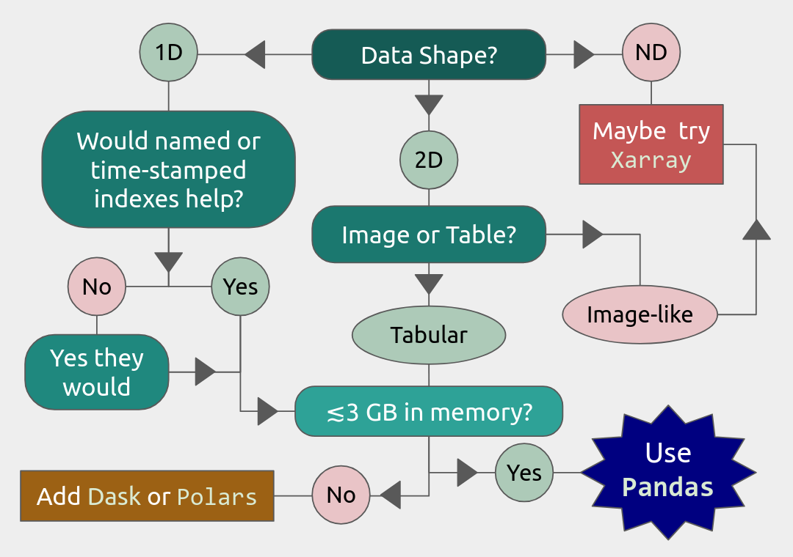

Intro to Pandas on HPC
======================

.. objectives::

   You will learn how to 
   - Find and load Pandas on your local HPC resource
   - Load data into DataFrames in whole or in part
   - Estimate the size of your data in memory
   - Reduce your data size by converting to appropriate memory-saving data types
   - Run standard functions with multi-threading using Numba

.. note::

   We will **not** cover Pandas functionality in depth except insofar as the workflow differs between an HPC cluster and a personal laptop. For in-depth instruction on the Pandas library, NAISS offers a different course, "An Introduction to Pandas for Data Science."

**Pandas**, short for PANel Data AnalysiS, is a Python data library for cleaning, organizing, and statistically analyzing moderately large (:math:`\lesssim3` GiB) data sets. It was originally developed for analyzing and modelling financial records (panel data) over time, and has since expanded into a package rivaling SciPy in the number and complexity of available functions. Pandas offers:

* Explicit, automatic data alignment: all entries have corresponding row and column labels/indexes.
* Easy methods to add, remove, transform, compare, broadcast, and aggregate data within and across data structures.
* Data structures that support any mix of numerical, string, list, Boolean, and datetime datatypes.
* I/O interfaces that support a wide variety of text, binary, and database formats, including Excel, JSON, HDF5, NetCDF, and SQLite.
* Hundreds of built-in functions for cleaning, organizing, and statistical analysis, plus support for user-defined functions.
* A simple interface with the Seaborn plotting library, and increasingly also Matplotlib.
* Easy multi-threading with Numba.

**Limitations.** Pandas alone has somewhat limited support for parallelization, N-dimensional data structures, and datasets much larger than 3 GiB. Fortunately, there are packages like ``dask`` and ``polars`` that can help with large data sets. In partcular, ``dask`` will be covered tomorrow in the Parallel Computing section of this course. There is also the ``xarray`` package that provides many similar functions to Pandas for higher-dimensional data structures, but that is outside the scope of this workshop.

Load and Run
------------

Pandas has been part of the SciPy-bundle module (which also contains NumPy) since 2020, so at most HPC resources, you should use ``ml spider SciPy-bundle`` to see which versions are available and how to load them.

.. important::

   Pandas requires Python 3.8.x and newer. Do not use SciPy-bundles for Python 2.7.x!

Some facilities also have Anaconda, which typically includes Pandas, JupyterLab, NumPy, SciPy, and many other popular packages. However, if there is a Python package you want that is not included, you will typically have to build your own environment to install it, and extra steps may be required to use that conda environment in a development tool like Jupyter Lab.

.. tabs::

   .. tab:: HPC2N
     
      .. important::

         For this session, you should load

         .. code-block:: console
        
            ml GCC/12.3.0 Python/3.11.3 SciPy-bundle/2023.07 matplotlib/3.7.2 Tkinter/3.11.3

      As of 27-11-2024, the output of ``ml spider SciPy-bundle`` on Kebnekaise is:

      .. code-block:: console

        ----------------------------------------------------------------------------
          SciPy-bundle:
        ----------------------------------------------------------------------------
            Description:
              Bundle of Python packages for scientific software
        
             Versions:
                SciPy-bundle/2019.03
                SciPy-bundle/2019.10-Python-2.7.16
                SciPy-bundle/2019.10-Python-3.7.4
                SciPy-bundle/2020.03-Python-2.7.18
                SciPy-bundle/2020.03-Python-3.8.2
                SciPy-bundle/2020.11-Python-2.7.18
                SciPy-bundle/2020.11
                SciPy-bundle/2021.05
                SciPy-bundle/2021.10-Python-2.7.18
                SciPy-bundle/2021.10
                SciPy-bundle/2022.05
                SciPy-bundle/2023.02
                SciPy-bundle/2023.07-Python-3.8.6
                SciPy-bundle/2023.07
                SciPy-bundle/2023.11
          ----------------------------------------------------------------------------
            For detailed information about a specific "SciPy-bundle" package (including how to load the modules) use the module's full name.
            Note that names that have a trailing (E) are extensions provided by other modules.
            For example:
          
               $ module spider SciPy-bundle/2023.11
          ----------------------------------------------------------------------------

   .. tab:: LUNARC

      .. important::

         For this session, you should load

         .. code-block:: console
        
            ml GCC/13.2.0 Python/3.11.5 SciPy-bundle/2023.11 matplotlib/3.8.2
     
      On the LUNARC HPC Desktop, all On-Demand versions of Jupyter and Spyder load Pandas, NumPy, SciPy, Matplotlib, Seaborn, and many other Python packages automatically, so you don't need to load any modules. 

      If you work at the command line and choose not to use Anaconda3, you will need to load a SciPy-bundle to access Pandas. Use ``ml spider SciPy-bundle`` to see which versions are available, which Python versions they depend on, and how to load them.

      .. important::
    
         Pandas requires Python 3.8.x and newer. Do not use SciPy-bundles for Python 2.7.x!

      As of 10-11-2025, the output of ``ml spider SciPy-bundle`` on Cosmos is:

      .. code-block:: console

        ----------------------------------------------------------------------------
          SciPy-bundle:
        ----------------------------------------------------------------------------
            Description:
              Bundle of Python packages for scientific software
        
             Versions:
                SciPy-bundle/2020.11-Python-2.7.18
                SciPy-bundle/2020.11
                SciPy-bundle/2021.05
                SciPy-bundle/2021.10-Python-2.7.18
                SciPy-bundle/2021.10
                SciPy-bundle/2022.05
                SciPy-bundle/2023.02
                SciPy-bundle/2023.07
                SciPy-bundle/2023.11
                SciPy-bundle/2024.05
        
        ----------------------------------------------------------------------------
          For detailed information about a specific "SciPy-bundle" package (including ho
        w to load the modules) use the module's full name.
          Note that names that have a trailing (E) are extensions provided by other modu
        les.
          For example:
        
             $ module spider SciPy-bundle/2024.05
        ----------------------------------------------------------------------------

   .. tab:: UPPMAX

      .. important::

         For this session, if you are on **Rackham**, you should load

         .. code-block:: console
        
            module load python/3.11.8

         If you are on **Pelle**, you should load

         .. code-block:: console
        
            module load python/3.XX.X
     
      On Rackham, Python versions 3.8 and newer include NumPy, Pandas, and Matplotlib. There is no need to load additional modules after loading your preferred Python version. On Pelle... FIXME

   .. tab:: Tetralith (NSC)
     
      .. important::

         For this session, you should load

         .. code-block:: console
        
            module load buildtool-easybuild/4.8.0-hpce082752a2 GCC/13.2.0 Python/3.11.5 SciPy-bundle/2023.11 JupyterLab/4.2.0
         
         Pandas, like NumPy, has typically been part of the SciPy-bundle module since 2020. Use ``ml spider SciPy-bundle`` to see which versions are available and how to load them.

   .. tab:: Dardel (PDC)

      - Jupyter Lab is only available on Dardel via ThinLinc. 
      - As there are only 30 ThinLinc licenses available at this time, we recommend that you work on the exercises with a local installation on a personal computer. 
      - Do not trust that a ThinLinc session will be available or that On-Demand applications run therein will start in time for you to keep up (it is not unusual for wait times to be longer than the requested walltime). 
      - The exercises were written to work on a regular laptop. If you must work on Dardel, follow the steps below, and view the `exercises <https://github.com/UPPMAX/HPC-python/blob/main/docs/day3/HPC-Pandas-exercises.ipynb>`_ and `solutions <https://github.com/UPPMAX/HPC-python/blob/main/docs/day3/HPC-Pandas-exercises-solutions.ipynb>`_ in the GitHub repository (they should render correctly).

      .. important::

         For this session, you could load

         .. code-block:: console
        
            ml cray-python/3.11.7
     
      On Dardel, all cray-python versions include NumPy, SciPy, and Pandas, and do not require any prerequisites. Matplotlib is separate and will have to be loaded using ``ml PDC/23.12 matplotlib/3.8.2-cpeGNU-23.12``, where PDC/23.12 is a prerequisite. The versions available for for both cray-python and matplotlib are limited because it is generally assumed that most users will build their own environments, but the installed versions are fine for this course.

     - ALTERNATIVE IF THINLINC IS AVAILABLE
     - Start Jupyter from the Menu and it will work! 

          - Default Anaconda 3 has all packages needed for this lesson

     - OR USE SPYDER:
          - start interactive session

          .. code-block:: console 

             salloc --ntasks=4 -t 0:30:00 -p shared --qos=normal -A naiss2025-22-934
             salloc: Pending job allocation 9102757
             salloc: job 9102757 queued and waiting for resources
             salloc: job 9102757 has been allocated resources
             salloc: Granted job allocation 9102757
             salloc: Waiting for resource configuration
             salloc: Nodes nid001057 are ready for job

          We need to ssh to the specific node, like

          .. code-block:: console 

             ssh nid001057

          Use the conda env you created in Exercise 2 in `Use isolated environemnts <https://uppmax.github.io/HPC-python/day2/use_isolated_environments.html#exercises>`_

          .. code-block:: console

             ml PDC/23.12
             ml miniconda3/24.7.1-0-cpeGNU-23.12
             export CONDA_ENVS_PATH="/cfs/klemming/projects/supr/courses-fall-2025/$USER/"
             export CONDA_PKG_DIRS="/cfs/klemming/projects/supr/courses-fall-2025/$USER/"
             source activate spyder-env
             conda install matplotlib pandas seaborn
             spyder %

.. note::

   2025 versions of SciPy-bundle are not widely installed or recommended, because numerical stability tests are failing during installation.

To know if Pandas is the right tool for your job, you can consult the flowchart below.

We will also have a short session after this on plotting with Seaborn, a package for easily making publication-ready statistical plots with Pandas data structures.

Introductory Topics (Review)
----------------------------

Important Data Types and Object Classes
^^^^^^^^^^^^^^^^^^^^^^^^^^^^^^^^^^^^^^^

The main object classes of Pandas are ``Series`` and ``DataFrame``. There is also a separate object class called ``Index`` for the row indexes/labels and column labels, if applicable. Data that you load from file will mainly be loaded into either Series or DataFrames. Indexes are typically extracted later if needed.

* ``pandas.Series(data, index=None, name=None, ...)`` instantiates a 1D array with customizable indexes (labels) attached to every entry for easy access, and optionally a name for later addition to a DataFrame as a column.

  - Indexes can be numbers (integer or float), strings, datetime objects, or even tuples. The default is 0-based integer indexing. Indexes are also a Pandas data type (the data type of the row and column labels)

* ``pandas.DataFrame(data, columns=None, index=None, ...)`` instantiates a 2D array where every column is a Series. All entries are accessible by column and row labels/indexes.

  - Any function that works with a DataFrame will work with a Series unless the function specifically requires column arguments.
  - Column labels and row indexes/labels can be safely (re)assigned as needed.

For the rest of this lesson, example DataFrames will be abbreviated as ``df`` in code snippets (and example Series, if they appear, will be abbreviated as ``ser``).

.. admonition:: **Important Attributes Cheatsheet**
   :collapsible: closed

   The API reference in the `official Pandas documentation <https://pandas.pydata.org/docs/user_guide/index.html>`_ shows hundreds of methods and attributes for Series and DataFrames. The following is a very brief list of the most important attributes and what they output.
   
   - ``df.index`` returns a list of **row labels** as an array of Pandas datatype ``Index``
   - ``df.columns`` returns a list of **column labels** as an array of Pandas datatype ``Index``
   - ``df.dtypes`` lists datatypes by column
   - ``df.shape`` gives a tuple of the number of rows and columns in ``df``
   - ``df.values`` returns ``df`` converted to a NumPy array (also applicable to ``df.columns`` and ``df.index``)
   
Pandas assigns the data in a Series and each column of a DataFrame a datatype based on built-in or NumPy datatypes or other formatting cues. Important Pandas datatypes include the following.

* Numerical data are stored as ``float64`` or ``int64``. You can convert to 32-, 16-, and even 8-bit versions of either to save memory.
* The ``object`` datatype stores any of the built-in types ``str``, ``Bool``, ``list``, ``tuple``, and mixed data types. Malformed data are also often designated as ``object`` type.

  - A common indication that you need to clean your data is finding a column that you expected to be numeric assigned a datatype of ``object``.

* Pandas has many functions devoted to time series, so there are several datatypes---``datetime``, ``timedelta``, and ``period``. The first two are based on `NumPy data types of the same name <https://numpy.org/devdocs/reference/arrays.datetime.html>`_ , and ``period`` is a time-interval type specified by a starting datetime and a recurrence rate. Unfortunately, we won't have time to cover these at depth.

There are also specialized datatypes for, e.g. saving on memory or performing windowed operations, including

* ``Categorical`` is a set-like datatype for non-numeric data with few unique values. The unique values are stored in the attribute ``.categories``, that are mapped to a number of low-bit-size integers, and those integers replace the actual values in the DataFrame as it is stored in memory, which can save a lot on memory usage.
* ``Interval`` is a datatype for tuples of bin edges, all of which must be open or closed on the same sides, usually output by Pandas discretizing functions.
* ``Sparse[float64, <omitted>]`` is a datatype based on the SciPy sparse matrices, where ``<omitted>`` can be NaN, 0, or any other missing value placeholder. This placeholder value is stored in the datatype, and the DataFrame itself is compressed in memory by not storing anything at the coordinates of the missing values. 

This is far from an exhaustive list.

Loading/Creating DataFrames
^^^^^^^^^^^^^^^^^^^^^^^^^^^

Most of the time, Series and DataFrames will be loaded from files, not made from scratch. To review, the following table lists I/O functions for a few of the most common data formats; `the full table with links to the documentation pages for each function can be found here. <https://pandas.pydata.org/pandas-docs/stable/user_guide/io.html>`__ Input and output functions are sometimes called readers and writers, respectively. The ``read_csv()`` is by far the most commonly used since it can read any text file with a specified delimiter (comma, tab, or otherwise). 

======  ============================================  ===================================================  =================================
Typ1e    Data Description                              Reader                                               Writer
======  ============================================  ===================================================  =================================
text    **CSV / ASCII text with standard delimiter**  ``read_csv(path_or_url, sep=',', **kwargs)``         ``to_csv(path, **kwargs)``
text    JSON                                          ``read_json()``                                      ``to_json(path, **kwargs)``
SQL     SQLite table or query                         ``read_sql()``                                       ``to_sql(path, **kwargs)``
binary  **MS Excel**/**OpenDocument**                 ``read_excel(path_or_url, sheet_name=0, **kwargs)``  ``to_excel(path, **kwargs)``
binary  HDF5 Format                                   ``read_hdf()``                                       ``to_hdf(path, **kwargs)``
binary  Apache Parquet                                ``read_parquet()``                                   ``to_parquet()``
======  ============================================  ===================================================  =================================

Most of these functions have several dozen possible kwargs. It is left to the reader to determine which kwargs are needed. *Most kwargs in a given reader function also appear in the corresponding writer function, and serve the same purpose.*

.. tip::
   
   Most of the *text* readers above, and the Excel reader, have kwargs that let you choose to load only some of the data, namely ``nrows`` and ``usecols``.

   * ``nrows`` lets you read in only the first *n* rows with their column headers, where $n \ge 0$. If $n=0$, only the column names will be returned. This is a very efficient way to inspect large datasets.
   * ``usecols`` is the same as in NumPy's ``loadtxt()`` and ``genfromtxt()`` functions, i.e., it selects columns by position index and returns a data structure containing only those columns of data.

.. tip::

   Most of the above reader/writer functions were chosen not only because they are commonly used, but because, apart from ``read_excel()``, these support **chunking** for data sets that are larger than memory. Chunking is the act of performing operations, including I/O, on fixed-row-count subsets of the data, assuming each row is independent. For more information see the documentation on `using chunking <https://pandas.pydata.org/pandas-docs/stable/user_guide/scale.html#use-chunking.>`__
   
In most reader functions, including ``index_col=0`` sets the first column as the row labels, and the first row is assumed to contain the list of column names by default. If you forget to set one of the columns as the list of row indexes during import, you can do it later with ``df.set_index('column_name')``.

.. challenge:: 

   Code along! Open your preferred IDE and load the provided file ``exoplanets_5250_EarthUnits_fixed.csv`` into DataFrame ``df``. Then, save ``df`` to a text (.txt) file with a tab (``\t``) separator.
   
.. code-block:: python

   import pandas as pd
   df = pd.read_csv('exoplanets_5250_EarthUnits_fixed.csv',index_col=0)
   df.to_csv('./docs/day3/exoplanets_5250_EarthUnits.txt', sep='\t',index=True)

**Creating DataFrames in Python.** Building a DataFrame or Series from scratch is also easy. Lists and arrays can be converted directly to Series and DataFrames, respectively.

* Both ``pd.Series()`` and ``pd.DataFrame()`` have an ``index`` kwarg to assign a list of numbers, names, times, or other hashable keys to each row. 
* You can use the ``columns`` kwarg in ``pd.DataFrame()`` to assign a list of names to the columns of the table. The equivalent for ``pd.Series()`` is just ``name``, which only takes a single value and doesn't do anything unless you plan to join that Series to a larger DataFrame.
* Dictionaries and record arrays can be converted to DataFrames with ``pd.DataFrame.from_dict(myDict)`` and ``pd.DataFrame.from_records(myRecArray)``, respectively, and the keys will automatically be converted to column labels.

.. challenge:: 

   Code along! In your preferred IDE, recreate the DataFrame shown below and view it with a print statement.

.. jupyter-execute::

    import numpy as np
    import pandas as pd
    df = pd.DataFrame( np.arange(1,13).reshape((4,3)), index=['w','x','y','z'], columns=['a','b','c'] )
    print(df)

It is also possible (and occasionally necessary) to convert DataFrames and Series to NumPy arrays, dictionaries, record arrays, or strings with the methods ``.to_numpy()``, ``.to_dict()``, ``to_records()``, and ``to_string()``, respectively.

Inspection and Memory Usage
^^^^^^^^^^^^^^^^^^^^^^^^^^^

The main data inspection functions for DataFrames (and Series) are as follows:

* ``df.head()`` (or ``df.tail()``)  prints first (or last) 5 rows of data with row and column labels, or accepts an integer argument to print a different number of rows.
* ``df.info()`` prints the number of rows with their first and last index values; titles, index numbers, valid data counts, and datatypes of columns; and the estimated size of ``df`` in memory. **Note:** do not rely on this memory estimate if your dataframe contains non-numeric data (see below). 
* ``df.describe()`` prints summary statistics for all the numerical columns in ``df``.
* ``df.nunique()`` prints counts of the unique values in each column.
* ``df.value_counts()`` prints each unique value and the number of of occurrences for every combination of row and column values for as many of each as are selected (usually applied to just a couple of columns at a time at most)
* ``df.memory_usage()`` returns the estimated memory usage per column (see important notes below).

.. important:: The ``memory_usage()`` Function
   
   ``df.memory_usage(deep=False)`` returns the estimated memory usage of each column, but with the default ``deep=False``, this includes the sizes of *pointers* to non-numeric data, but not the full sizes of strings and other non-numeric data. The sum of these per-column estimates is the same as what is reported by ``df.info()``, which is an significant underestimate. This is because numeric columns are fixed width in memory and can be stored contiguously, but object-type columns are variable in size, so only pointers can be stored at the location of the main DataFrame in memory. The strings that those pointers refer to are kept elsewhere. With ``deep=True``, the sizes of strings and other non-numeric data are factored in, giving a much better estimate of the total size of ``df`` in memory.

.. jupyter-execute::

    import numpy as np
    import pandas as pd
    df = pd.read_csv('./docs/day3/exoplanets_5250_EarthUnits.csv',index_col=0)
    print(df.info())
    print('\n',df.memory_usage())
    print('\n Compare: \n',df.memory_usage(deep=True))

.. admonition:: "Data Selection and Preprocessing Cheatsheet"
   :collapsible:
   
   Below is a table of the syntax for how to select or assign different subsets or cross-sections of a DataFrame. `The complete guide, including how to select data by conditions, can be found at this link. <https://pandas.pydata.org/pandas-docs/stable/user_guide/indexing.html>`__
   
   ===============================  ==================================================================================
   To Access/Assign...                   Syntax
   ===============================  ==================================================================================
   1 cell (scalar output)           ``df.at['row','col']`` or ``df.iat[i,j]``
   column(s) by name                ``df['col']`` or ``df[['col0', 'col1', ...]]``
   row(s) by index                  ``df.iloc[i]`` or ``df.iloc[i:j]``
   rows and columns by name         ``df.loc[['rowA','rowB', ...], ['col0', 'col1', ...]]``
   rows and columns by index        ``df.iloc[i:j, m:n]``
   columns by name, rows by index   You can mix ``.loc[]`` and ``.iloc[]`` for selection, **but NOT for assignment!**
   ===============================  ==================================================================================

   The following table describes basic functions for finding, removing, and replacing missing or unwanted data, which is necessary ahead of any machine learning applications. Pandas has its own functions for detecting missing data in order to detect both regular ``NaN`` and the datetime equivalent, ``NaT``. Any of the following functions will work on individual columns or any other subset of the DataFrame as well as the whole. `Click here for more information on handling missing or invalid data in Pandas. <https://pandas.pydata.org/pandas-docs/stable/user_guide/missing_data.html>`__

   =========================================  ============================================================================
   Pandas Function                            Purpose                                 
   =========================================  ============================================================================
   ``.isna()``                                locates missing/invalid data (NaN/NaT)
   ``.notna()``                               locates valid data
   ``df.dropna(axis=axis, inplace=False)``    remove rows (``axis=0``) or columns (``axis=1``) containing invalid data
   ``df.fillna()``                            replace NaNs with a fixed value
   ``df.interpolate()``                       interpolate missing data using any method of ``scipy.interpolate()``
   ``df.drop_duplicates(inplace=False)``      remove duplicate rows or rows with duplicate values of columns in ``subset``
   ``df.drop(data, axis=axis)``               remove unneeded columns (``axis=1``) or rows (``axis=0``) by name or index
   ``df.mask(condition, other=None)``         mask unwanted numeric data by condition, optionally replace from ``other``
   ``df.replace(to_replace=old, value=new)``  replace ``old`` value with ``new`` (very flexible; see docs)
   =========================================  ============================================================================

Operations
^^^^^^^^^^

Pandas DataFrames and Series have a vast library of function methods that are evaluated vector-wise (whole columns or rows at once) automatically. In lieu of in-depth discussion (provided by a separate course, "An Introduction to Pandas for Data Science"), important groups of operations and links to official documentation on their use are provided below. Users are encouraged to refer to these links in later exercises demonstrating how to make them run more efficiently on HPC systems. **Iteration through loops is costly and usually avoidable.**

.. tabs::

   .. tab:: String Operations

      Most built-in string methods can be applied column-wise to Pandas data structures (Series, Index, or columns of DataFrames) using ``.str.<method>()``, where ``.str.`` is an accessor. `Click here for complete documentation about working with text data in Pandas. <https://pandas.pydata.org/pandas-docs/stable/user_guide/text.html>`__

   .. tab:: Statistical Functions

      Nearly all NumPy statistical functions (UFuncs) and a few ``scipy.mstats`` functions can be called as aggregate methods of DataFrames, Series, any subsets thereof, or `GroupBy objects (for which the statistics are calculated per group). <https://pandas.pydata.org/pandas-docs/stable/user_guide/groupby.html>`__ 

      * NumPy-like methods: ``.abs()``, ``.count()``, ``.max()``, ``.min()``, ``.mean()``, ``.median()``, ``.mode()``, ``.prod()``, ``.quantile()``, ``.sum()``, ``.std()``, ``.var()``, ``.cumsum()``, ``.cumprod()``, ``.cummax()``\* and ``.cummin()``\* (\* Pandas-only)
      * SciPy (m)stats-like methods: ``.sem()``, ``.skew()``, ``.kurt()``, and ``.corr()``

      All of the above ignore NaNs by default, and can be evaluated within `rolling windows. <https://pandas.pydata.org/pandas-docs/stable/user_guide/window.html>`__ For DataFrames and GroupBy objects, you must set ``numeric_only=True`` to exclude non-numeric data, and specify whether to aggregate along rows (``axis=0``) or columns (``axis=1``). `Start at this link for more complete documentation. <https://pandas.pydata.org/pandas-docs/stable/user_guide/basics.html#descriptive-statistics>`__

   .. tab:: Binary/Comparative Methods

      **Binary Operations.** Normal binary math operators (``+``, ``%``, ``**``, etc.) work when both data structures are the same shape or when one is a scalar. However, special Pandas versions of these operators are required when one of the data structures is a DataFrame and the other is a Series. `Click here for full documentation with examples. <https://pandas.pydata.org/pandas-docs/stable/user_guide/basics.html#flexible-binary-operations>`__ All of these arithmetic operators require you to specify the axis along which to broadcast the operation. 

      **Comparative Methods.** Binary comparative operators work normally when comparing a DataFrame/Series to a scalar, but to compare any two Pandas data structures element-wise, comparison methods are required. After any comparative expression, scalar or element-wise, you can add ``.any()`` or ``.all()`` once to aggregate along the column axis, and twice to get a single value for the entire DataFrame. `Click here for more complete documentation on these operators and boolean reductions thereof. <https://pandas.pydata.org/pandas-docs/stable/user_guide/basics.html#flexible-comparisons>`__

      .. tip::

         * If 2 DataFrames (or Series) are identically indexed (identical row and column labels in the same order), ``df1.compare(df2)`` can be used to quickly find discrepant values, and ``df1.equals(df2)`` can be used to test for equality between DataFrames with missing data.
         * To find *datatype* differences between visually identical datasets, use ``pd.testing.assert_frame_equal(df1, df2)`` or ``pd.testing.assert_series_equal(df1, df2)`` to see if an ``AssertionError`` is raised.

   .. tab:: User-Defined Functions

      If the transformation you need to apply to your data cannot be simply constructed of the previously described functions there are several methods to help you apply more complex or user-defined functions. For more complete information `read all subsections of the documentation under the heading "Function Application." <https://pandas.pydata.org/pandas-docs/stable/user_guide/basics.html#function-application>`__

      * ``.map(func)`` takes a scalar function and broadcasts it to every element of the data structure. Function ``func`` may be passed by name or lambda function, but both input and output must be scalars (no arrays).
      * ``.agg()`` applies 1 or more reducing (aggregating) functions (e.g. ``.mean()``) to a Series, DataFrame, or GroupBy object.
      * ``.transform()`` broadcasts functions to every cell of the DataFrame, Series, or GroupBy object that calls it (aggregating functions are not allowed). Group-wise transformations can yield surprising results due to how GroupBy objects are received.
      * ``.apply()`` can handle aggregating, broadcasting, and expanding\* functions (\*list-like output for each input cell) for Series, DataFrames, and GroupBy objects, and can evaluate the functions either row-wise or column-wise. However, its flexibility and relatively intuitive interface come at the cost of speed, and the output structure can be unpredictable when the inputs are GroupBy objects. 
      * ``.pipe()`` is useful when you need to chain several functions that take and return whole DataFrames or GroupBy objects.
      
      The ``.agg()`` and ``.transform()`` methods in particular allow simultaneous evaluation of a different function for each column, or multiple functions per column for 1 or more columnns. If multiple functions are applied per column for >1 column, however, the output will be a `hierarchical DataFrame, <https://pandas.pydata.org/pandas-docs/stable/user_guide/advanced.html#hierarchical-indexing-multiindex>`__ which can be hard to work with.

HPC-Specific Topics
-------------------

Efficient Data Types
^^^^^^^^^^^^^^^^^^^^

**Categorical data.** ``Categorical`` type maps all the unique values of a column to short numerical codes in the column's place in memory, stores the codes in the smallest integer format that fits the largest-valued code, and only converts the codes to the associated strings when the data are printed. This data type is extremely efficient when the number of unique values are small relative to the size of the data set, but it is not recommended when half or more of the data values are unique.  

* To convert a column in an existing Dataframe, simply set that column equal to itself with ``.astype('category')`` at the end. If defining a new Series that you want to be categorical, simply include ``dtype='category'``.
* To get attributes or call methods of ``Categorical`` data, use the ``.cat`` accessor followed by the attribute or method. E.g., to get the category names as an index object, use ``df['cat_col'].cat.categories``.
* ``.cat`` methods include operations to add, remove, rename, and even rearrange categories in a specific hierarchy.
* The order of categories can be asserted either in the definition of a ``Categorical`` object to be used as the indexes of a series, by calling ``.cat.as_ordered()`` on the Series if you're happy with the current order, or by passing a rearranged or even a completely new list of categories to either ``.cat.set_categories([newcats], ordered=True)`` or ``.cat.reorder_categories([newcats], ordered=True)``.

  - When an order is asserted, it becomes possible to use ``.min()`` and ``.max()`` on the categories.

.. jupyter-execute::

    import pandas as pd
    import numpy as np
    df = pd.read_csv('./docs/day3/exoplanets_5250_EarthUnits_fixed.csv',index_col=0)    
    print("Before:\n", df['planet_type'].memory_usage(deep=True))
    # Convert planet_type to Categorical
    ptypes=df['planet_type'].astype('category')
    print("After:\n", ptypes.memory_usage(deep=True))
    # assert order (coincidentally alphabetical order is also reverse mass-order)
    ptypes = ptypes.cat.reorder_categories(ptypes.cat.categories[::-1], ordered=True)
    print(ptypes)

Numerical data can be recast as categorical by binning it with ``pd.cut()`` or ``pd.qcut()``, and these bins can be used to create GroupBy objects. Bins created like this are automatically assumed to be in ascending order. However, some mathematical operations may no longer work on the results.

.. note::

   The Pandas datatype ``Categorical`` is named for general data science term "categorical variable", a classifier like species, sex, brand name, etc. The Pandas datatype should always be typeset as code and capitalized in this documentation. 

**Sparse Data.** If you have a DataFrame where around half or more of the entries are NaN or a filler value, you can use the ``SparseArray`` format or ``SparseDtype`` to save memory. Initialize Series or DataFrames as ``SparseDtype`` by setting the kwarg ``dtype=pd.SparseDtype(dtype=np.float64, fill_value=None)`` in the ``pd.Series()`` or ``pd.DataFrame()`` initialization functions, or call the method ``.astype(pd.SparseDtype("float", fill_value))`` on an existing Series or DataFrame. Data of ``SparseDtype`` have a ``.sparse`` accessor in much the same way as Categorical data have ``.cat``. Most `NumPy universal functions <https://numpy.org/doc/stable/reference/ufuncs.html>`__ also work on Sparse Arrays. Other methods and attributes include:

- ``df.sparse.density``: prints fraction of data that are non-NaN
- ``df.sparse.fill_value``: prints fill value for NaNs, if any (if None, it returns NaN)
- ``df.sparse.from_spmatrix(data)``: makes a new `SparseDtype` DataFrame from a SciPy sparse matrix
- ``df.sparse.to_coo()``: converts a DataFrame (or Series) to sparse SciPy COO type (`more on those here <https://docs.scipy.org/doc/scipy/reference/generated/scipy.sparse.coo_array.html#scipy.sparse.coo_array>`_)

This example shows the difference in memory usage between a 1000x1000 identity matrix as a regular NumPy array and as a SparseDtype DataFrame:

.. jupyter-execute::

    import pandas as pd
    import numpy as np
    import sys
    a = np.diag( np.random.rand(1000) )
    print("Regular memory usage as Numpy array: ", sys.getsizeof(a))
    spdf = pd.DataFrame(a, dtype=pd.SparseDtype(dtype=np.float64, fill_value=0))
    print("Memory usage as SparseDtype DataFrame: ", spdf.memory_usage(deep=True).sum())

Numba (JIT Compilation)
^^^^^^^^^^^^^^^^^^^^^^^

If Numba is installed, setting ``engine=numba`` in most built-in functions can boost performance if the function has to be run multiple times over several columns, particularly if you can set ``engine_kwargs={"parallel": True}``. Numba uses Just-In-Time (JIT) compilation to compile pure Python code to a machine-optimized form at runtime, automatically incorporating multi-threading across available CPU cores if parallelism is enabled. Types of functions that this works for include:

* Statistical functions like ``mean()``, ``median()``, and ``std()``, which can be applied to the whole data set or to rolling windows. 
* Complex functions, or user-defined functions decorated with ``@jit``, applied via ``.agg()``, ``.transform()``, ``.map()``, or ``.apply()``.

Parallel function evaluation occurs column-wise, so **performance will be boosted if and only if the function is repeated many times over many columns.** For small datasets, the added overhead can actually worsen performance.

.. tip::

   Since JIT-compiled functions are parallelized column-wise, make sure that the number of threads allocated for any interactive session or slurm script and the number of threads passed to Numba are all equal to the number of columns you want to process in parallel. Assuming you have imported Numba as ``numba``, the way to tell Numba the number of threads to use is: ``numba.set_num_threads(ncols)`` where ``ncols`` is the number of columns to apply the function to in parallel.   

Here is a (somewhat scientifically nonsensical) example using the exoplanets DataFrame to show the speed-up for 5 columns.

.. jupyter-execute::
   
     import numpy as np
     import pandas as pd
     df = pd.read_csv('./docs/day3/exoplanets_5250_EarthUnits_fixed.csv',index_col=0)
     import numba
     numba.set_num_threads(4)
     stuff =  df.iloc[:,4:9].sample(n=250000, replace=True, ignore_index=True)
     %timeit stuff.rolling(500).mean()
     %timeit stuff.rolling(500).mean(engine='numba', engine_kwargs={"parallel": True})

.. tip::

   Alternatively to JIT, the Cython package lets Python code be compiled into C with minimal additional code. The compiled code can then run markedly faster depending on the application and whether or not variables are declared with static data types. The `Pandas documentation on Cython shows an example in Jupyter using IPython magic commands, <https://pandas.pydata.org/pandas-docs/stable/user_guide/enhancingperf.html#cython-writing-c-extensions-for-pandas>`__ (see also `this article on IPython Magics <https://www.python4data.science/en/latest/workspace/ipython/magics.html>`__).

   However, the more typical use case requires writing a ``.pyx`` file, compiling it with a ``setup.py`` script, and executing the compiled file from a Slurm script or the bash shell. Since this approach requires somewhat more C experience, it is outside the scope of this course. Interested users can `view the official Cython documentation here. <https://cython.readthedocs.io/en/stable/src/tutorial/cython_tutorial.html>__

Getting Dummy Variables for Machine Learning
^^^^^^^^^^^^^^^^^^^^^^^^^^^^^^^^^^^^^^^^^^^^

Machine Learning (ML) programs like TensorFlow and PyTorch take Series/DataFrame inputs, but they generally require numeric input. If some of the variables that you want to predict are categorical\* (e.g. species, sex, brand name, etc.; see also the note in Efficient Datatypes), they need to be converted to a numerical form that TensorFlow and PyTorch can use. Standard practice is turn a categorical variable with *N* unique values into *N* or *N*-1 boolean columns, where a row entry that was assigned a given category value has a 1 or True in the boolean column corresponding to that category and 0 or False in all the other boolean category columns.   

The Pandas function that does this is ``pd.get_dummies(data, dtype=bool, drop_first=False, prefix=pref, columns=columns)``.

* ``dtype`` can be ``bool`` (default, less memory), ``float`` (more memory usage), ``int`` (same memory as ``float``), or a type string with precision like ``'float32'`` or ``'uint16'``
* ``drop_first``, when True, removes the first category encountered in the original column, which should be done if and only if
   - all categories are mutually exclusive, and
   - non-membership in the remaining categories is perfectly correlated with membership in the dropped category. 
* ``prefix`` is just a set of strings you can add to dummy column names to make clear which ones are related.
* If nothing is passed to ``columns``, Pandas will try to convert the entire DataFrame to dummy variables, which is usually a bad idea. *Always pass the subset of columns you want to convert to the ``columns`` kwarg.*

Let's say you did an experiment where you tested 100 people to see if their preference for Coke or Pepsi correlated with whether the container it came in was made of aluminum, plastic, or glass, and whether it was served with or without ice.

.. jupyter-execute::

    from random import choices
    import pandas as pd
    sodas = choices(['Coke','Pepsi'],k=100)
    containers = choices(['aluminum','glass','plastic'],k=100)
    ices = choices([1, 0],k=100) ###already boolean
    soda_df = pd.DataFrame(list(zip(sodas,containers,ices)),
                           columns=['brand','container_material','with_ice'])
    print(soda_df.head())
    print("\n Memory usage:\n",soda_df.memory_usage(deep=True),"\n")
    dummy_df = pd.get_dummies(soda_df, drop_first=True, columns=['brand','container_material'],
                              prefix=['was','in'], dtype=int)
    print("Dummy version:\n",dummy_df.head())
    print("\n Memory usage:\n",dummy_df.memory_usage(deep=True))

Dummy variables can also be converted to categorical columns names with ``pd.from_dummies()`` as long as their column names had prefixes to group related variables.

* Both dummy variables and the ``Categorical`` data type use less memory than the default ``object``-type for categorical data if there are many repeating values.
* Dummy variables typically use more memory than ``Categorical`` datatype columns, but they allow more vectorwise operations.

Chunking for Large Datasets
^^^^^^^^^^^^^^^^^^^^^^^^^^^

When a data file is larger than memory, your first instinct should be to load only the columns and rows that you need. We already discussed the ``usecols`` and ``nrows`` kwargs when we went over the most common reader functions. But what if the data you need to load is still larger than memory?

* Several of the most common Pandas data reader functions, like ``read_csv()``, also have a **``chunksize`` kwarg** that allow you to read in and work on out-of-memory datasets in batches of rows that fit in memory.
* Similarly, common writer functions also let you append chunks to file rather than overwriting them to write to files that are larger than memory, using the kwarg **``mode='a'``**.

While loaded, chunks can be indexed and manipulated like full-sized DataFrames. 

Workflows that can be applied to chunks can also be used to aggregate over multiple files, so it may also be worth breaking a single out-of-memory file into logical subsections that individually fit in memory. `The Pandas documentation on chunking chooses this method of demonstration <https://pandas.pydata.org/docs/user_guide/scale.html#use-chunking>`__ rather than showing how to iterate over chunks loaded from an individual file.

The following example uses the table ``covid19_italy_region.csv``, which is not out-of-memory for a typical HPC cluster but is fairly large. We will use...TBC

.. caution::

   Chunking with Pandas alone works only when no coordination is required between chunks. Functions that apply independently to every row are ideal. Some aggregate statistics can be calculated if care is taken to make sure that either all chunks are of identical size or that different-sized chunks are reweighted appropriately. However, if your data have natural groupings where group membership is not known by position a priori, or where each group is itself larger than memory, you may be better off using Dask or other libraries. 
