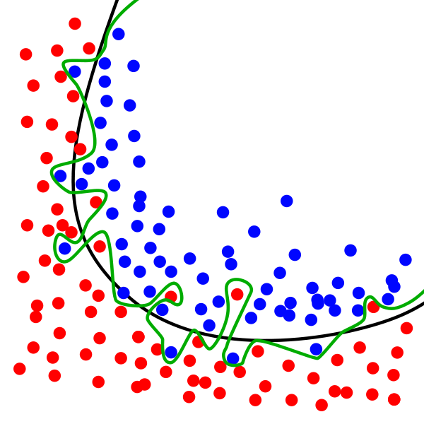

Dimensionality Reduction
========================

Guest Lecture by Professor **Anders Hast**  

* Distinguished University Teacher, InfraVis, UU Node
* Research page: `andershast.com <https://andershast.com>`_
* email: anders.hast@it.uu.se
* InfraVis: `infravis.se <https://infravis.se>`_

.. questions::

    - How and why dimensionality reduction is an important tool?

.. objectives::

    - We will look at tools for visualising what cannot easily be seen, i.e. high dimensionality reduction  
    - Share insights and experience from Anders's own research

visualisation <--> Science
--------------------------

.. figure:: ../img/varanoi.png
    :width: 300px
    :align: right
    :alt: varanoi_regions

    Clustering

    
    Decision boundary

    

* We will look at tools for visualising what cannot easily be seen, i.e. high dimensionality reduction
* We will also see that you can make discoveries in your visualisations!

What is a typical machine learning task?
--------------------------------------

* Differ between different classes of features
* Features usually have more than 3 dimensions, hundreds or even thousands!
* The idea is to find a separating curve in high dimensional space
* Usually we visualise this in 2D since it is easier to understand!
* We will look at several techniques to do this!
* If we can separate in 2D it can often be done in High dimensional space and vice versa!

**Dimensionality reduction:**  

* Project from several dimensions to fewer, often 2D or 3D
* Remember: we get a distorted picture of the high dimensional space!
* Some techniques
    * SOM
    * PCA
    * t-SNE
    * UMAP

.. raw:: html

   

Some Dimensionality Reduction Techniques:
--------------------------------------------

PCA (on Iris Data)
^^^^^^^^^^^^^^^^^^^

* PCA = “find the directions where the data varies the most.”
* PCA finds a new coordinate system that fits the data:
* The first axis (1st principal component) points where the data spreads out the most.
* The second axis (2nd principal component) is perpendicular to the first and captures the next largest spread.
* The eigenvectors are the directions of those new axes — the principal components.
* The eigenvalues tell you how much variance (spread) each component captures.
* Fisher's iris data consists of measurements on the sepal length, sepal width, petal length, and petal width for 150 iris specimens.
* There are 50 specimens from each of three species.
* One axis per data element (which ones are discriminant?)
* Follow each individual using the lines

.. admonition:: Iris and its PCA
    :class: dropdown

    .. figure:: ../img/iris_data.png
        :align: center
        :alt: iris_data

    .. raw:: html

        

     
    .. figure:: ../img/iris_pca.png
        :align: center
        :alt: iris_pca

    .. raw:: html

        

     
    .. figure:: ../img/iris_lines.png
        :align: center
        :alt: iris_lines
        

t-SNE
^^^^^^

* A dimensionality-reduction method for visualising high- dimensional data in 2D or 3D
* It keeps similar points close together and dissimilar ones far apart
* Works by turning distances between points into probabilities of being neighbours, both in the original space and in the low-dimensional map
* Then it moves points to make those probabilities match (minimizing KL divergence)
* Uses a Student's t-distribution in 2D to keep clusters separated and avoid crowding

.. admonition:: PCA vs t-SNE vs UMAP
    :class: dropdown

    .. figure:: ../img/pca_example.png
        :align: center
        :alt: pca_example

        PCA

    .. raw:: html

        

    .. figure:: ../img/t-SNE_example.png
        :align: center
        :alt: SNE_example

        t-SNE

    .. raw:: html

        

    .. figure:: ../img/umap.png
        :align: center
        :alt: umap_example

        UMAP

UMAP
^^^^^^

* A nonlinear dimensionality-reduction method, like t-SNE, used to visualize high-dimensional data in 2D or 3D
* Based on manifold theory — it assumes your data lies on a curved surface within a high-dimensional space
* Builds a graph of local relationships (who's close to whom) in the original space, then finds a low-dimensional layout that preserves those relationships

Face Recognition (FR) Use case
--------------------------------

.. admonition:: InfraVis slides on FR
    :class: dropdown

        .. figure:: ../img/face_recognition/Visualise_your_Research_NAISS_page-0012.jpg
            :align: center
        .. figure:: ../img/face_recognition/Visualise_your_Research_NAISS_page-0013.jpg
            :align: center
        .. figure:: ../img/face_recognition/Visualise_your_Research_NAISS_page-0014.jpg
            :align: center
        .. figure:: ../img/face_recognition/Visualise_your_Research_NAISS_page-0015.jpg
            :align: center
        .. figure:: ../img/face_recognition/Visualise_your_Research_NAISS_page-0016.jpg
            :align: center
        .. figure:: ../img/face_recognition/Visualise_your_Research_NAISS_page-0017.jpg
            :align: center
        .. figure:: ../img/face_recognition/Visualise_your_Research_NAISS_page-0018.jpg
            :align: center
        .. figure:: ../img/face_recognition/Visualise_your_Research_NAISS_page-0019.jpg
            :align: center
        .. figure:: ../img/face_recognition/Visualise_your_Research_NAISS_page-0020.jpg
            :align: center
        .. figure:: ../img/face_recognition/Visualise_your_Research_NAISS_page-0021.jpg
            :align: center
        .. figure:: ../img/face_recognition/Visualise_your_Research_NAISS_page-0022.jpg
            :align: center
        .. figure:: ../img/face_recognition/Visualise_your_Research_NAISS_page-0023.jpg
            :align: center
        .. figure:: ../img/face_recognition/Visualise_your_Research_NAISS_page-0024.jpg
            :align: center
        .. figure:: ../img/face_recognition/Visualise_your_Research_NAISS_page-0025.jpg
            :align: center
        .. figure:: ../img/face_recognition/Visualise_your_Research_NAISS_page-0026.jpg
            :align: center
        .. figure:: ../img/face_recognition/Visualise_your_Research_NAISS_page-0027.jpg
            :align: center
        .. figure:: ../img/face_recognition/Visualise_your_Research_NAISS_page-0028.jpg
            :align: center

.. keypoints::

    * We looked at several dimensionality reduction techniques
    * They are useful to be able to explore your high dimensional data!
    * But not only nice pictures
        * Make discoveries!
        * New results!

Exercise
---------

.. challenge::

    You will find a jupyter notebook in the tarball called ``DimRed.ipynb`` (``Exercises/day4/Dim_reduction``), which works upon a face recognition dataset kept in the ``dataset`` folder. 
    Try running the notebook and give the correct dataset path wherever required.
    
    The env required for this notebook is ``pip install numpy matplotlib scikit-learn scipy pillow plotly umap-learn jupyter``

    Sample examples from documentations: https://scikit-learn.org/stable/auto_examples/decomposition/plot_pca_iris.html#sphx-glr-auto-examples-decomposition-plot-pca-iris-py , https://plotly.com/python/t-sne-and-umap-projections/
