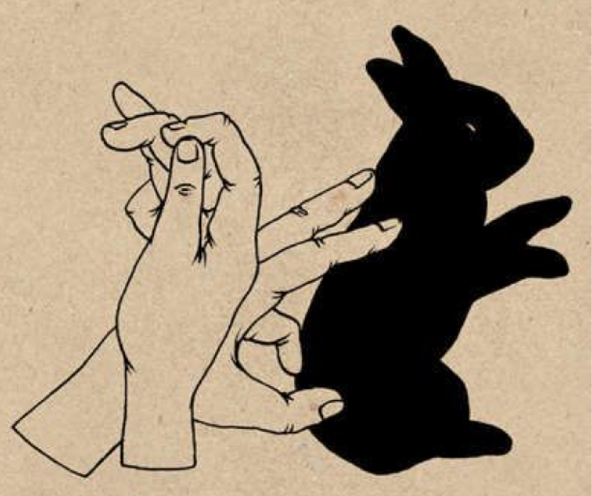

Dimensionality Reduction
========================

.. figure:: ../img/infravis_logo.png
    :align: right
    :alt: infravis_logo

Guest Lecture by Professor **Anders Hast**  

* Distinguished University Teacher, InfraVis, UU Node
* Research page: `andershast.com <https://andershast.com>`_
* email: anders.hast@it.uu.se
* InfraVis: `infravis.se <https://infravis.se>`_

.. questions::

    - How and why dimensionality reduction is an important tool?

.. objectives::

    - We will look at tools for visualising what cannot easily be seen, i.e. high dimensionality reduction  
    - Share insights and experience from Anders's own research

The Essence of Machine Learning: Classification
-------------------------------------------------

    
    Decision boundary

    

How can a model separate the "blue" from the "red"?

Which model is the best, the green curve or the black?

Classification challenges:

* **Black curve**: The model will guess "wrong" sometimes for new data
* **Green curve**: The model will make even more wrong guesses? Why?
    "Outliers" or special cases have too much impact on the classification boundaries.

**Dimensionality reduction:**  

Project from several dimensions to fewer, often 2D or 3D.  

*Remember*: we get a distorted picture of the high dimensional space!

.. raw:: html

   

Some Dimensionality Reduction Techniques:
--------------------------------------------

PCA (on Iris Data)
^^^^^^^^^^^^^^^^^^^

* Fisher's iris data consists of measurements on the sepal length, sepal width, petal length, and petal width for 150 iris specimens. There are 50 specimens from each of three species.
* Pretty good separation of classes
* However PCA often fails for high dimensional data as the clusters will overlap!

.. admonition:: Iris and its PCA
    :class: dropdown

    .. figure:: ../img/iris_data.png
        :align: center
        :alt: iris_data

    .. raw:: html

        

     
    .. figure:: ../img/iris_pca.png
        :align: center
        :alt: iris_pca

        

t-SNE
^^^^^^

* t-distributed stochastic neighbor embedding (t-SNE) is a `statistical <https://en.wikipedia.org/wiki/Statistics>`_ method for visualising high-dimensional data by giving each datapoint a location in a two or three-dimensional map.
* The t-SNE algorithm comprises two main stages.
* First, t-SNE constructs a `probability distribution <https://en.wikipedia.org/wiki/Probability_distribution>`_ over pairs of high-dimensional objects in such a way that similar objects are assigned a higher probability while dissimilar points are assigned a lower probability.
* Second, t-SNE de nes a similar probability distribution over the points in the low-dimensional map, and it minimises the `Kullback–Leibler divergence <https://en.wikipedia.org/wiki/Kullback%E2%80%93Leibler_divergence>`_ between the two distributions with respect to the locations of the points in the map.

.. admonition:: PCA vs t-SNE vs HOG
    :class: dropdown

    .. figure:: ../img/pca_example.png
        :align: center
        :alt: pca_example

        PCA

    .. raw:: html

        

    .. figure:: ../img/t-SNE_example.png
        :align: center
        :alt: SNE_example

        t-SNE

    .. raw:: html

        

    .. figure:: ../img/hog_tnse_example.png
        :align: center
        :alt: pca_exhog_tnse_exampleample

        HOG & t-SNE

UMAP
^^^^^^

* Uniform manifold approximation and projection (UMAP) is a nonlinear dimensionality reduction technique.
* Visually, it is similar to t-SNE, but it assumes that the data is uniformly distributed on a `locally connected Riemannian manifold <https://en.wikipedia.org/wiki/Riemannian_manifold>`_ and that the `Riemannian metric <https://en.wikipedia.org/wiki/Riemannian_manifold#Riemannian_metrics_and_Riemannian_manifolds>`_ is locally constant or approximately locally constant.
* UMAP is newer and therefore preferred by many.
* However tends to separate clusters better! But is that always better?

Face Recognition (FR) Use case
--------------------------------

.. admonition:: InfraVis slides on FR
    :class: dropdown

    .. figure:: ../img/face_recognition/fr_1.jpg
        :align: center
    .. figure:: ../img/face_recognition/fr_2.jpg
        :align: center
    .. figure:: ../img/face_recognition/fr_3.jpg
        :align: center
    .. figure:: ../img/face_recognition/fr_4.jpg
        :align: center
    .. figure:: ../img/face_recognition/fr_5.jpg
        :align: center
    .. figure:: ../img/face_recognition/fr_6.jpg
        :align: center
    .. figure:: ../img/face_recognition/fr_7.jpg
        :align: center
    .. figure:: ../img/face_recognition/fr_8.jpg
        :align: center

.. keypoints::

  * Dimensionality reduction techniques are useful to be able to **explore** your high dimensional data!
  * But not only nice pictures
        * Make **discoveries**!
        * New **results**!
        * Use visualisation and clustering for classification

Exercise
---------

.. challenge::

    You will find a jupyter notebook in the tarball called ``DimRed.ipynb`` (``Exercises/day4/Dim_reduction``), which works upon a face recognition dataset kept in the ``dataset`` folder. 
    Try running the notebook and give the correct dataset path wherever required.
    
    The env required for this notebook is ``pip install numpy matplotlib scikit-learn scipy pillow plotly umap-learn``
