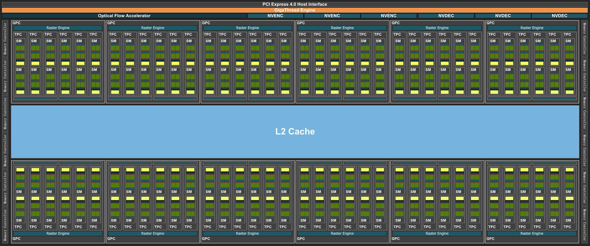

Using GPUs with Python
======================

.. questions::

   - What is GPU acceleration?
   - How to enable GPUs (for instance with CUDA) in Python code?
   - How to deploy GPUs at HPC2N, UPPMAX, LUNARC, NSC, PDC and C3SE?
   
   

.. objectives::

   - Get an intro to common schemes for GPU code acceleration
   - Learn about the GPU nodes at HPC2N, UPPMAX, LUNARC, NSC, PDC, and C3SE
   - Learn how to make a batch script asking for GPU nodes at HPC2N, UPPMAX, LUNARC, NSC, PDC, and C3SE 

Introduction
------------ 
   
In order to understand the capabilities of a GPU, it is instructive to compare a pure CPU architecture with a GPU based architecture. Here, there is a schemematics of the former:

.. figure:: ../img/AMD-Zen4-CPU-b-cn1701.png
   :align: center

   Pure CPU architecture (single node). In the present case there are 256 cores, each with its own cache memory (LX). There is a shared memory (~378 GB/NUMA node) for all these cores. This is an AMD Zen4 node. 
   The base frequency is 2.25 GHz, but it can boost up to 3.1 GHz. 

As for the GPU architecture, a GPU card of type Ada Lovelace (like the L40s) looks like this:

   Note: The AD102 GPU also includes 288 FP64 Cores (2 per SM) which are not depicted in the above diagram. The FP64 TFLOP rate is 1/64th the TFLOP rate of FP32 operations. The small number of FP64 Cores are included to ensure any programs with FP64 code operate correctly, including FP64 Tensor Core code. 
   This is a single GPU engine of a L40s card. There are 12 Graphics Processing Clusters (GPCs), 72 Texture Processing Clusters (TPCs), 144 Streaming Multiprocessors (SMs), and a 384-bit memory interface with 12 32-bit memory controllers).
   On the diagram, each green dot represents a CUDA core (single precision), while the yellow are RT cores and the blue Tensor cores. The cores are arranged in the slots called SMs in the figure. Cores in the same SM share some local and fast cache memory.

.. figure:: ../img/GPC-with-raster-engine.png
   :align: center
   :width: 450 

   The GPC is the dominant high-level hardware block. Each GPC includes a dedicated Raster Engine, two Raster Operations (ROPs) partitions, with each partition containing eight individual ROP units, and six TPCs. Each TPC includes one PolyMorph Engine and two SMs. 
   Each SM contain 128 CUDA Cores, one Ada Third-Generation RT Core, four Ada Fourth-Generation Tensor Cores, four Texture Units, a 256 KB Register File, and 128 KB of L1/Shared Memory, which can be configured for different memory sizes depending on the needs of the graphics or compute workload.

In a typical cluster, some GPUs are attached to a single node resulting in a CPU-GPU hybrid architecture. The CPU component is called the host and the GPU part the device.
One possible layout (Kebnekaise, AMD Zen4 node with L40s GPU) is as follows:

.. figure:: ../img/AMD-Zen4-GPU-1605.png 
   :align: center

   Schematics of a hybrid CPU-GPU architecture. A GPU L40s card is attached to a NUMA island which in turn contains 24 cores (AMD Zen4 CPU node with 48 cores total). The NUMA island and the GPUs are connected through a PCI-E interconnect which makes the data transfer between both components rather slow.

We can characterize the CPU and GPU performance with two quantities: the **latency** and the **througput**.

- **Latency** refers to the time spent in a sole computation. 
- **Throughput** denotes the number of computations that can be performed in parallel. Then, we can say that a CPU has low latency (able to do fast computations) but low throughput (only a few computations simultaneously).

In the case of GPUs, the latency is high and the throughput is also high. We can visualize the behavior of the CPUs and GPUs with cars as in the figure below. A CPU would be compact road where only a few racing cars can drive whereas a GPU would be a broader road where plenty of slow cars can drive.

.. figure:: ../img/cpu-gpu-highway.png
   :align: center

   Cars and roads analogy for the CPU and GPU behavior. The compact road is analogous to the CPU (low latency, low throughput) and the broader road is analogous to the GPU (high latency, high throughput).

Not every Python program is suitable for GPU acceleration. GPUs process simple functions rapidly, and are best suited for repetitive and highly-parallel computing tasks. GPUs were originally designed to render high-resolution images and video concurrently and fast, but since they can perform parallel operations on multiple sets of data, they are also often used for other, non-graphical tasks. Common uses are machine learning and scientific computation were the GPUs can take advantage of massive parallelism. 

Many Python packages are not CUDA aware, but some have been written specifically with GPUs in mind. 
If you are usually working with for instance NumPy and SciPy, you could optimize your code for GPU computing by using CuPy which mimics most of the NumPy functions. Another option is using Numba, which has bindings to CUDA and lets you write CUDA kernels in Python yourself. This means you can use custom algorithms. This is for NVidia GPUs. On AMD GPUs you would use HIP. 

One of the most common use of GPUs with Python is for machine learning or deep learning. For these cases you would use something like Tensorflow or PyTorch libraries which can handle CPU and GPU processing internally without the programmer needing to do so. We will talk more about that later in the course. 

GPUs on UPPMAX, HPC2N, LUNARC, NSC, PDC, and C3SE systems
---------------------------------------------------------

There are generally either not GPUs on the login nodes or they cannot be accessed for computations.
To use them you need to either launch an interactive job or submit a batch job.

.. tabs::

   .. tab:: UPPMAX

      The new cluster Pelle has GPUs. L40s GPUs (up to 10 GPU cards) and H100 GPUs (up to 2 GPU cards).

      You need to use this batch command (number of cards is depending on type):

      - for L40s GPUs (up to 10 GPU cards): 

      .. code-block::
 
         #SBATCH -p gpu 
         #SBATCH --gpus=l40s:<number of GPUs>

      - for H100 GPUs (up to 2 GPU cards): 

      .. code-block:: 

         #SBATCH -p gpu
         #SBATCH --gpus=h100:<number of GPUs>

   .. tab:: HPC2N

      Kebnekaise's GPU nodes are considered a separate resource, and the regular compute nodes do not have GPUs.

      Kebnekaise has a great many different types of GPUs:

      - V100 (2 cards/node)
      - A40 (8 cards/node)
      - A6000 (2 cards/node)
      - L40s (2 or 6 cards/node)
      - A100 (2 cards/node)
      - H100 (4 cards/node)
      - MI100 (2 cards/node)

      To access them, you need to use this to use the batch system:

      ``#SBATCH --gpus=x``

      where x is the number of GPU cards you want. Above are given how many are on each type, so you can ask for up to that number.

      In addition, you need to add this to use the batch system:

      ``#SBATCH -C <type>``

      where type is

      - v100
      - a40
      - a6000
      - l40s
      - a100
      - h100
      - mi100

      For more information, see HPC2N's guide to the different parts of the batch system: https://docs.hpc2n.umu.se/documentation/batchsystem/resources/

   .. tab:: LUNARC 

      LUNARC has Nvidia A100 GPUs and Nvidia A40 GPUs, but the latter ones are reserved for interactive graphics work on the on-demand system, and Slurm jobs should not be submitted to them.

      Thus in order to use the A100 GPUs on Cosmos, add this to your batch script:

      A100 GPUs on AMD nodes:

      .. code-block::
  
         #SBATCH -p gpua100
         #SBATCH --gres=gpu:1

      These nodes are configured as exclusive access and will not be shared between users. User projects will be charged for the entire node (48 cores). A job on a node will also have access to all memory on the node.

      A100 GPUs on Intel nodes:

      .. code-block::

         #SBATCH -p gpua100i
         #SBATCH --gres=gpu:<number>

      where ``<number>`` is 1 or 2 (Two of the nodes have 1 GPU and two have 2 GPUs).

   .. tab:: NSC

      Tetralith has Nvidia T4 GPUs. In order to access them, add this to your batch script or interactive job: 

      .. code-block:: 

         #SBATCH -n 1 
         #SBATCH -c 32 
         #SBATCH --gpus-per-task=1

   .. tab:: PDC 

      Dardel has 4 AMD Instinct™ MI250X á 2 GCDs per node. 

      You need to add this to your batch script or interactive job in order to access them: 

      .. code-block:: 

         #SBATCH -N 1
         #SBATCH --ntasks-per-node=1
         #SBATCH -p gpu

   .. tab:: C3SE

      Alvis is meant for GPU jobs. 
      There is no node-sharing on multi-node jobs (``--exclusive`` is automatic).

      NOTE: Requesting ``-N 1`` does not mean 1 full node

      You would need to add this to your batch script:

      .. code-block:: 

         #SBATCH -p alvis
         #SBATCH -N <nodes>
         #SBATCH --gpus-per-node=<type>:x

      where <type> is one of

      - V100
      - T4
      - A100

      and x is number of GPU cards

      - 1-4 for V100
      - 1-8 for T4
      - 1-4 for A100

Numba example
-------------

Numba is installed on some of the centers as a module (HPC2N, LUNARC, and C3SE). For UPPMAX and NSC we'll use virtual environments. 

.. admonition NOTE

   PDC/Dardel has AMD GPUs and numba after version 0.53.1 only has compatibility with CUDA. The numba 0.53.1 version is too old to work with anything else installed. 
   
   Thus, no numba example for PDC. You can try and play around with the hip example (marked with hip in the name) in the Exercises/examples/programs folder. There is also an example batch scripts for GPUs on Dardel in the Exercises/examples/pdc folder, which you can try with. 
   
   Note that you need to install ``hip-python`` in a virtual environment to get any of it to work. 

We are going to use the following program for testing on the machines (minus Dardel). It was taken from a (now absent) linuxhint.com exercise but there are also many great examples at 
https://numba.readthedocs.io/en/stable/cuda/examples.html): 

.. admonition:: Python example ``add-list.py`` using Numba 
    :class: dropdown
   
        .. code-block:: python
        
             import numpy as np
             from timeit import default_timer as timer
             from numba import vectorize
             
             # This should be a substantially high value.
             NUM_ELEMENTS = 100000000
             
             # This is the CPU version.
             def vector_add_cpu(a, b):
               c = np.zeros(NUM_ELEMENTS, dtype=np.float32)
               for i in range(NUM_ELEMENTS):
                   c[i] = a[i] + b[i]
               return c
               
             # This is the GPU version. Note the @vectorize decorator. This tells
             # numba to turn this into a GPU vectorized function.
             @vectorize(["float32(float32, float32)"], target='cuda')
             def vector_add_gpu(a, b):
               return a + b;
 
             def main():
               a_source = np.ones(NUM_ELEMENTS, dtype=np.float32)
               b_source = np.ones(NUM_ELEMENTS, dtype=np.float32)
               
               # Time the CPU function
               start = timer()
               vector_add_cpu(a_source, b_source)
               vector_add_cpu_time = timer() - start
 
               # Time the GPU function
               start = timer()
               vector_add_gpu(a_source, b_source)
               vector_add_gpu_time = timer() - start
 
               # Report times
               print("CPU function took %f seconds." % vector_add_cpu_time)
               print("GPU function took %f seconds." % vector_add_gpu_time)
              
               return 0
 
             if __name__ == "__main__":
               main()
                 
As before, we need a batch script to run the code. There are no GPUs on the login node and even if there were we should not run long/heavy jobs there. 

**Note** Type along! 

.. tabs::

   .. tab:: UPPMAX

      Running a GPU Python code interactively on Pelle. 

      .. code-block:: console
      
         $[bbrydsoe@pelle2 ~] salloc -A uppmax2025-2-393 -t 00:30:00 -n 2 -p gpu --gpus=l40s:1
         salloc: Pending job allocation 406444
         salloc: job 406444 queued and waiting for resources
         salloc: job 406444 has been allocated resources
         salloc: Granted job allocation 406444
         salloc: Waiting for resource configuration
         salloc: Nodes p202 are ready for job
         [bbrydsoe@p202 ~]$ module load Python/3.13.5 foss/2025b CUDA/13.0.2
         [bbrydsoe@p202 ~]$ source /sw/arch/local/software/python/venvs/numba-gpu/bin/activate
         [bbrydsoe@p202 ~]$ python add-list.py
         CPU function took 17.475140 seconds.
         GPU function took 0.134774 seconds.          

   .. tab:: UPPMAX (batch)

      Running a GPU Python code on Pelle.  

      .. code-block:: console
      
         #!/bin/bash
         # Remember to change this to your own project ID after the course!
         #SBATCH -A uppmax2025-2-393 
         # We are asking for 5 minutes
         #SBATCH --time=00:05:00
         # Asking for one L40s GPU
         #SBATCH -p gpu
         #SBATCH --gpus=l40s:1

         module load Python/3.13.5 foss/2025b CUDA/13.0.2
         source /sw/arch/local/software/python/venvs/numba-gpu/bin/activate
         
         python add-list.py

         
   .. tab:: HPC2N
   
      Running a GPU Python code interactively. 

      .. code-block:: console

         $ salloc -A hpc2n2025-151 --time=00:30:00 -n 1 --gpus=1 -C l40s 
         salloc: Pending job allocation 32126787
         salloc: job 32126787 queued and waiting for resources
         salloc: job 32126787 has been allocated resources
         salloc: Granted job allocation 32126787
         salloc: Waiting for resource configuration
         salloc: Nodes b-cn1606 are ready for job
         $ module load GCC/12.3.0 Python/3.11.3 OpenMPI/4.1.5 SciPy-bundle/2023.07 CUDA/12.1.1 numba/0.58.1
         $ srun python add-list.py 
         CPU function took 14.216318 seconds.
         GPU function took 0.390335 seconds.

   .. tab:: HPC2N (batch)

      Batch script, ``add-list.sh``, to run the same GPU Python script (the numba code, ``add-list.py``) at Kebnekaise. 
      As before, submit with ``sbatch add-list.sh`` (assuming you called the batch script thus - change to fit your own naming style). 
      
      .. code-block:: bash

          #!/bin/bash
          # Remember to change this to your own project ID after the course!
          #SBATCH -A hpc2n2025-151     # HPC2N ID - change to your own
          # We are asking for 5 minutes
          #SBATCH --time=00:05:00
          #SBATCH -n 1 
          # Asking for one L40s GPU
          #SBATCH --gpus=1    
          #SBATCH -C l40s 

          # Remove any loaded modules and load the ones we need
          module purge  > /dev/null 2>&1
          module load GCC/12.3.0 Python/3.11.3 OpenMPI/4.1.5 SciPy-bundle/2023.07 CUDA/12.1.1 numba/0.58.1 

          # Run your Python script
          python add-list.py

   .. tab:: LUNARC (batch)

      Batch script, "add-list.sh", to run the same GPU Python script (the numba code, "add-list.py") at Cosmos. As before, submit with "sbatch add-list.sh" (assuming you called the batch script thus - change to fit your own naming style).

      .. code-block:: console

         #!/bin/bash
         # Remember to change this to your own project ID after the course!
         #SBATCH -A lu2025-7-106 
         # We are asking for 5 minutes
         #SBATCH --time=00:05:00
         #SBATCH --ntasks-per-node=1
         # Asking for one A100 GPU
         #SBATCH -p gpua100
         #SBATCH --gres=gpu:1    

         # Remove any loaded modules and load the ones we need
         module purge  > /dev/null 2>&1
         module load GCC/12.3.0  Python/3.11.3 OpenMPI/4.1.5 numba/0.58.1 SciPy-bundle/2023.07 CUDA/12.1.1 

         # Run your Python script
         python add-list.py

   .. tab:: C3SE (batch)

      Batch script, "add-list.sh", to run the same GPU Python script (the numba code, "add-list.py") at Alvis. As before, submit with "sbatch add-list.sh" (assuming you called the batch script thus - change to fit your own naming style). 

      .. code-block:: 

         #!/bin/bash
         # Remember to change this to your own project ID after the course!
         #SBATCH -A naiss2025-22-934
         # We are asking for 10 minutes
         #SBATCH -t 00:10:00
         #SBATCH -p alvis
         #SBATCH -N 1 --gpus-per-node=T4:2
         # Writing output and error files
         #SBATCH --output=output%J.out
         #SBATCH --error=error%J.error
   
         # Load any needed GPU modules and any prerequisites - on Alvis this module loads all 
         ml purge > /dev/null 2>&1
         module load numba-cuda/0.20.0-foss-2025b-CUDA-12.9.1
         python add-list.py 

   .. tab:: NSC: batch 

      Batch script, "add-list.sh", to run the same GPU Python script (the numba code, "add-list.py") at Tetralith. As before, submit with "sbatch add-list.sh" (assuming you called the batch script thus - change to fit your own naming style). 

      .. code-block:: 

         #!/bin/bash
         # Remember to change this to your own project ID after the course!
         #SBATCH -A naiss2025-22-934
         # We are asking for 5 minutes
         #SBATCH --time=00:05:00
         #SBATCH -n 1 
         #SBATCH -c 32 
         #SBATCH --gpus-per-task=1
      
         # Remove any loaded modules and load the ones we need
         module purge  > /dev/null 2>&1
         module load buildenv-gcccuda/12.9.1-gcc11-hpc1 Python/3.11.5-env-hpc1-gcc-2023b-eb

         # The above modules should have numba. If it does not work, install numba yourself
         # or load a virtual environment where numba is installed
         # This is the steps to create it and then load:
         # ml buildenv-gcccuda/12.9.1-gcc11-hpc1 Python/3.11.5-bare-hpc1-gcc-2023b-eb
         # python -m venv mynumba
         # source mynumba/bin/activate
         # pip install numba
         #
         # source <path-to>/mynumba/bin/activate

         # Run your Python script 
         python add-list.py 

         ERROR! 

Exercises
---------

.. challenge:: Integration 2D with Numba

   An initial implementation of the 2D integration problem with the CUDA support for Numba could be as follows:

   .. admonition:: ``integration2d_gpu.py``
      :class: dropdown

      .. code-block:: python

         from __future__ import division
         from numba import cuda, float32
         import numpy
         import math
         from time import perf_counter
         
         # grid size
         n = 100*1024
         threadsPerBlock = 16
         blocksPerGrid = int((n+threadsPerBlock-1)/threadsPerBlock)
         
         # interval size (same for X and Y)
         h = math.pi / float(n)
         
         @cuda.jit
         def dotprod(C):
             tid = cuda.threadIdx.x + cuda.blockIdx.x * cuda.blockDim.x 
         
             if tid >= n:
                 return
         
             #cummulative variable
             mysum = 0.0
             # fine-grain integration in the X axis
             x = h * (tid + 0.5)
             # regular integration in the Y axis
             for j in range(n):
                 y = h * (j + 0.5)
                 mysum += math.sin(x + y)
         
             C[tid] = mysum
         
         
         # array for collecting partial sums on the device
         C_global_mem = cuda.device_array((n),dtype=numpy.float32)
         
         starttime = perf_counter()
         dotprod[blocksPerGrid,threadsPerBlock](C_global_mem)
         res = C_global_mem.copy_to_host()
         integral = h**2 * sum(res)
         endtime = perf_counter()
         
         print("Integral value is %e, Error is %e" % (integral, abs(integral - 0.0)))
         print("Time spent: %.2f sec" % (endtime-starttime))

   Notice the larger size of the grid in the present case (100*1024) compared to the serial case's size we used previously (10000). Large computations are necessary on the GPUs to get the benefits of this architecture. 

   One can take advantage of the shared memory in a thread block to write faster code. Here, we wrote the 2D integration example from the previous section where threads in a block write on a `shared[]` array. Then, this array is reduced (values added) and the output is collected in the array ``C``. The entire code is here:

   .. admonition:: ``integration2d_gpu_shared.py``
      :class: dropdown

      .. code-block:: python

         from __future__ import division
         from numba import cuda, float32
         import numpy
         import math
         from time import perf_counter
         
         # grid size
         n = 100*1024
         threadsPerBlock = 16
         blocksPerGrid = int((n+threadsPerBlock-1)/threadsPerBlock)
         
         # interval size (same for X and Y)
         h = math.pi / float(n)
         
         @cuda.jit
         def dotprod(C):
             # using the shared memory in the thread block
             shared = cuda.shared.array(shape=(threadsPerBlock), dtype=float32) 
         
             tid = cuda.threadIdx.x + cuda.blockIdx.x * cuda.blockDim.x 
             shrIndx = cuda.threadIdx.x
         
             if tid >= n:
                 return
         
             #cummulative variable
             mysum = 0.0
             # fine-grain integration in the X axis
             x = h * (tid + 0.5)
             # regular integration in the Y axis
             for j in range(n):
                 y = h * (j + 0.5)
                 mysum += math.sin(x + y)
         
             shared[shrIndx] = mysum
         
             cuda.syncthreads()
         
             # reduction for the whole thread block
             s = 1
             while s < cuda.blockDim.x:
                 if shrIndx % (2*s) == 0:
                     shared[shrIndx] += shared[shrIndx + s]
                 s *= 2
                 cuda.syncthreads()
             # collecting the reduced value in the C array
             if shrIndx == 0:
                 C[cuda.blockIdx.x] = shared[0]
         
         # array for collecting partial sums on the device
         C_global_mem = cuda.device_array((blocksPerGrid),dtype=numpy.float32)
         
         starttime = perf_counter()
         dotprod[blocksPerGrid,threadsPerBlock](C_global_mem)
         res = C_global_mem.copy_to_host()
         integral = h**2 * sum(res)
         endtime = perf_counter()
         
         print("Integral value is %e, Error is %e" % (integral, abs(integral - 0.0)))
         print("Time spent: %.2f sec" % (endtime-starttime))

   Prepare a batch script to run these two versions of the integration 2D with Numba support and monitor the timings for both cases.

.. solution:: Solution for HPC2N
    :class: dropdown

     A template for running the python codes at HPC2N is here:

     .. admonition:: ``job-gpu.sh``
        :class: dropdown
      
         .. code-block:: bash 

            #!/bin/bash
            # Remember to change this to your own project ID after the course!
            #SBATCH -A hpc2n2025-151
            #SBATCH -t 00:08:00
            #SBATCH -N 1
            #SBATCH -n 24
            #SBATCH -o output_%j.out   # output file
            #SBATCH -e error_%j.err    # error messages
            #SBATCH --gpus=1
            #SBATCH -C l40s 
            #SBATCH --exclusive 
    
            ml purge > /dev/null 2>&1
            ml GCC/12.3.0 Python/3.11.3 OpenMPI/4.1.5 SciPy-bundle/2023.07 CUDA/12.1.1 numba/0.58.1  
            python integration2d_gpu.py
            python integration2d_gpu_shared.py

     For the ``integration2d_gpu.py`` implementation, the time for executing the kernel and doing some postprocessing to the outputs (copying the C array and doing a reduction) was 4.35 sec. which is a much smaller value than the time for the serial numba code of 152 sec obtained previously. 

     The simulation time for the ``integration2d_shared.py`` implementation was 1.87 sec. by using the shared memory trick. 

.. solution:: Solution for UPPMAX
    :class: dropdown

     A template for running the python codes at UPPMAX is here:

     .. admonition:: ``job-gpu.sh``
        :class: dropdown
      
         .. code-block:: bash 

            #!/bin/bash
            # Remember to change this to your own project ID after the course!
            #SBATCH -A uppmax2025-2-393
            # We are asking for 10 minutes
            #SBATCH --time=00:10:00
            # Asking for one GPU
            #SBATCH -p gpu
            #SBATCH --gpus=l40s:1
            #SBATCH -o output_%j.out   # output file
            #SBATCH -e error_%j.err    # error messages

            # Remove any loaded modules and load the ones we need
            ml purge > /dev/null 2>&1
            module load Python/3.13.5 foss/2025b CUDA/13.0.2 
            source /sw/arch/local/software/python/venvs/numba-gpu/bin/activate 

            # Run your Python script

            python integration2d_gpu.py
            python integration2d_gpu_shared.py

.. solution:: Solution for LUNARC
    :class: dropdown

     A template for running the python codes at LUNARC is here:

     .. admonition:: ``job-gpu.sh``
        :class: dropdown
      
         .. code-block:: bash 

            #!/bin/bash
            # Remember to change this to your own project ID after the course!
            #SBATCH -A lu2025-7-106
            #SBATCH -t 00:15:00
            #SBATCH -n 24
            #SBATCH -o output_%j.out   # output file
            #SBATCH -e error_%j.err    # error messages
            #SBATCH --ntasks-per-node=1
            #SBATCH -p gpua100
            #SBATCH --gres=gpu:1
            #SBATCH --exclusive

            ml purge > /dev/null 2>&1
            module load GCC/12.2.0  OpenMPI/4.1.4 Python/3.10.8 SciPy-bundle/2023.02 CUDA/12.1.1 numba/0.58.0

            python integration2d_gpu.py
            python integration2d_gpu_shared.py

.. solution:: Solution for NSC
    :class: dropdown

     A template for running the python codes at NSC is here:

     .. admonition:: ``job-gpu.sh``
        :class: dropdown
      
         .. code-block:: bash 

            #!/bin/bash
            # Remember to change this to your own project ID after the course!
            #SBATCH -A naiss2025-22-934
            #SBATCH -t 00:20:00
            #SBATCH -n 24
            #SBATCH --gpus-per-task=1
            #SBATCH -o output_%j.out   # output file
            #SBATCH -e error_%j.err    # error messages
            #SBATCH --exclusive

            ml purge > /dev/null 2>&1
            ml load buildtool-easybuild/4.8.0-hpce082752a2 GCC/13.2.0
            ml load Python/3.11.5 SciPy-bundle/2023.11 JupyterLab/4.2.0

            # Load a virtual environment where numba is installed
            # or you can create it with the following steps:
            # ml buildtool-easybuild/4.8.0-hpce082752a2 GCC/13.2.0 Python/3.11.5 SciPy-bundle/2023.11 JupyterLab/4.2.0
            # python -m venv mynumba
            # source mynumba/bin/activate
            # pip install numba
            # pip install tensorflow
            #
            source <path-to>/mynumba/bin/activate

            python integration2d_gpu.py
            python integration2d_gpu_shared.py

.. solution:: Solution for C3SE
    :class: dropdown

     A template for running the python codes at C3SE is here:

     .. admonition:: ``job-gpu.sh``
        :class: dropdown
      
         .. code-block:: bash 

            #!/bin/bash
            # Remember to change this to your own project ID!
            #SBATCH -A naiss2025-22-934
            #SBATCH -t 00:15:00
            #SBATCH -p alvis
            #SBATCH -N 1 --gpus-per-node=T4:4
            #SBATCH -o output_%j.out   # output file
            #SBATCH -e error_%j.err    # error messages

            ml purge > /dev/null 2>&1
            ml numba-cuda/0.20.0-foss-2025b-CUDA-12.9.1

            python integration2d_gpu.py
            python integration2d_gpu_shared.py

.. keypoints::

   -  You deploy GPU nodes via SLURM, either in interactive mode or batch
   -  In Python the numba package is handy
  
.. important::

   - Of course, interactive mode could also be from inside Desktop on Demand, Jupyter, VScode, spyder ... 
   - CUDA does not work directly on AMD GPUs, there hip is used instead. 
   - We will use GPUs more in the ML/DL section! 

Additional information
----------------------
         
* `Numba documentation examples <https://numba.readthedocs.io/en/stable/cuda/examples.html>`_
* `New York University CUDA/Numba lesson  <https://nyu-cds.github.io/python-numba/05-cuda/>`_
* Hands-On GPU Programming with Python and CUDA : Explore High-Performance Parallel Computing with CUDA, Brian Tuomanen. Packt publishing.
* Parallel and High Performance Computing, Robert Robey and Yuliana Zamora. Manning publishing.
