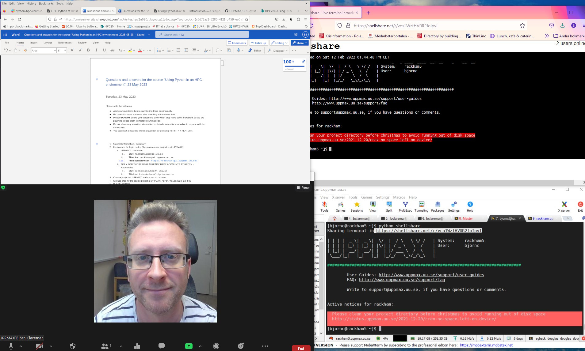

.. Python-at-UPPMAX documentation master file, created by
   sphinx-quickstart on Fri Jan 21 18:24:04 2022.
   You can adapt this file completely to your liking, but it should at least
   contain the root `toctree` directive.
   
Welcome to HPC python course material
=====================================

.. admonition:: This material
   
   Here you will find the content of the workshop Using Python in an HPC environment.
   
   - Documentation at the HPC centres UPPMAX and HPC2N
      - UPPMAX: https://www.uppmax.uu.se/support/user-guides/python-user-guide/
      - HPC2N: https://www.hpc2n.umu.se/resources/software/user_installed/python

.. admonition:: Content

   - This course aims to give a brief, but comprehensive introduction to using Python in an HPC environment.
   - You will learn how to
      - use modules to load Python
      - find site installed Python packages
      - install packages yourself
      - use virtual environments, 
      - write a batch script for running Python
      - use Python in parallel
      - how to use Python for ML and on GPUs. 
   - This course will consist of lectures interspersed with hands-on sessions where you get to try out what you have just learned.    

.. admonition:: Cluster-specific approaches

   - The course is a cooperation between UPPMAX (Rackham, Snowy, Bianca) and HPC2N (Kebnekaise). The main focus will be on UPPMAX's systems, but Kebnekaise will be included as well.  
   - In most cases there is little or no difference between UPPMAX's systems and HPC2N's systems, except naming of modules and such. We will mention (and cover briefly) instances when there are larger differences.  

Some practicals
----------------
        
.. admonition:: Zoom

    - You should have gotten an email with the links    
    - Main room for lectures (recorded)
    - Breakout rooms
      - exercises, including a silent room for those who just want to work on their own without interruptions. 
      - help
    - The **lectures and demos will be recorded**, but **NOT the exercises**. 
      - If you ask questions during the lectures, you may thus be recorded. 
      - If you do not wish to be recorded, then please keep your microphone muted and your camera off during lectures and write your questions in the Q/A document (see more information below about the collaboration documents which are also listed above).
    - Use your REAL NAME.
    - Please MUTE your microphone when you are not speaking
    - Use the “Raise hand” functionality under the “Participants” window during the lecture. 
    - Please do not clutter the Zoom chat. 
    - Behave politely!
    
.. admonition:: Q/A collabration document

    - Use the Q/A page for the workshop with your questions.
        - https://umeauniversity.sharepoint.com/:w:/s/HPC2N630/EaIq18aFUiFBtFnuCjRz5OUBZvzB4sLn9saaU7aTRvyUFA?e=TYSq8H

    - Depending on how many helpers there are we'll see how fast there are answers. 
        - Some answers may come after the workshop.
 
    - Create a new line for new questions. Take care if others are editing at the same time. 

.. admonition:: Exercises

    - You can download the exercises from the course GitHub repo, under the "Exercises" directory: https://github.com/UPPMAX/HPC-python/tree/main/Exercises 
    - On HPC2N, you can copy the exercises in a tarball from ``/proj/nobackup/hpc2n2023-089/TBC``
    - On UPPMAX you can copy the exercises in a tarball from ``/proj/naiss2023-22-500/TBC`` 
    
.. admonition:: **Your expectations?**
   
    - Find best practices for using Python at an HPC centre
    - Learn how to use and install packages
    - Use the HPC capabilities of Python

    
    **Not covered**
    
    - Improve python *coding* skills 
    - Specifics of other clusters

.. warning::

    - It is good to have a familiarity with the LINUX command line. 
    - Short introductions : https://uppsala.instructure.com/courses/67267/pages/using-the-command-line-bash?module_item_id=455632
    - Linux "cheat sheet": https://www.hpc2n.umu.se/documentation/guides/linux-cheat-sheet
    - UPPMAX software library: https://uppsala.instructure.com/courses/67267/pages/uppmax-basics-software?module_item_id=455641
    - Whole intro course material (UPPMAX): https://www.uppmax.uu.se/support/courses-and-workshops/introductory-course-winter-2022/
    - HPC2N's intro course material (including link to recordings): https://github.com/hpc2n/intro-course

.. admonition:: Prepare your environment now!
  
   - Please log in to Rackham, Kebnekaise or other cluster that you are using.

    
.. tabs::

   .. tab:: UPPMAX

      - Rackham: ``ssh <user>@rackham.uppmax.uu.se`` 
      
      - Rackham through ThinLinc, use: ``<user>@rackham-gui.uppmax.uu.se``
      - Create a working directory where you can code along. We recommend creating it under the course project storage directory
   
         
      - Example. If your username is "mrspock" and you are at UPPMAX, this we recommend you create this folder: 
     
         /proj/naiss2023-22-500/mrspock/pythonUPPMAX

   .. tab:: HPC2N

      - Kebnekaise: ``<user>@kebnekaise.hpc2n.umu.se``     
      - Kebnekaise through ThinLinc, use: ``<user>@kebnekaise-tl.hpc2n.umu.se``
   
      - Create a working directory where you can code along. We recommend creating it under the course project storage directory
   
       - Example. If your username is bbrydsoe and you are at HPC2N, then we recommend you create this folder: 
     
         /proj/nobackup/hpc2n2023-089/bbrydsoe/pythonHPC2N
         
.. admonition:: Use Thinlinc or terminal?

   - It is up to you!
   - Graphics come easier with Thinlinc
   - For this course, when having many windows open, it may be better to run in terminal, for space issues.
   
   
Example of arrangement for the "worst case"!
############################################
- Q/A document
- ZOOM view
- (shellshare) or web browser (HackMD - https://uppmax.github.io/HPC-python/index.html) with course material
- your own terminal

Preliminary schedule
====================

.. list-table:: Preliminary schedule
   :widths: 25 25 50
   :header-rows: 1

   * - Time
     - Topic
     - Activity
   * - 9:00
     - Syllabus 
     -
   * - 9:10
     - Introduction 
     - Lecture
   * - 9:20
     - Loading modules and running Python codes 
     - Lecture + type-along 
   * - 9:35
     - Dealing with packages  
     - Lecture + type-along 
   * - 9:55
     - **Coffee**
     - 
   * - 10:10
     - Dealing with Conda  
     - Lecture + type-along + exercise
   * - 10:30
     - Isolated environments
     - Lecture + type-along + exercise
   * - 10:50
     - **Short leg stretch**
     - 
   * - 10:55
     - SLURM Batch scripts for Python jobs  
     - Lecture + type-along + exercise
   * - 11:20
     - Interactive
     - Lecture + type-along
   * - 11:40
     - Catch-up time and Q/A (no recording)
     - Q/A
   * - 12:00
     - **LUNCH**
     -
   * - 13:00
     - Parallelising simple Python codes
     - Lecture + type-along + exercise
   * - 13:40
     - Using GPU:s for Python
     - Lecture + type-along + exercise
   * - 14:10
     - **Short leg stretch**
     - 
   * - 14:15
     - Using Python for Machine Learning jobs
     - Lecture + type-along + exercise
   * - 14:55
     - **Coffee**
     - 
   * - 15:10
     - Summary 
     -
   * - 15:15
     - Extra time for exercises (no recording)
     - exercises 
   * - 15:35
     - Q&A on-demand (no recording)
     -

   * - 16.00
     - END
     -
    

.. toctree::
   :maxdepth: 2
   :caption: Lessons!

   intro.rst
   load_run.rst
   packages.rst
   isolated.rst
   batch.md
   interactive.md
   parallel.rst
   gpu.md
   ml.md
   summary.rst

.. toctree::
   :maxdepth: 2
   :caption: Extra reading:

   packages_deeper.rst
   isolated_deeper.rst
   jupyter.md
   ML_deeper.rst
   uppmax.rst
   kebnekaise.md
   bianca.rst
   
.. toctree::
   :maxdepth: 2
   :caption: Exercises:

   exercises.rst

  

.. Indices and tables
.. ==================

.. * :ref:`genindex`
.. * :ref:`modindex`
.. * :ref:`search`
