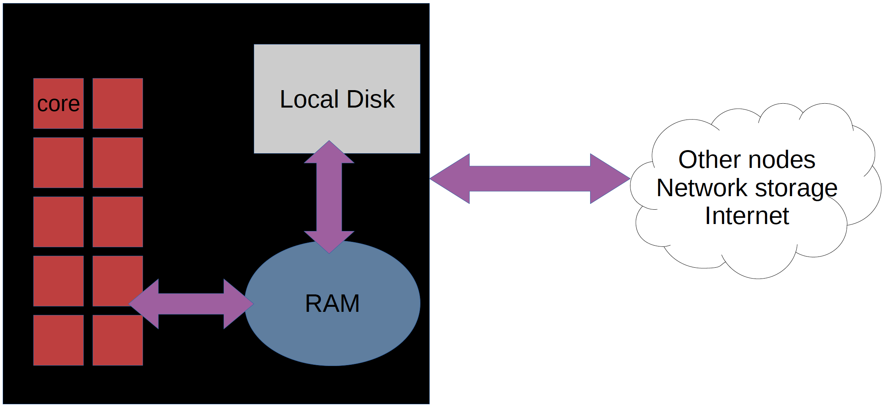

.. Python-at-UPPMAX documentation master file, created by
   sphinx-quickstart on Fri Jan 21 18:24:04 2022.
   You can adapt this file completely to your liking, but it should at least
   contain the root `toctree` directive.
   
Welcome to "Using Python in an HPC environment" course material
===============================================================

.. admonition:: This material
   
   Here you will find the content of the workshop Using Python in an HPC environment.
   
   - Documentation at the HPC centres UPPMAX, HPC2N, LUNARC and NSC
      - UPPMAX: <https://docs.uppmax.uu.se/software/python/>
      - HPC2N: <https://docs.hpc2n.umu.se/tutorials/userinstalls/#python__packages>
      - LUNARC: <https://lunarc-documentation.readthedocs.io/en/latest/guides/applications/Python/>
      - NSC: <https://www.nsc.liu.se/support/>

.. admonition:: Content

   - This course aims to give a brief, but comprehensive introduction to using Python in an HPC environment.
   - You will learn how to
      - use modules to load Python
      - find site installed Python packages
      - install packages yourself
      - use virtual environments, 
      - write a batch script for running Python
      - use Python in parallel
      - use Python for ML and on GPUs. 
   - This course will consist of lectures interspersed with hands-on sessions where you get to try out what you have just learned.    

    **Not covered**
    
    - Improve python *coding* skills 
    - Specifics of other clusters

   - **We aim to give this course in spring and fall every year.**

.. warning::

  **Target group**
 
  - The course is for present or presumptive users at UPPMAX, HPC2N, LUNARC, NSC or possibly other clusters in Sweden. 
  - Therefore we apply python solutions on all four clusters, so a broad audience can benefit.
  - We also provide links to the Python/Jupyter documentation at other Swedish HPC centres with personell affiliated to NAISS.

  **Cluster-specific approaches**
  
   - The course is a cooperation between UPPMAX (Rackham, Snowy, Bianca), HPC2N (Kebnekaise), and LUNARC (Cosmos). The main focus will be on UPPMAX's and NSC's systems, but Kebnekaise and Cosmos will be included as well. If you already have an account at Kebnekaise or Cosmos, you can use those systems for the hands-ons. 
   - In most cases there is little or no difference between UPPMAX's systems, HPC2N's systems, LUNARC's, or NSC's systems (and the other HPC systems in Sweden), except naming of modules and such. We will mention (and cover briefly) instances when there are larger differences.  

   - See further below a short introduction to the centre-specific cluster architectures of UPPMAX, HPC2N, LUNARC, NSC.

.. admonition:: How is the workshop run?
  
   - General sessions with small differences shown for UPPMAX, HPC2N, LUNARC, and NSC in tabs
   - Main focus on the NAISS resources at UPPMAX and NSC, but Kebnekaise/Cosmos specifics will be covered
   - Users who already have accounts/projects at HPC2N (Kebnekaise) or LUNARC (Cosmos) are welcome to thoses systems for the exercises. UPPMAX/Rackham and NSC/Tetralith will be used for everyone else. 

.. admonition:: Some practicals

   - `Code of Conduct <https://github.com/UPPMAX/HPC-python/blob/main/CODE_OF_CONDUCT.md>`_
      - Be nice to each other!
 
   - Zoom
       - You should have gotten an email with the links
      
       - Zoom policy:

          - Zoom chat (maintained by co-teachers):

            - technical issues of zoom
            - technical issues of your settings
            - direct communication 
            - each teacher may have somewhat different approach

          -  collaboration document (see below):

             - "explain again"         
             - elaborating the course content
             - solutions for your own work

       - Recording policy:
          - The lectures and demos will be recorded.
          - The questions asked per microphone during these sessions will be recorded
          - If you don't want your voice to appear use: 

             - use the collaboration document (see below)

       - The Zoom main room is used for most lectures
       - Some sessions use breakout rooms for exercises, some of which use a silent room

.. admonition:: Q/A collabration document

    - Use the Q/A page for the workshop with your questions.
        - https://umeauniversity.sharepoint.com/:w:/s/HPC2N630/EZJ2RH0InOlIqCSF1DAhxXgBVirUT04xQsaHka17j2ZJIw?rtime=4q1KLG9z3Eg

   - Use this page for the workshop with your questions
   - It helps us identify content that is missing in the course material
   - We answer those questions as soon as possible

.. warning::

   - Please, be sure that you have gone through the **`pre-requirements <https://uppmax.github.io/HPC-python/prereqs.html>`_** and **`preparations <https://uppmax.github.io/HPC-python/preparations.html>`_**
   - It mentions the familiarity with the LINUX command line.
   - The applications to connect to the clusters
      - terminals
      - remote graphical desktop ThinLinc

The four HPC centers UPPMAX, HPC2N, LUNARC, and NSC
----------------------------------------------------
   
- UPPMAX has three different clusters 

    - Rackham for general purpose computing on CPUs only
    - Snowy available for local projects and suits long jobs (< 1 month) and has GPUs
    - Bianca for sensitive data and has GPUs

- HPC2N has Kebnekaise with GPUs  

- LUNARC has two systems 
     
    - Cosmos (CPUs and GPUs)
    - Cosmos-SENS (sensitive data) 

- NSC has one NAISS system (and several others) 
     
    - Tetralith (CPUs and GPUs)

    - Conda is recommended only for UPPMAX, LUNARC, and NSC users
    
.. warning:: 

   - At HPC2N, UPPMAX, LUNARC, and NSC we call the applications available via the *module system* **modules**. 

      - <http://docs.uppmax.uu.se/cluster_guides/modules/> 
      - <https://docs.hpc2n.umu.se/documentation/modules/>
      - <https://lunarc-documentation.readthedocs.io/en/latest/manual/manual_modules/>  
      - <https://www.nsc.liu.se/software/modules/>

   - To distinguish these modules from the **python** *modules* that work as libraries we refer to the later ones as **packages**.
   
Briefly about the cluster hardware and system at UPPMAX, HPC2N, LUNARC, and NSC
:::::::::::::::::::::::::::::::::::::::::::::::::::::::::::::::::::::::::::::::

**What is a cluster?**

- Login nodes and calculations/computation nodes

- A network of computers, each computer working as a **node**.
     
- Each node contains several processor cores and RAM and a local disk called scratch.

- The user logs in to **login nodes**  via Internet through ssh or Thinlinc.

  - Here the file management and lighter data analysis can be performed.

.. figure:: img/cluster.png
   :align: center

- The **calculation/compute nodes** have to be used for intense computing. 

 
Overview of the UPPMAX systems
##############################

.. mermaid:: mermaid/uppmax2.mmd

Overview of HPC2N's system 
##########################

.. mermaid:: mermaid/kebnekaise.mmd

Overview of LUNARC's systems
############################

.. figure:: img/cosmos-resources.png
   :align: center

Overview of NSC's system
############################

.. mermaid:: mermaid/tetralith.mmd

Preliminary schedule
====================

.. list-table:: Preliminary schedule Thursday 5 December
   :widths: 20 25 40 15
   :header-rows: 1

   * - Time
     - Topic
     - Content
     - Teacher(s)
   * - 9:00
     - Introduction to the course, log in, load/run Python, find packages
     - Getting started with practical things
     - All
   * - 9:55
     - **Coffee**
     - 
     - 
   * - 10:10
     - Install packages and isolated environments 
     - Install, create and handle
     - Björn
   * - 11.00
     - **Short leg stretch** 10m
     - 
     - 
   * - 10:40
     - Reaching compute nodes with Slurm   (70)
     - Batch jobs vs interactive work in IDEs
     - Birgitte
   * - ~~11:50~~
     - Catch-up time and Q/A (no recording)
     - 
     - 
   * - 12:00
     - **LUNCH**
     - 
     - 
   * - 13:00-14:45
     - Analysis with Python (90m)
     - Matplotlib, IDEs and plots from scripts
     - Rebecca
   * - 13.55
     - **Short leg stretch** 15m
     - 
     - 
   * - 14.45
     - **Coffee** 15 min
     - 
     - 
   * - 15.00
     - Using GPUs for Python (30m)
     - Birgitte
     - 
   * - 15:30
     - Summary + Q/A Evaluation
     - 
     - 
   * - ~15.50
     - Use cases and Q/A
     - Bring your own problems
     - All

.. list-table:: Preliminary schedule Friday 6 December
   :widths: 20 25 40 15
   :header-rows: 1

   * - Time
     - Topic
     - Content
     - Teacher
   * - 9:00
     - Analysis with Python part I (50)
     - Pandas
     - Rebecca
   * - 9:50
     - **Coffee**
     - 
     - 
   * - 10:05
     - Analysis with Python part II (50)
     - Pandas & Seaborn
     - Rebecca
   * - 10.55
     - **Short leg stretch**
     - 
     - 
   * - 11:10
     - Parallelism part I: MPI, Processes, Dask
     - Processes, MPI
     - Pedro
   * - 12:00
     - **LUNCH**
     - 
     - 
   * - 13:00
     - Big Data with Python (35)
     - File formats and packages, Chunking
     - Björn
   * - 13:50
     - **Short leg stretch**
     - 
     - 
   * - 14:05
     - Machine and Deep Learning part I (50)
     - Pytorch, Tensorflow, ScikitLearn
     - Jayant
   * - 14.55
     - **Coffee**
     - 
     - 
   * - 15:10
     - Machine and Deep Learning part II (40)
     - Pytorch, Tensorflow, ScikitLearn
     - Jayant
   * - 15.50
     - **Short leg stretch**
     - 
     - 
   * - 16.00
     - Summar and  Q&A and avaluation
     - 
     - 
   * - 16.20
     - Use cases and Q&A
     - Bring your own problems
     - All
   * - 16.45
     - 
     - 
     - 

Prepare your environment now!
-----------------------------

.. challenge:: Log in and create a user folder (if not done already)

   - Please log in to Rackham, Kebnekaise, Cosmos or other cluster that you are using.

   .. admonition:: Use Thinlinc or terminal?

      - It is up to you!
      - Graphics come easier with Thinlinc
      - For this course, when having many windows open, it may sometimes be better to run in terminal, for screen space issues.

.. admonition:: Prepare your environment now!

   :class: dropdown
  
   - Please log in to Rackham, Kebnekaise, Cosmos, Tetralith, or other cluster that you are using.
   - For graphics, ThinLinc may be the best option.
      - The `ThinLinc app <https://www.cendio.com/thinlinc/download/>`_.
   - Rackham has access for regular SSH, through a regular ThinLinc client and a through a web browser interface with ThinLinc: 
       - SSH: rackham.uppmax.uu.se  
       - ThinLinc client: rackham-gui.uppmax.uu.se 
       - Web browser interface: https://rackham-gui.uppmax.uu.se
       - `ThinLinc user guide at UPPMAX <http://docs.uppmax.uu.se/cluster_guides/thinlinc/>`_
           - 2FA may be needed, which can be handled by logging in with regular SSH, doing 2FA, logging out again, then there is a grace period of some minutes for you to login to ThinLinc. `More here: <https://www.uu.se/en/centre/uppmax/get-started/2-factor>`_
   - Kebnekaise has access for regular SSH, ThinLinc clients, and through a web browser interface with ThinLinc: 
       - SSH: kebnekaise.hpc2n.umu.se 
       - ThinLinc client: kebnekaise-tl.hpc2n.umu.se 
       - From webbrowser: https://kebnekaise-tl.hpc2n.umu.se:300/ 
   - Cosmos: 
       - SSH: cosmos.lunarc.lu.se 
       - ThinLinc: cosmos-dt.lunarc.lu.se 
           - 2FA required! For more info, `go here: <https://lunarc-documentation.readthedocs.io/en/latest/getting_started/login_howto/>`_ 
   - Tetralith: 
       - SSH: tetralith.nsc.liu.se  
       - ThinLinc: tetralith.nsc.liu.se  
       - 2FA is needed. Info here about setup: <https://www.nsc.liu.se/support/2fa/>  

.. admonition:: Project

    - The course project on UPPMAX (Rackham) is: ``naiss2024-22-1442``
    - The course project on HPC2N (Kebnekaise) is: ``hpc2n2024-142``
    - The course project on LUNARC (Cosmos) is: ``lu2024-2-88``
    - The course project on NSC (Tetralith) is: ``naiss2024-22-1493``  

Make working directories 
    
.. tabs::

   .. tab:: UPPMAX

      - Rackham: ``ssh <user>@rackham.uppmax.uu.se``       
      - Rackham through ThinLinc, 
       
         - use the App with
             - address: ``rackham-gui.uppmax.uu.se``  NB: leave out the ``https://www.``!
             - user: ``<username-at-uppmax>``  NB: leave out the ``https://www.``!
         - or go to <https://rackham-gui.uppmax.uu.se>

           - here, you'll need two factor authentication.
          
      - Create a working directory where you can code along. We recommend creating it under the course project storage directory
   
         - Example. If your username is "mrspock" and you are at UPPMAX, then we recommend you to create a user folder in the project folder of the course and step into that: 

         - ``cd /proj/hpc-python-fall``
         - ``mkdir mrspock``
         - ``cd mrspock``

   .. tab:: HPC2N

      - Kebnekaise: ``<user>@kebnekaise.hpc2n.umu.se``     
      - Kebnekaise through ThinLinc, use the client and put
        
         - as server: ``kebnekaise-tl.hpc2n.umu.se`` 
         - as user: ``<username-at-HPC2N>`` NOTE: Leave out the ``@hpc2n.umu.se``
      - Create a working directory where you can code along. We recommend creating it under the course project storage directory: /proj/nobackup/hpc2-python-fall-hpc2n
   
      - Example. If your username is bbrydsoe and you are at HPC2N, then we recommend you create this folder: 
     
          - ``/proj/nobackup/hpc-python-fall-hpc2n/bbrydsoe``

   .. tab:: LUNARC 

      - Cosmos with SSH: ``cosmos.lunarc.lu.se``
      - Cosmos through ThinLinc: ``cosmos-dt.lunarc.lu.se``

          - as server: ``cosmos-dt.lunarc.lu.se``
          - as user: ``<username-at-lunarc>`` NOTE: leave out the ``@lunarc.lu.se`` 

      - Create a working directory where you can code along, under the storage directory. The storage directory is located under: ``/lunarc/nobackup/projects/lu2024-17-44``    

   .. tab:: NSC 

      - Tetralith with SSH: ``tetralith.nsc.liu.se``
      - Tetralith through ThinLinc: ``tetralith.nsc.liu.se``

          - as server: tetralith.nsc.liu.se``
          - as user: ``<username-at-nsc>`` NOTE: leave out the ``@nsc.liu.se``

          - Create a working directory where you can code along, under ``/proj/hpc-python-fall-nsc``. 

      - 2FA is needed. Info here about setup: <https://www.nsc.liu.se/support/2fa/>   

.. admonition:: Exercises

   - Stay in/go to the folder you just created above!
   - You can download the exercises from the course GitHub repo, under the "Exercises" directory or clone the whole repo!
 
       - Clone it with: ``git clone https://github.com/UPPMAX/HPC-python.git``
       - Copy the tarball with ``wget https://github.com/UPPMAX/HPC-python/raw/refs/heads/main/exercises.tar.gz`` and then uncompress with ``tar -zxvf exercises.tar.gz``  

   - Get an overview here: ``https://github.com/UPPMAX/HPC-python/tree/main/Exercises``
   
**NOTE** If you downladed the tarball and uncompressed it, the exercises are under ``exercises/`` in the directory you picked. Under that you find Python scripts in ``programs`` and batch scripts in the directories named for the sites. 

**NOTE** If you are downloading / cloning from the course GitHub repo and into the above directory, your Python examples and batch submit file examples will be in a subdirectory of that.

Assuming you created a directory MYDIR-NAME under the project storage, you will find the examples as follows:

.. tabs::

   .. tab:: UPPMAX

        Python programs

        .. code-block:: sh

            /proj/hpc-python-fall/MYDIR-NAME/HPC-python/Exercises/examples/programs/

        Batch submit files 

        .. code-block:: sh

            /proj/hpc-python-fall/MYDIR-NAME/HPC-python/Exercises/examples/uppmax

   .. tab:: HPC2N
 
      Python programs

      .. code-block:: sh

          /proj/nobackup/hpc-python-fall-hpc2n/MYDIR-NAME/HPC-python/Exercises/examples/programs/

      Batch submit files

      .. code-block:: sh

          /proj/nobackup/hpc-python-fall-hpc2n/MYDIR-NAME/HPC-python/Exercises/examples/hpc2n/

   .. tab:: LUNARC

      Python programs

      .. code-block:: sh

      TO_BE_DONE

      Batch submit files

      .. code-block::

      TO_BE_DONE 

   .. tab:: NSC

      Python programs

      .. code-block:: sh

         /proj/hpc-python-fall-nsc/MYDIR-NAME/HPC-python/Exercises/examples/programs/

      Batch submit files 

      .. code-block:: sh 

      /proj/hpc-python-fall-nsc/MYDIR-NAME/HPC-python/Exercises/examples/nsc    
    

   
Content of the course
---------------------

.. toctree::
   :maxdepth: 2
   :caption: Pre-requirements:

   prereqs.rst
   preparations.rst
    
.. toctree::
   :maxdepth: 2
   :caption: Lessons day 1:

   day1/intro.rst
   day1/load_run_packages.rst
   day1/install_packages.rst
   day1/batch.md
   day1/interactive.md
   day1/IDEs.rst
   day1/ondemand-desktop.rst
   day1/Matplotlib60min.rst
   day1/gpu.md
   summary.rst

.. toctree::
   :maxdepth: 2
   :caption: Lessons day 2:

   day2/pandas.rst
   day2/Seaborn-Intro.rst
   day2/parallel.rst
   day2/big_data.md
   day2/ml.md

.. toctree::
   :maxdepth: 2
   :caption: Extra reading:

   extra/packages_deeper.rst
   extra/isolated_deeper.rst
   extra/interactive_deeper.rst
   extra/jupyterHPC2N.rst
   #jupyter.md
   uppmax.rst
   kebnekaise.md
   bianca.rst
   
.. Indices and tables
.. ==================

.. * :ref:`genindex`
.. * :ref:`modindex`
.. * :ref:`search`
