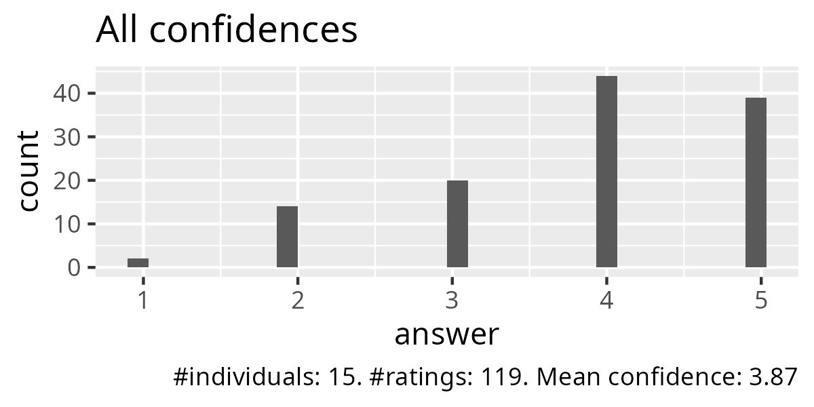
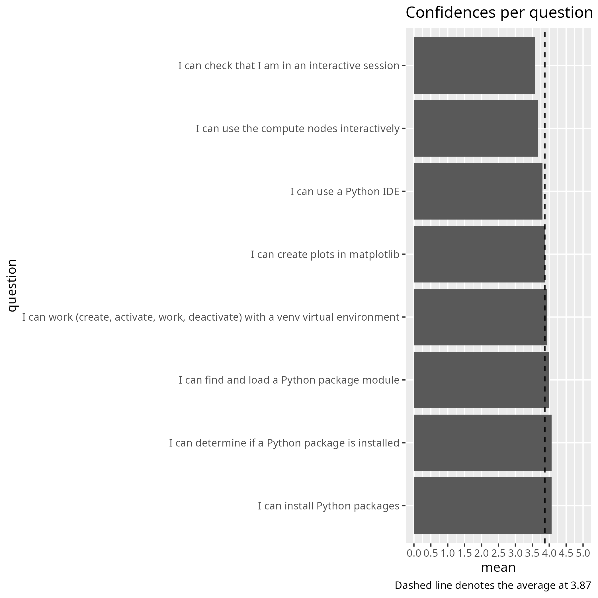
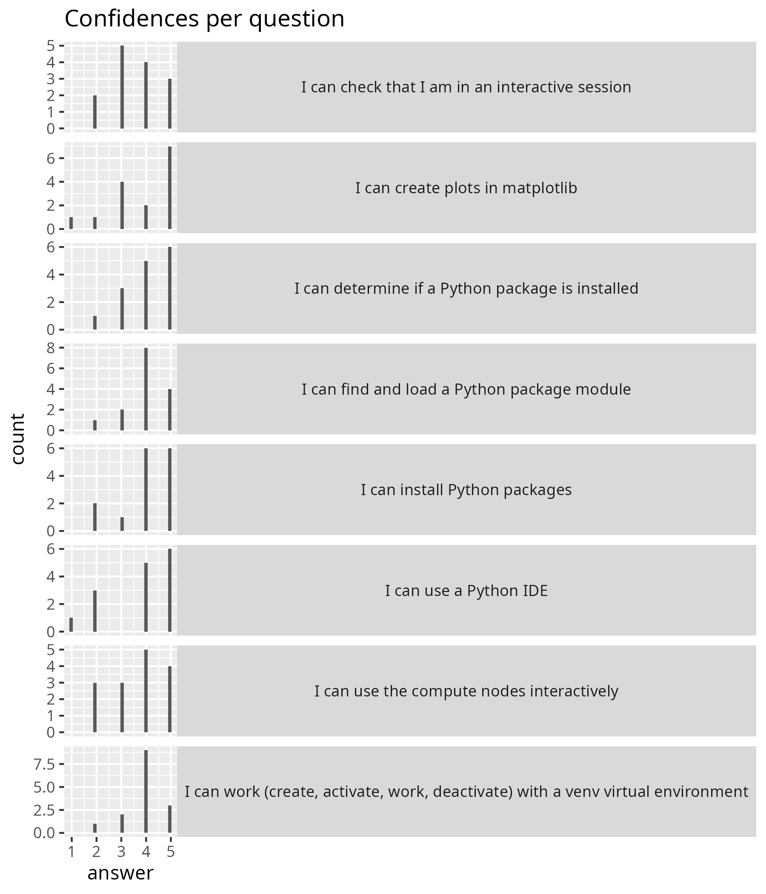

# Evaluation 2025-04-25

- Date: 2025-04-25
- Day: 2
- Number of registrations: 62
- Number of learners: 16 (26% show up)
- Number of evaluations: 15 (94% filled in evaluation)
- [Success score](success_score.txt): 77%

## Info about our learners

From the registration form.

Using cluster                           |Number of learners
----------------------------------------|------------------
Using NAISS cluster                     |35	
Using local university cluster			    |13	
Previously used NAISS/SNIC 		     	    |7	
Previously used local/university cluster|8	
Other clusters 		     		              |5	
Never used clusters 				            |10	
					
					
Using Python                                                                                     |Number of learners
-------------------------------------------------------------------------------------------------|------------------
I have no previous experience with Python					                                     |6
I know Python at a beginner level, can write very simple Python code, can import a Python package|25
I have an intermediate knowledge of Python. I can install Python packages					     |15
I am proficient in Python					                                                     |16
					
					
Using Linux                                                                                                                                  |Number of learners
---------------------------------------------------------------------------------------------------------------------------------------------|-------------------
I have never used Linux/Unix					                                                                                             |3
I have a basic understanding of Linux/Unix (like orient myself among files and directories; copy, move and remove files; and read text files)|31
I can do basic shell scripting					                                                                                             |22
I have a high level of Linux/Unix proficiency					                                                                             |6

## Analysis

- [Evaluation results (csv)](evaluation_20250425_day_2.csv)
- [Evaluation results (pdf)](evaluation_20250425_day_2.pdf)
- [Evaluation results (xlsx)](evaluation_20250425_day_2.xlsx)
- [Analysis script](analyse.R)
- [Average confidence per question (.csv)](average_confidences.csv)
- [Success score](success_score.txt): 77%

