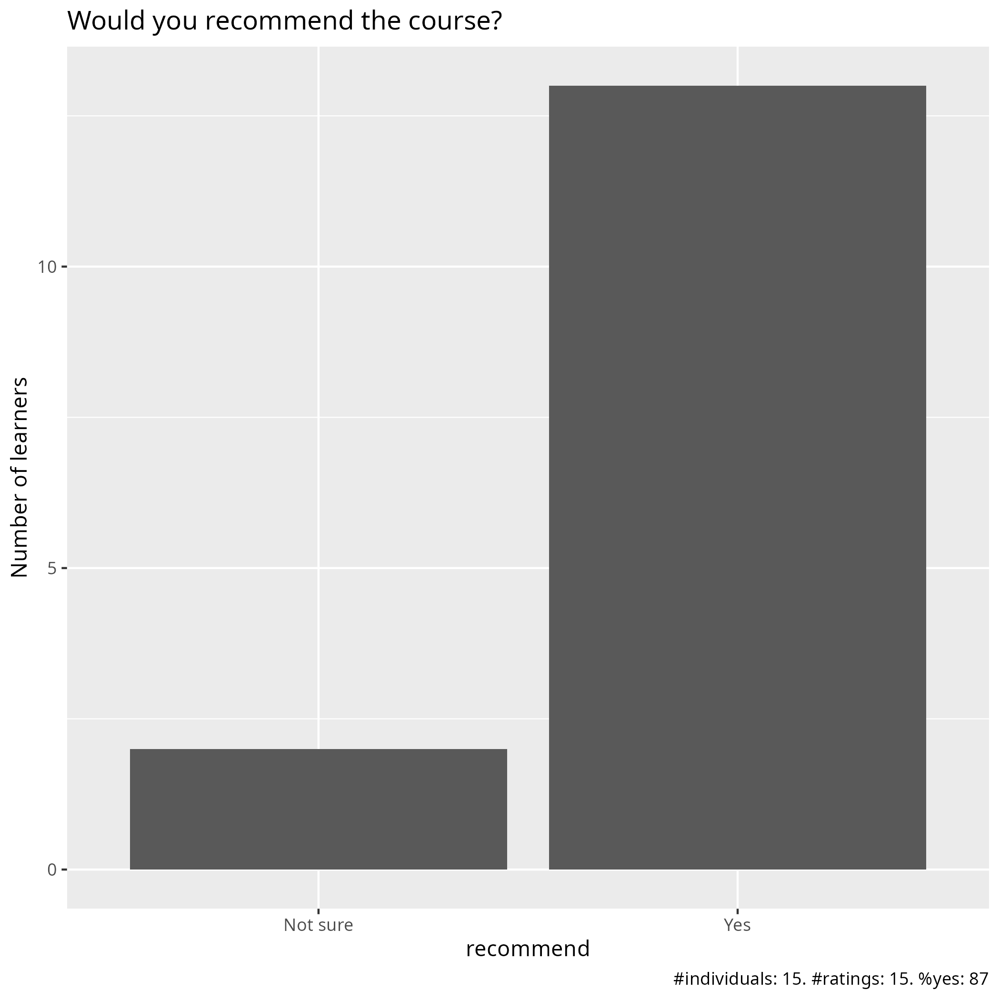

# Evaluation 2025-04-25

- Date: 2025-04-25
- Day: 2
- Number of registrations: 62
- Number of learners: 16 (26% show up)
- Number of evaluations: 15 (94% filled in evaluation)
- [Success score](success_score.txt): 77%

## Info about our learners

From the registration form.

Using cluster                           |Number of learners
----------------------------------------|------------------
Using NAISS cluster                     |35	
Using local university cluster			    |13	
Previously used NAISS/SNIC 		     	    |7	
Previously used local/university cluster|8	
Other clusters 		     		              |5	
Never used clusters 				            |10	
					
					
Using Python                                                                                     |Number of learners
-------------------------------------------------------------------------------------------------|------------------
I have no previous experience with Python					                                     |6
I know Python at a beginner level, can write very simple Python code, can import a Python package|25
I have an intermediate knowledge of Python. I can install Python packages					     |15
I am proficient in Python					                                                     |16
					
					
Using Linux                                                                                                                                  |Number of learners
---------------------------------------------------------------------------------------------------------------------------------------------|-------------------
I have never used Linux/Unix					                                                                                             |3
I have a basic understanding of Linux/Unix (like orient myself among files and directories; copy, move and remove files; and read text files)|31
I can do basic shell scripting					                                                                                             |22
I have a high level of Linux/Unix proficiency					                                                                             |6

## Analysis

- [Evaluation results (csv)](evaluation_20250425_day_2.csv)
- [Evaluation results (pdf)](evaluation_20250425_day_2.pdf)
- [Evaluation results (xlsx)](evaluation_20250425_day_2.xlsx)
- [Analysis script](analyse.R)
- [Average confidence per question (.csv)](average_confidences.csv)
- [Success score](success_score.txt): 77%

### [Pace](pace.txt)

- the pacing was good. I really liked the course material.
- Fast on the second day
- great
- I think it was good, I could keep up and take notes during all of the lectures.
- I feel like it was a bit rushed, good content but a bit too much given the amount of time maybe?
- It was a lot of information to take in. However the resources provided are sufficient to catch up if we were stuck anywhere.
- Good
- It was the right pace
- I did not feel comfortable during the afternoon session was running too fast, just to adjust to the schedule and got few from that and was confused because of several concepts in a bunch without explain the practical examples I guess it is been assumed that everybody knows all the concepts.
- Too fast to combine explanations and exercises
- Good pace considering the amount of materials and time. Then one needs to practise home by rewatching the YT videos
- Inconsistent - seemed slow much of the time, while some parts passed by before they could be properly explained or understood: it seemed to me that the time was not spent on the right things. I know enough about Python, I do not know enough about the software module system and SLURM and any other HPC-specific stuff.
- Too fast
- okish
- Suitable

### [Future topics](future_topics.txt)

- Xarray and dask
- it is totally enough for me to study this content, and the document is great, I can read the document to revise the lesson
- It could be helpful to have a lecture about R as well.
- More information on the HPC environment within a similar context. Maybe focusing on one HPC centre at a time.
- Topics are ok. Just give more profound and practical demos during the sessions.
- A summary of options in using Python in the HPC, with suggestions and best practices. What to do when the default modules are not enough.
- This 2nd day and we have not going through ML and Deep learning PyTorch and Tensorflow GPU: PINNs, Quantum ML (PennyLane, Qiskit) or small LLM
- matplotlib from a regular shell/interactive/in compute jobs
- How to find compatible modules and packages

### [Other comments](comments.txt)

- every thing is great for me
- I think all of the training materials were very clear, and I liked the amount of hands-on exercises. I also really appreciated how supportive all of the teachers were, the classes had a very nice atmosphere.
- Overall, a great session, but it would be great to have more time plannned into each session for questions.
- For the matplotlib part: to improve more demonstrations rather than read so quickly the content to accomplish the schedule. Improve the depth of the course not too superficial to at least catch some key points that helps to start.  The morning session had better demo and I could follow the steps.
- The written material is quite good and shows the different options, but simply going through them during the course takes too long and sometimes end up with focus on specific HPC systems that not everyone is going to use. There are instructions for each cluster, so maybe the topics should be more generic with access to the specific info as needed. The IDE section, for example, could only show how to do it to very specific cases, while having the cluster instructions and a generic discussion about the options could be better.
- Overall very good docs from each mentors that states pro and contro and niche details of each HPC. Infinite for trouble-shooting support especially for beginners
- (did not attend Matplotlib part) 1. Overall the reading/presentation material was good to very good, just too far between exercises - as soon as one step has been explained, I want to test it and make sure I can do it! But some information was outdated and some part or parts had lots of spelling errors.  2. Again and again, there was not enough time margins within each session. Asking us to do stuff on the breaks is BAD. Breaks are needed for food, toilet and looking away from the screen. Can't learn anything if we don't get breaks.  3. Lunch break start and end time needs to be confirmed before 12:00. For those of us caught up in listening and following along it got cut much too short today.
- It's good that you record, but could you post the recordings a bit faster so we can go through before the rest of the course?
- Not fond of the IDEs, I think it's unnecessarily cumbersome. Shell is much easier to work in. You don't have to load a lot of other things, set graphics and fight with it :( Why this focus on jupyter or spyder or whatever it was called
