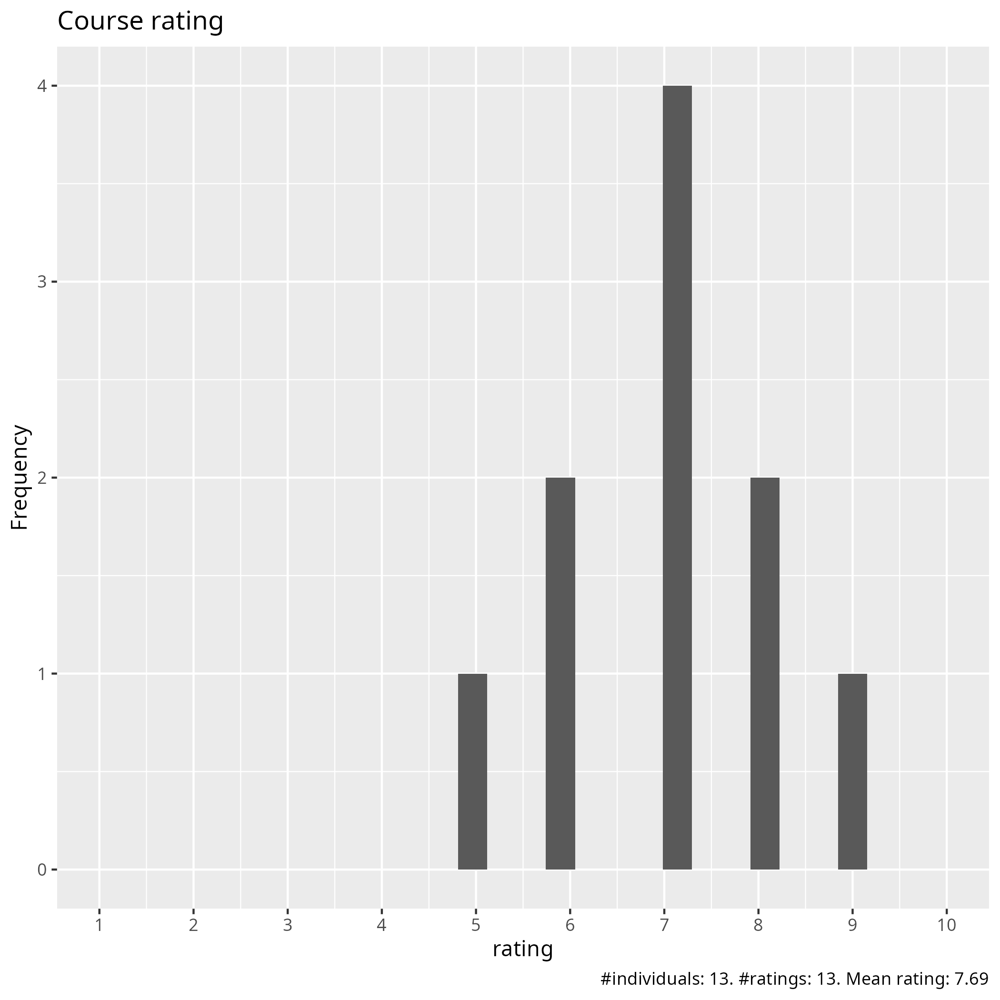
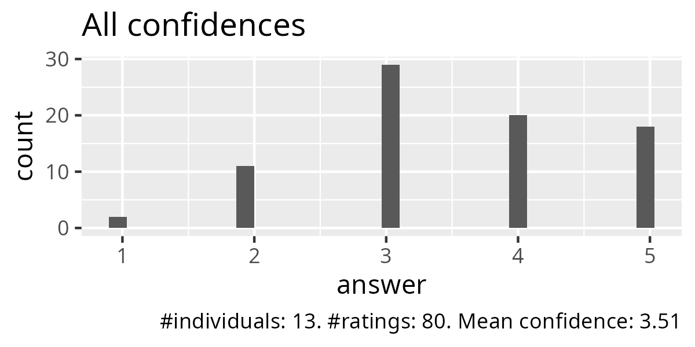
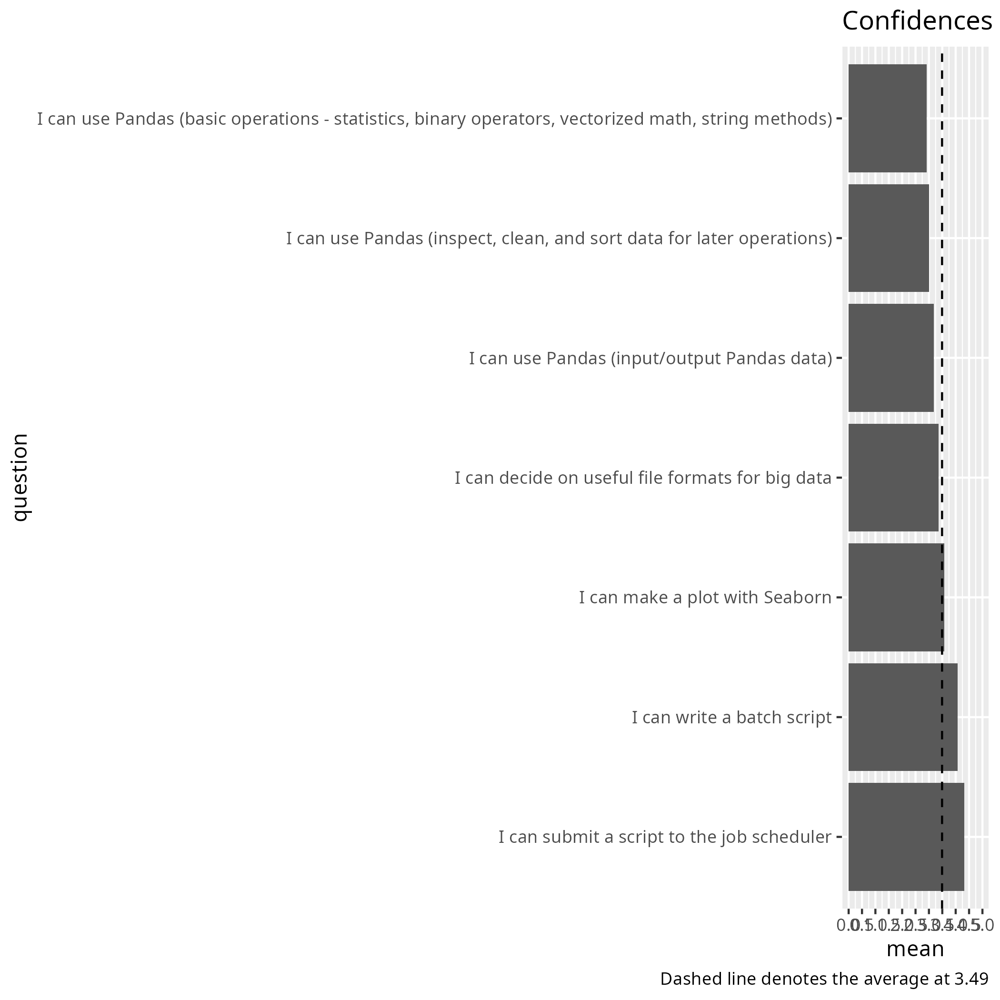
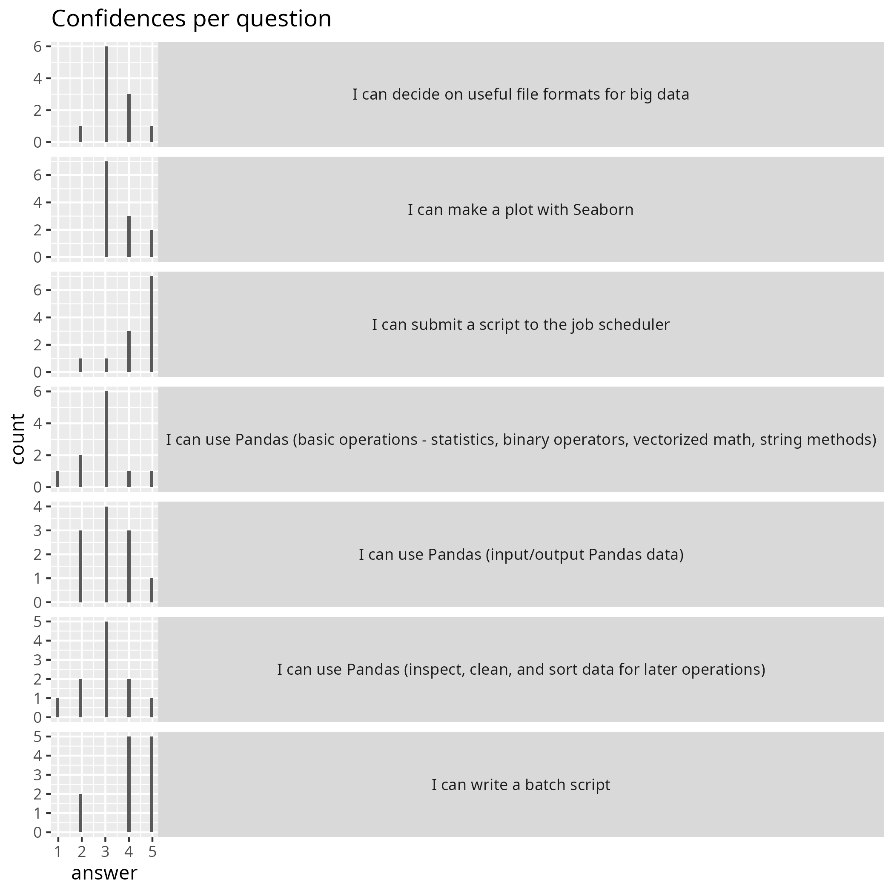
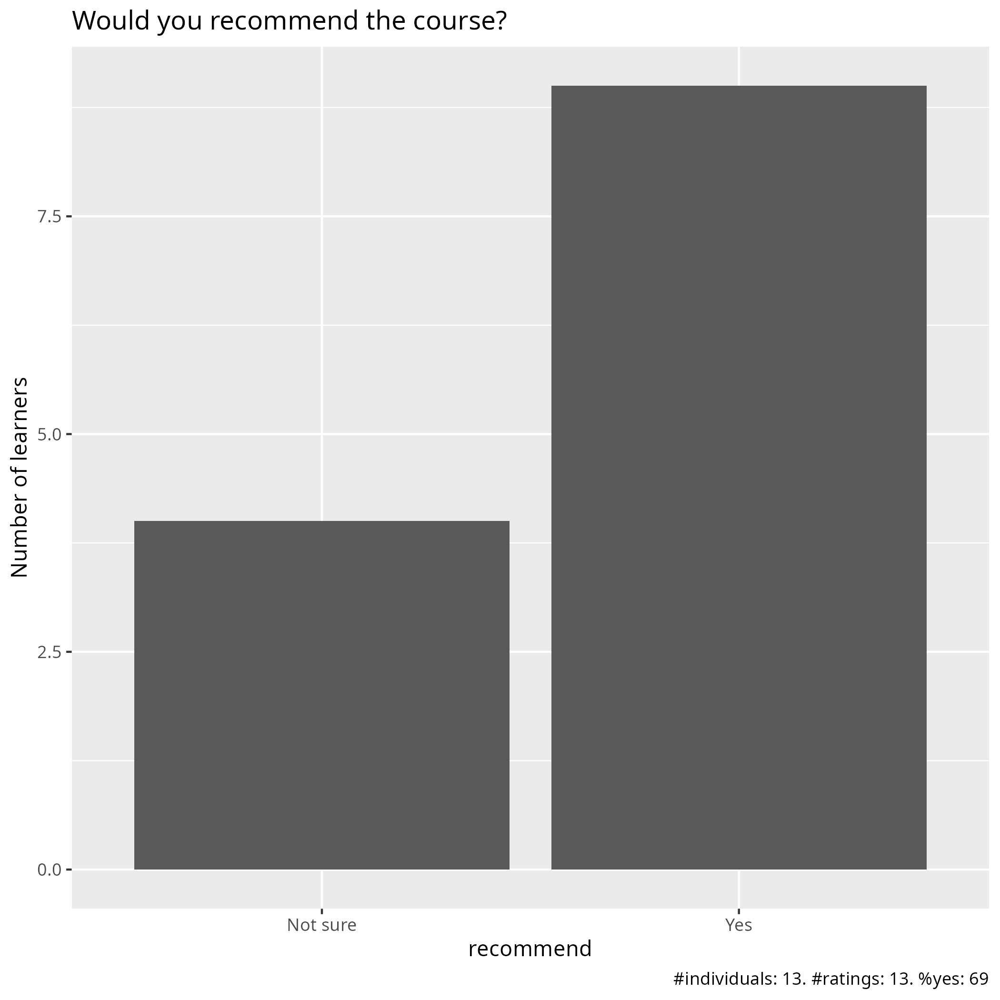

# Evaluation 2025-04-28

- Date: 2025-04-28
- Day: 3
- Number of registrations: ?
- Number of learners: ? (?% show up)
- Number of evaluations: ? (?% filled in evaluation)
- [Success score](success_score.txt): 70%

## Analysis

- [Evaluation results (csv)](evaluation_20250428_day_3.csv)
- [Evaluation results (pdf)](evaluation_20250428_day_3.pdf)
- [Evaluation results (xlsx)](evaluation_20250428_day_3.xlsx)
- [Analysis script](analyse.R)
- [Average confidence per question (.csv)](average_confidences.csv)
- [Success score](success_score.txt): 77%

### [Pace](pace.txt)

- presentation heavy - limited hands-on.
- For me it worked and I was able to follow and work on the exercises simultaneously
- I think it was a bit too much content in the first part,
- It was. agood pace. Enough time to understand all the sessions and ask questions
- I was okay but I do not have a background in that so it was pretty difficult for me to follow the practical session
- No comments. I did not attend afternoon lectures.
- Inconsistent: Rebecca fast/crammed (that part had a great lack of exercises), Brigitte and Björn between okay and slightly slow
- Overall good, first 2 sections were too fast.
- COnsidering that is a Intro and Overview of Python on HPC, the path was good and we have at the end some time for doing some exercises and ask for support and feedback to the mentors
- The Pandas section was a bit confusing and maybe too hurried
- Good
- I may need more time to train on Pandas, but I will watch the video again and try to code along. I didn't realize I needed to have a jupyter up and running for the session, so I could not code along
- Suitable

### [Future topics](future_topics.txt)

- how to use LLMs to improve/supplement our coding
- really basic course on programming
- How to work with data that has 3 or more dimensions. How to treat it and plot results, what plot strategies one can use.
- Polars DataFrame together with Pandas would be very interesting
- Maybe a course on batch job optimizing
- Maybe also more about using R for datascience

### [Other comments](comments.txt)

- I think I would really like to have a bit more a hands-on experience on this. Also, a big caveat in using all these is understanding the documentation/jargon. It would be useful to have that as part of this. As in any other language, you 'd need to refer to the documentation, so it would be good to know how to navigate it. The session where we were typing along was excellent! Very nicely paced, and the message was clear. Also tied together things we worked on last week. Maybe it would be useful to start with a type-along exercise so as people follow an exact example, and then build on that to discuss details. e.g. input + analysis + graph (then discuss types of input, types of analysis and functions, types of graph)
- I really like that a lot of resources are provided with additional links to extra material. It will be really helpful to have this on hand when I'm working on my own data.
- This course is HPC environments and Python data science tools mixed up into one (with a starting day of HPC access and Python coding basics) and it's too chaotic for good learning, in my not so humble opinion. There are better Python courses elsewhere, without HPC complications - this course might be better with a focus on all the HPC intricacies.
- The pandas section was too fast with too much information, it was hard to follow without being able to try some of the commands. It might be more interesting to be able to try some basic functions and then have access to the documents where there are more examples and commands.
- Which HPC have good Documentations, Exercises and recorded videos. What TO DO and not TO DO in Documentation and video lectures like tips and tricks
- This is mostly for the parts last week, I'm not so fond of this calling out of people with their names. It is stressing. I'm here to learn, and I do that better in peace. Also, could you please post the recordings a bit faster next time. I saw in the Q/A document that Brigitta lost the recordings for the first day so I am happy that Ricel at least posted them! Would be better to have them in the same youtube list as the rest though
- Please say ahead of the session that we should start up a jupyter or spider so we are ready to type along. It takes time to start up
