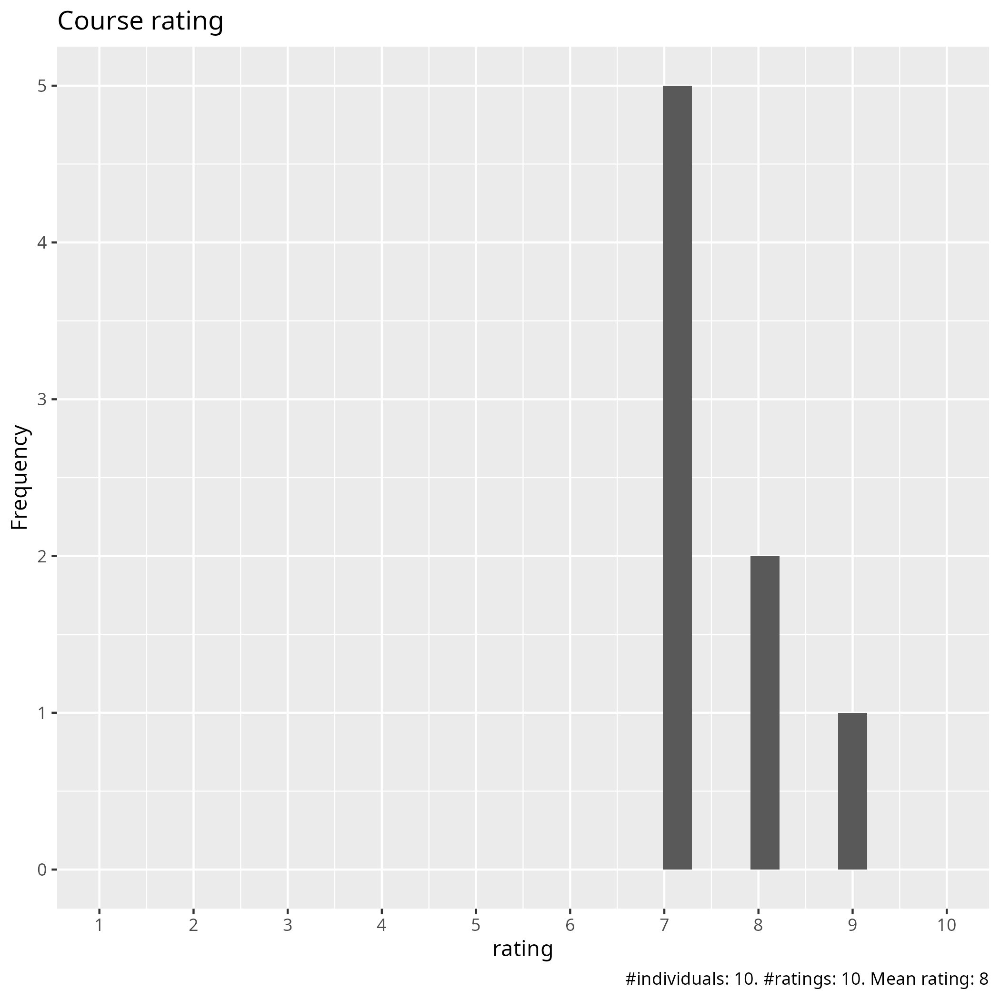
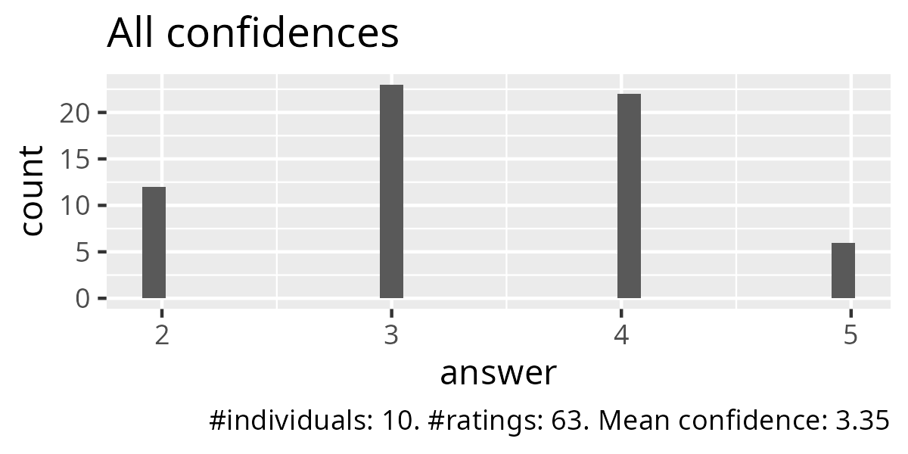
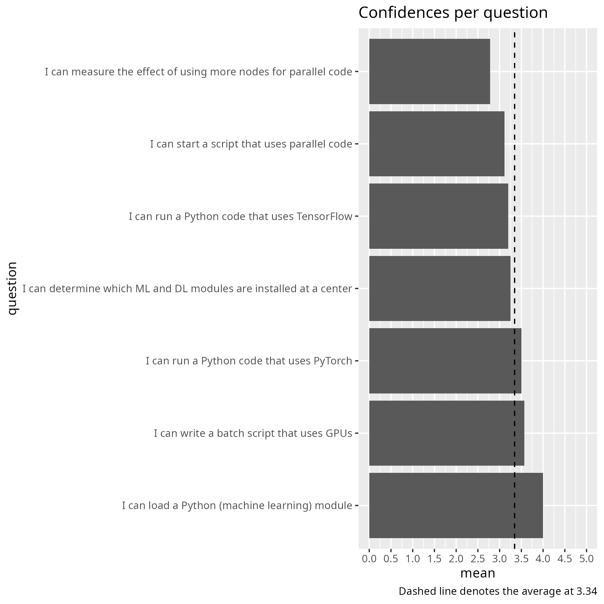
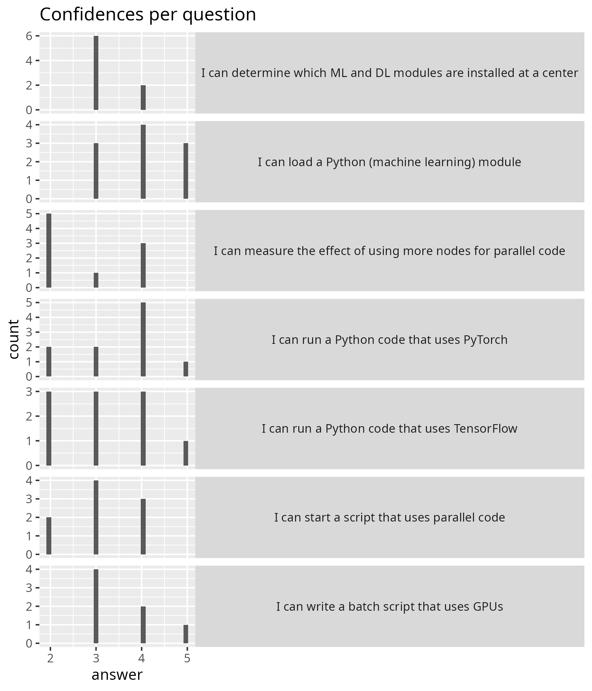
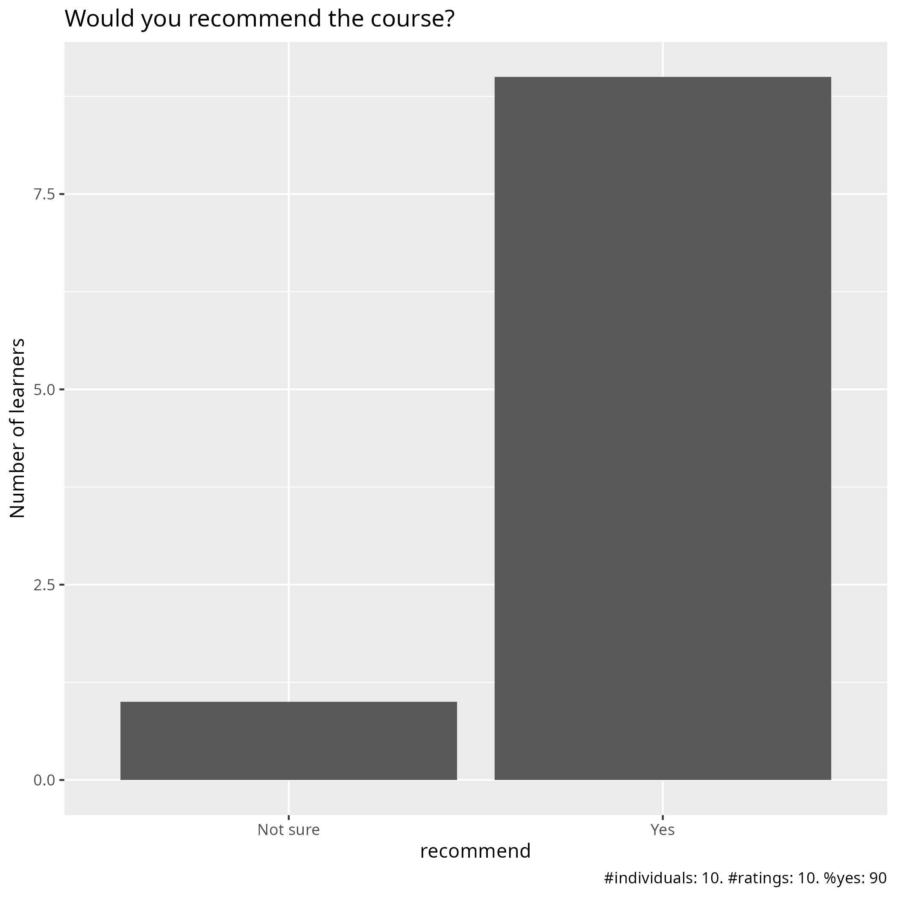

# Evaluation 2025-04-29

- Date: 2025-04-29
- Day: 4
- Number of registrations: ?
- Number of learners: ? (?% show up)
- Number of evaluations: ? (?% filled in evaluation)
- [Success score](success_score.txt): 67%

## Analysis

- [Evaluation results (csv)](evaluation_20250429_day_4.csv)
- [Evaluation results (pdf)](evaluation_20250429_day_4.pdf)
- [Evaluation results (xlsx)](evaluation_20250429_day_4.xlsx)
- [Analysis script](analyse.R)
- [Average confidence per question (.csv)](average_confidences.csv)
- [Success score](success_score.txt): 77%

### [Pace](pace.txt)

- It was okay. I was able to follow
- It was the right pace
- fast
- A bit fast
- considering the time, overall was very well structured and we were well supported by an excellent coordination of the Staff
- The Machine Learning part was hard to follow if you do not have a background on the topic, not clear what the objective was.
- First sections, on multiprocessing, had problems with the exercises and seemed to go by quickly - but I'm not too sure as I was caught up in debugging the environment problems. The section on GPUs, with Brigitte, went smoothly at a nice pace. ML with Jayant also worked well as he took the time to interact with the learners and adapt to how quickly we were able to get through.
- uneven
- Good
- ok

### [Future topics](future_topics.txt)

- spend more time on GPU and high performance computing and parallelism on advanced python script such as fourier transform, matrix operations, differential equations
- During last session 15:15 Prof. Anders Hast shared his experience and gave us hints on PCA. Hence, another host person, next time, on LLMs (Dr. Jayant) or PINNs (Physics-informed neural network) or other Deep Learnings that are now commonly useful and used, would be very appreciated to see practical applications and implementations of them.
- Better detail on how to prepare code execution for the different HPCs
- LMOD, SLURM, resource monitoring, how to think about and decide upon resource usage
- How to use JAX
- batch jobs with pytorch and tensorflow

### [Other comments](comments.txt)

- I like the exercises and the course material. The course teachers are helpful.
- As aforementioned, add practical applications and implementations are the most valuable asset of this course to encourage students and researchers to exploit and explore novel areas out of our research field or comfort zone
- The parts involving parallelism and Machine learning needed different approaches for different clusters, and it was not always clear what we had to do, as setting interactive jobs and batches are different between them. It was hard to see the point of the Machine Learning part and how it should be done or work in the HPC. It was really good to see the final presentation on Dimensionality reduction with examples from someone else, could maybe be done for other topics to introduce us to them with maybe a more dedicated course.
- We learn that which we end up doing. Today, in the multiprocessing part, the examples were not working and I did not learn Python multiprocessing - instead I learned a few more things about the module system and had continued failures with Python venvs. On the other hand, in the section on GPUs, the examples were working and I learned very little about using GPUs, but I did learn a few things about SLURM and using Snowy. In order to learn I guess we should have incomplete example code that requires us to type in the crucial parts that we need to be learning. It is nice to do this interspersed in the lecture, for really short/safe bits in the main room and for larger pieces where more discussion results in breakout rooms. Now it seems that we have a couple days worth of exercises still to do, but all the teachers and co-learners are not there anymore. This is not fun. I might add that it is stressful trying to get both a cup of tea and a bathroom break into 15 minutes and there is ZERO margin for overtime when the breaks are that short. Please plan your sessions with more time margins, so that discussions can be had and breaks be accomplished and perhaps even catching up when something did not work right could be possible. Far too often we ended up with no time for exercises - maybe some exercises for later is a good idea, but should in that case be clearly marked as such and the examples that are in the material we really should be able to get hands on with in every session. Right now it seems like I need to go back to almost every session from this course for some reason or the other. Finally, I note that Richel from the first day and Anders from the very end are the two teachers that seemed happy about and interested in the topics that they were teaching. That helps a lot, so that is the right teachers at the right parts.
- Why are you talking about julia when it is about python? Please focus on python!
- Very happy that u recorded but could you also record the first day and put with the others?
