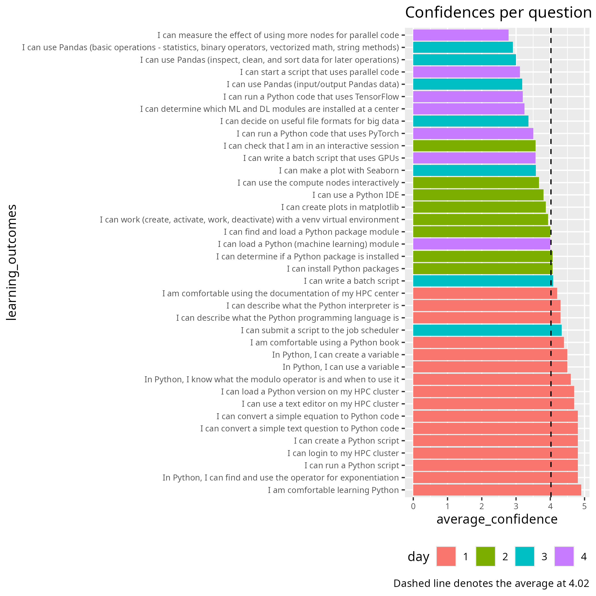

# Evaluation 2025-04

- [analysis.R](analysis.R)
- Feedback from a learner: 
  [evaluation_202504_full_course.md](evaluation_202504_full_course.md)

## [Analysis](analysis.R)

## [Feedback from a learner](evaluation_202504_full_course.md)

NB: On the first day, with Richel, I was mostly in the role of a TA rather
than a learner. I did not fill out the feedback form for that day,
but I had an immediate evaluation meeting with Richel at the end of the day.

NB 2: I did fill out the feedback evaluation form for the three remaining days,
and did not look back on what I wrote then (or look at the course evaluation
results at all) while writing this. Therefore this document probably duplicates
some of that while being feedback from a single (and perhaps not the most
representative) learner.

NB 3: I did not attend the matplotlib sessions.

## A multitude of teachers

This is GREAT! Some variation in perspective, focus and intensity makes a big
difference and is much appreciated. Anders Hast deserves special mention for
bringing true researcher enthusiasm, it is great to learn from teachers that
know and enjoy the subject at hand like that.

Sometimes a useful connection between two different sessions gets more or less
lost, e.g. mentioning line-by-line file IO from the first day when talking
about file formats at the end of day 3 would be easier to do well in a
traditional one-teacher-per-course format.
For this course I deem these losses very small and acceptable,
especially in the light of the advantages mentioned above.

However, the contrast between sessions pulls into sharp focus a few things to
improve upon:

Preparedness is key

Several sessions had examples, code-alongs or exercises that did not work as
intended without troubleshooting that was not within the focus of the session.
Learning about modules and packages and handling the dependency hell in various
ways is very good (I'll get back to this), but it is not good to be
interrupted by these things when trying to teach and learn something else.

It would be good if all of the course materials, for all of the clusters,
was confirmed working as intended before the course.[1] I do realize that this
is a big undertaking—but make no mistake, this course (with the amount of
content it currently has) is definitely a big undertaking.

Too much content, too little time

Full days leave little to zero time for going through the exercises on our own.
Having extra exercises for repeating and/or diving deeper after the course is
good, but all that is truly intended to be part of the course needs to be given
the time within the course. With no time to test and get some confidence that
one part is understood and doable, open questions and uncertainty cause
several problems for learners.

First, it immediately steals away some focus/brainpower. Second, we might not
get knowledge/skill presumed by later parts of the course. Third, the sheer
worry of the latter is not to be trifled with! I have seen that wreak havoc
on learning again and again in various lectures and labs.

The sessions on Pandas and Seaborn especially were much too rushed, to the point
that they felt close to useless. The session on IDEs had barely enough time for
me to get Jupyter running, while I would've expected to try VS Code and Spyder
as well since all of them are in there. The course taken as a whole also needs
either less content or more time.

To solve this nicely, please consider what content is crucial that learners get
to try and to ask questions about! The rest can be left in extras for the
learners to look at after the course. This is closely related to how general
a topic is, if there are many other places to ask questions
and get the right answers.

We learn what we do

In some sessions, mainly Parallellism and ML/DL if I recall correctly,
I was learning about modules and packages and lost track of the lecture as
I was trying to make the examples work. In some sessions I learned little
to nothing as I found no time to try anything. In some sessions I got to try
and learn every single thing that was in the course materials.

There seems to be two good ways to have learners actually do stuff in an
online course. One is what Richel does: most of the time in 2-person breakout
rooms, working through exercises as the main way of learning.

Another one is to have a well-prepared code notebook with
demos/examples/exercises to be completed by the learners.
On desktop screens and larger laptops learners can have their copy of the
notebook side-by-side with the meeting.
This method can smoothly intersperse both longer and very short bits of
hands-on coding into a lecture, akin to how the demos that weren't working in
the sessions on Parallel programming should have worked.

## Focus and structure

This course teaches many separate things. This gets a bit too messy,
both for the learners who do need to learn all of it—these people are new to
the entirety of this and will not be able to group and separate things—and
for the learners who only needs selected parts of the course.

It would be easier for both groups (though a bit less efficient,
for those who both need all of it and are somehow able to efficiently learn
it the way it is now) if this content was divided between as much as
four separate courses:

- Intro to HPC, usage and management of software and code 
  (Logging in, LMOD, SLURM; the things that are actually different
  between HPC and a single-user single computer)
- Intro to Python (this already exists and is day 1)
- Python coding for big computation, big data and AI (this includes parallell
  and GPU but is not specific to HPC and probably exists elsewhere)
- Using Python code, packages and environments at NAISS HPC systems
  (LMOD, venv, conda; when to use what and how they interact)

Course 1 is general to HPC users, not specific to Python. It should probably be provided by NAISS quite often and be a prerequisite to all other NAISS courses. Courses 2 and 3 are general to Python users, not specific to HPC, widely available from elsewhere. Course 4 is specific to Python in HPC; this is what I, a seasoned learner, would expect NAISS to provide in regards to using Python.

## What I expected (or hoped) to learn that I did not learn

Essentially the fourth course mentioned above. I have not acquired the one
skill (AFAIK) that is truly specific to Python on HPC: how to choose how to
manage the packages. Everything else (that was in this course) is shared with
either other HPC users or other Python users—therefore it is discussed and
taught by other resources—so this is what I truly wanted from this course.
I did learn a bit about it but it seemed to happen by accident as much or
more than as a result of the course truly focussing on this matter.

The fix would be to make sure every single command that loads a module or a python package does specify a specific version. Well, for the recurring problem that I do remember, but there may have been more problems. ↩︎
