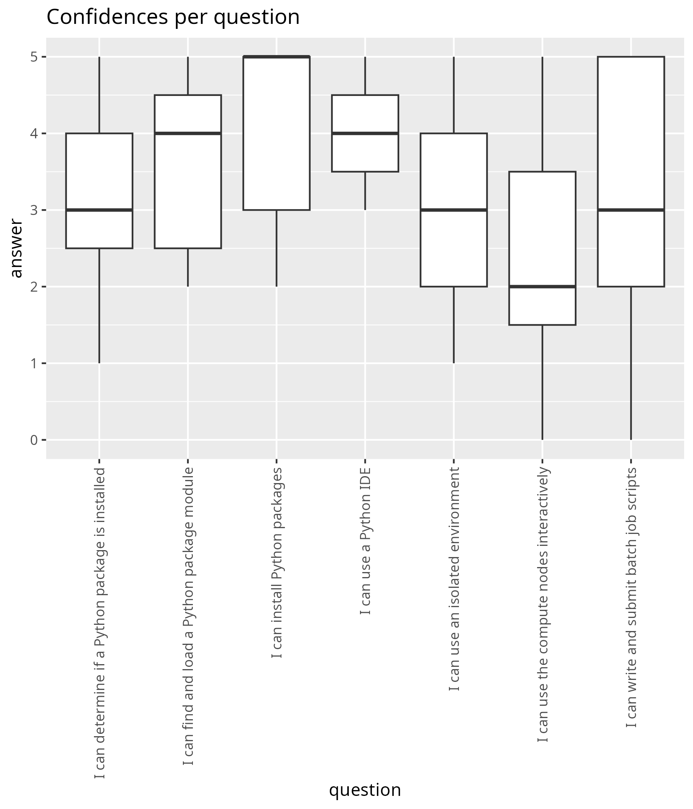
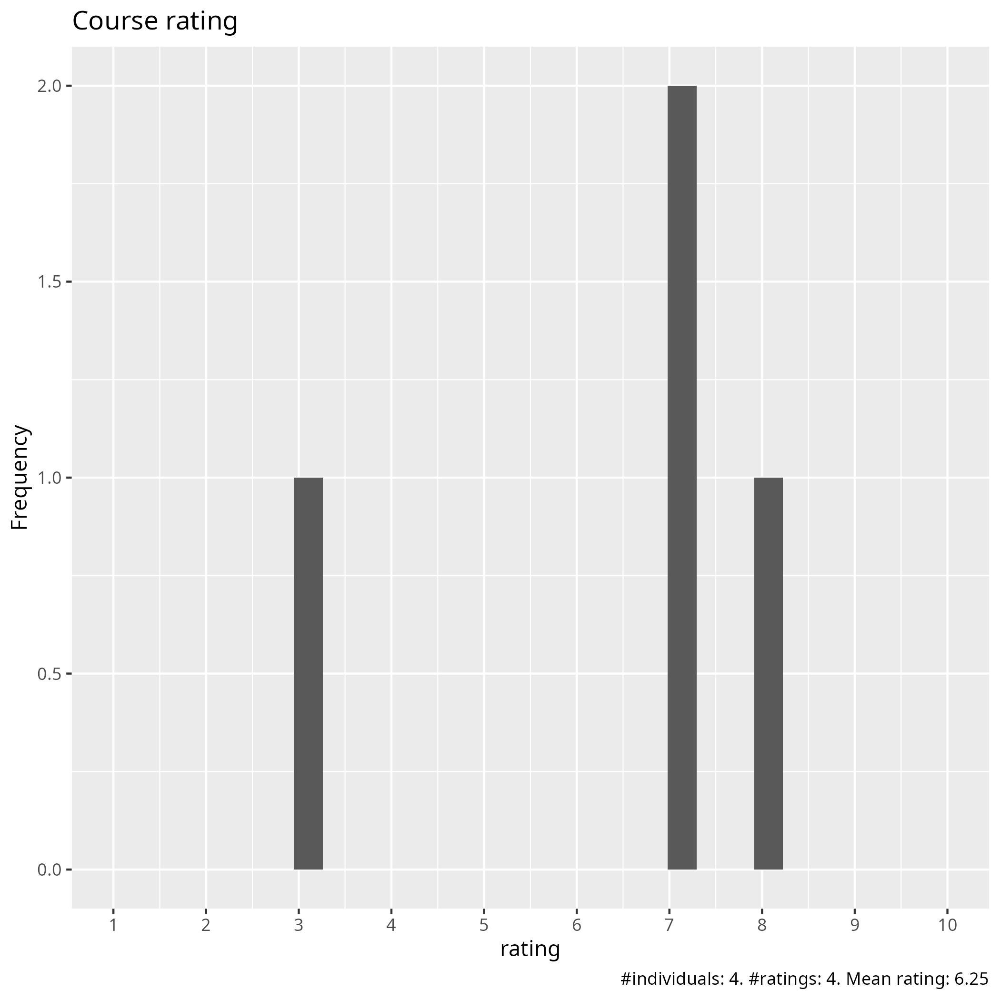
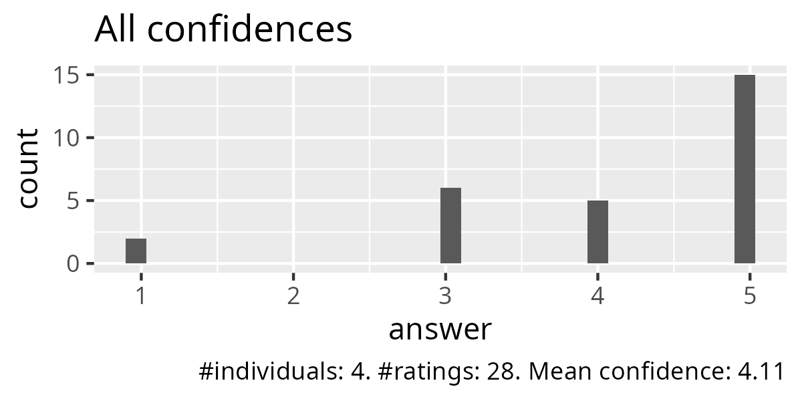
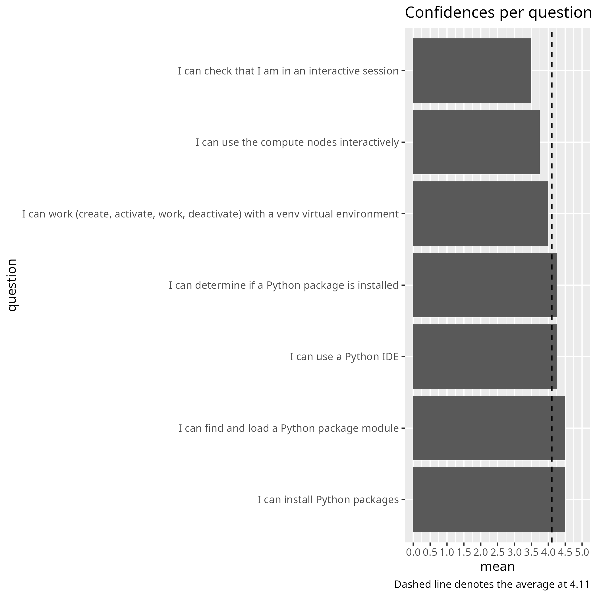
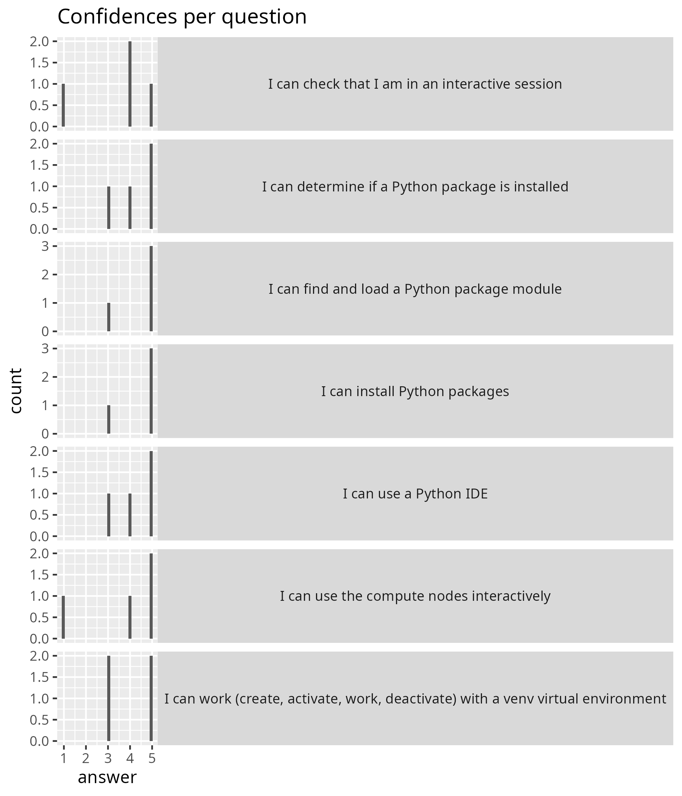
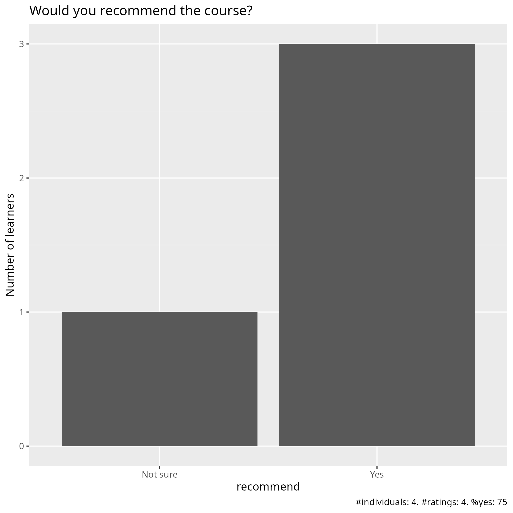

# Evaluation 

- Date: 2025-11-28
- Day: 2

## Initial confidence

- [Analysis script](analyse_pre.R)

## Survey at end

- [Evaluation results (csv)](survey_end.csv)
- [Evaluation results (xlsx)](survey_end.xlsx)
- [Analysis script](analyse.R)
- [Average confidence per question (.csv)](average_confidences.csv)
- [Success score](success_score.txt): 82%

### [Pace](pace.txt)

- It was very informative and fun
- a little bit tight
- The time allocated isolated environments and launching IDEs from the command line did not seem adequate
- no time for exercise so a bit to fast

### [Future topics](future_topics.txt)

- Me personally I want more about COSMOS-SENS but that is mainly as there is very little documentation at Lunarc about it
- NO
- More advanced practical management of Conda/virtual environments on HPC, Workflow systems like Nextflow or Snakemake

### [Other comments](comments.txt)

- Exercises were a bit less clear today, which ones we should do and when was a little confusing. Content was very good though :)
- NO
- Because each hpc has different setup it is a bit uninteresting to walk through them all when I'm only concerned with the one I'm using
