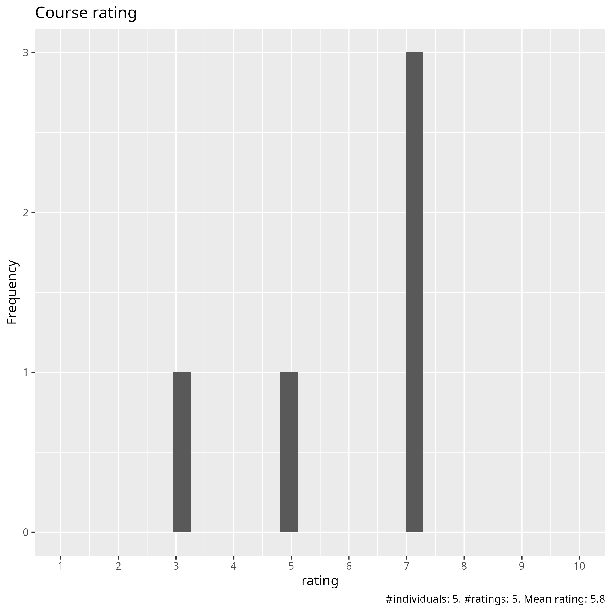
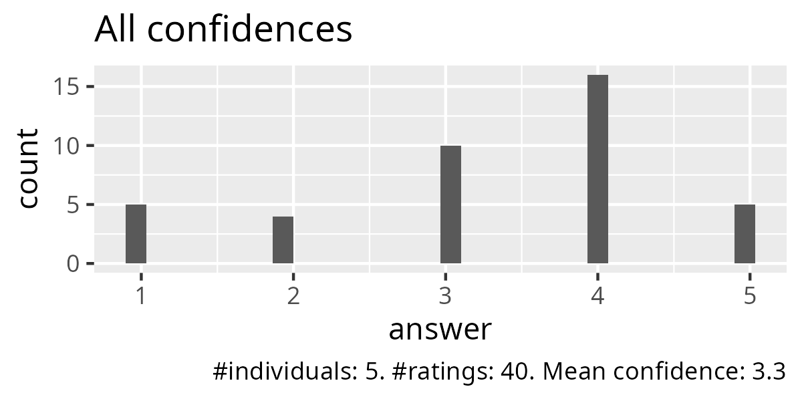
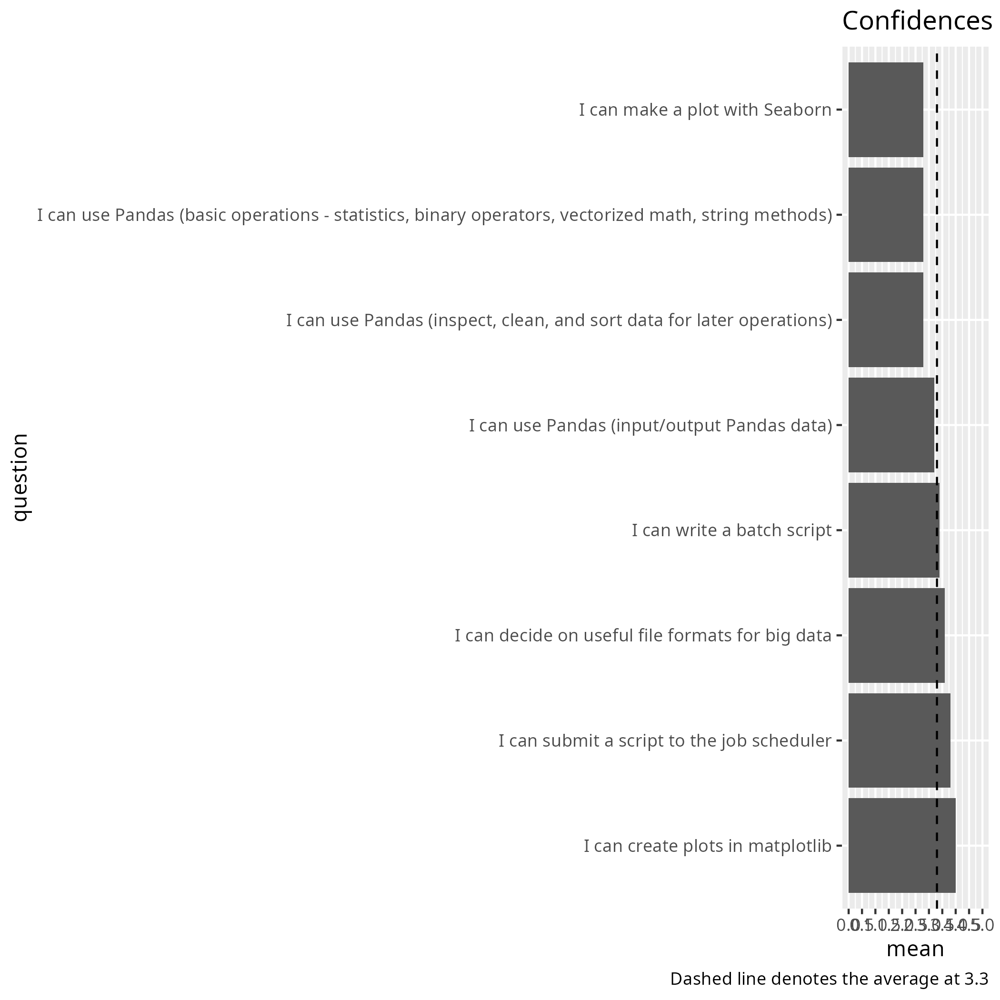
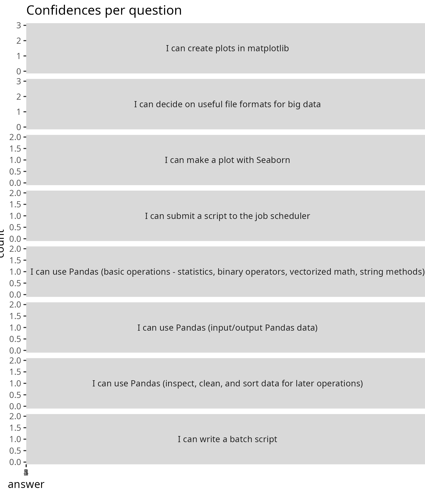
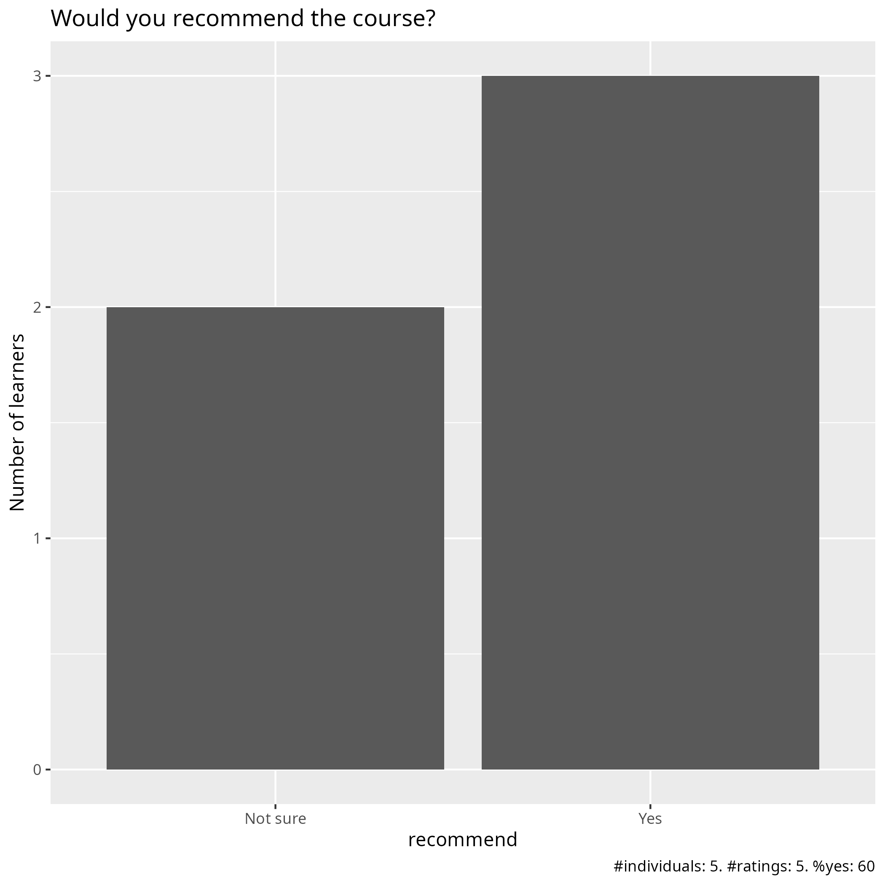

# Evaluation 

- Date: 2025-12-01
- Day: 3

## Survey at end

- [Evaluation results (csv)](survey_end.csv)
- [Evaluation results (xlsx)](survey_end.xlsx)
- [Analysis script](analyse.R)
- [Average confidence per question (.csv)](average_confidences.csv)
- [Success score](success_score.txt): 66%

### [Pace](pace.txt)

- Good
- Fine for the majority, a bit slow at times
- when you get stuck in setting things up you then also loose on the learning
- relatively fast, but gives good overview
- Second half was Ok.

### [Future topics](future_topics.txt)

- I guess that python, pandas, matplotlib and such could be prerequisites to the course and instead only focus on big data and hpc specifics

### [Other comments](comments.txt)

- Overall a good setup of the course! It is hard to do the excersices because environments etc. has to be set, so I will have to go back later to finish.
- The first half of today’s training covered important material, but I personally found the delivery less engaging. It felt more like a reading of the manual, and I didn’t gain much from it. Demonstrating everything with actual code and a more hands-on approach would be essential to better understand the core concepts. The second half of the training, however, was satisfactory.
