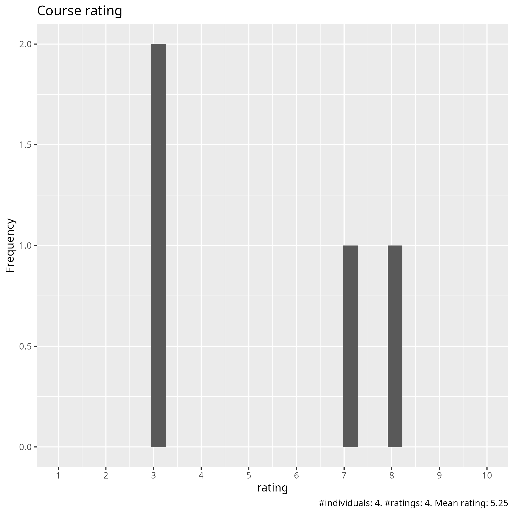
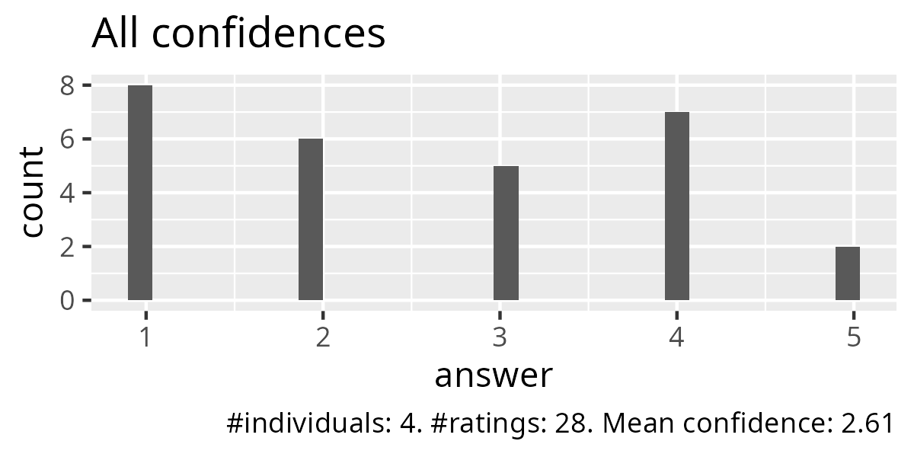
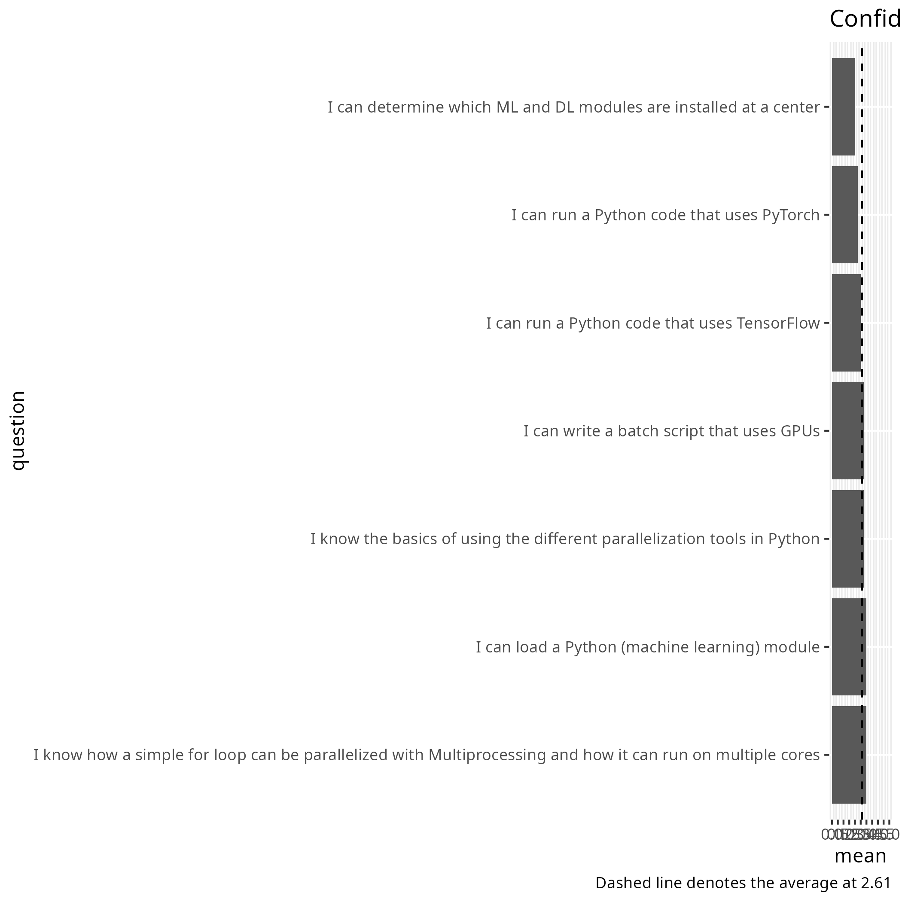
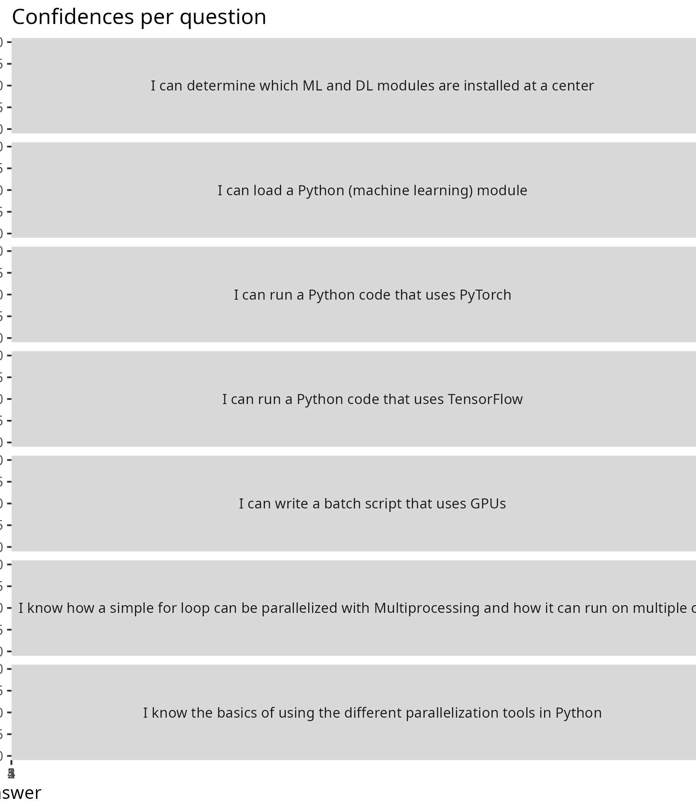
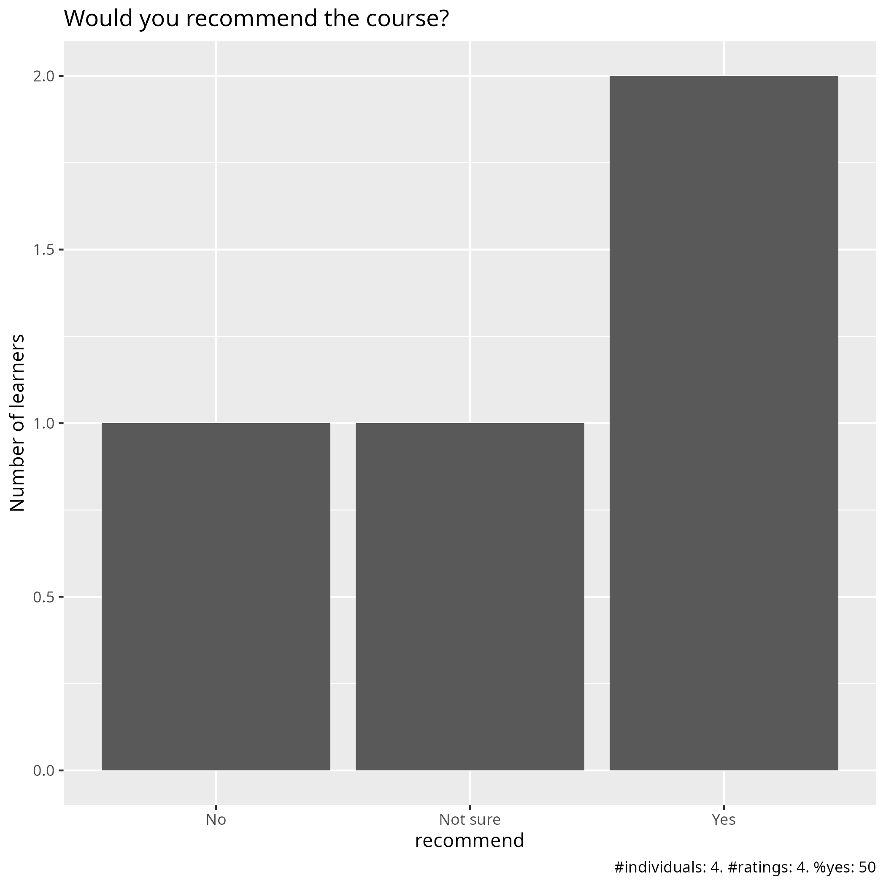

# Evaluation 

- Date: 2025-12-02
- Day: 4

## Survey at end

- [Evaluation results (csv)](survey_end.csv)
- [Evaluation results (xlsx)](survey_end.xlsx)
- [Analysis script](analyse.R)
- [Average confidence per question (.csv)](average_confidences.csv)
- [Success score](success_score.txt): 52%

### [Pace](pace.txt)

- NA
- a bit to fast for me to really learn by following examples, to uncertain with setting up environments, connectin et c
- good
- NA

### [Future topics](future_topics.txt)

- more on basic usage with nodes, set up jupyter, environments, loading modules

### [Other comments](comments.txt)

- The material is good, but the teaching technique is lacking. Richel started off very good with a lot of interaction, breakout rooms and time for questions and doing things yourself. I liked this and that the exercises were part of the teaching, not meant to do during breaks, then you would never get breaks. I and some other seemed to be lost already at ondemand, and interactive work. So maybe you should make that session more interactive. Then it would have been easier to follow the other sessions after that.
