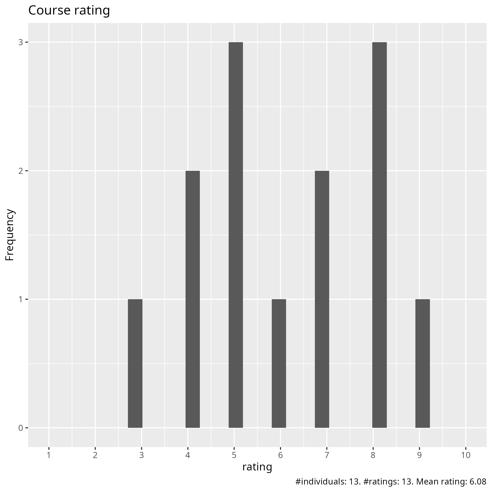
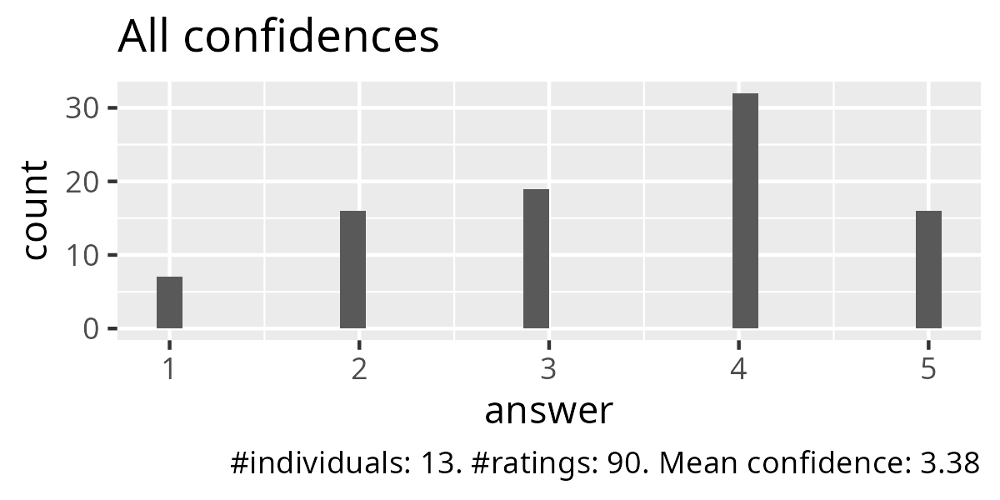
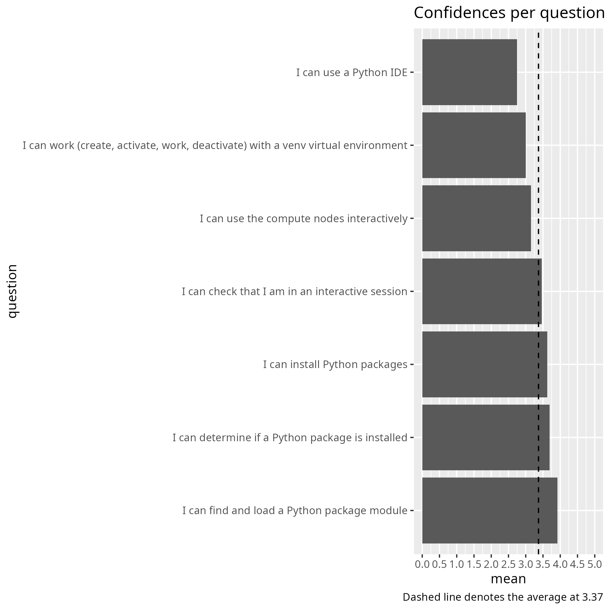
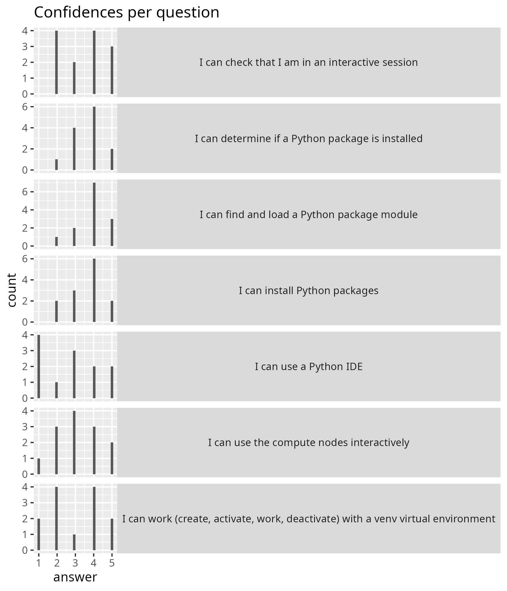
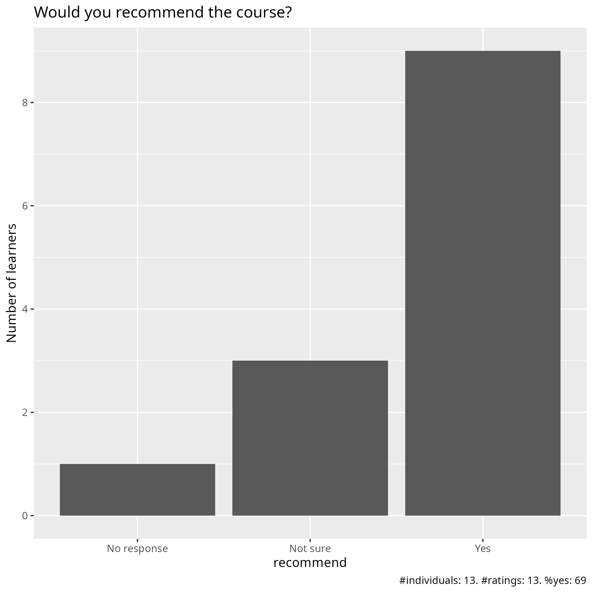

# Evaluation

- Date: 2026-04-22
- Day: 2

## Survey at end

- [Evaluation results (csv)](evaluation_results.csv)
- [Evaluation results (xlsx)](evaluation_results.xlsx)
- [Analysis script](analyse.R)
- [Average confidence per question (.csv)](average_confidences.csv)
- [Success score](success_score.txt): 68%

### [Pace](pace.txt)

- i got lost before the IDE session
- Not good at all. Not clear, things don't work, could not install an env really,
  The instructions on the site are confusing and don't work most of the time,
  I could not start any IDE, VS code didn't want to connect to PDC,
  it was quite bad for me
- Too high, mostly because of the amount of content during the day,
  but also due to technical issues.
- Pretty good. Good job balancing pace across a largish group.
- Well paced
- I could not keep up because I cannot multitask at all:
  I can either follow the tutorial or attempt the exercises, not both.
- I didn't like the way in which they have taught during day 2.
  I was a bit lost all the time. I think that if they are showing their
  console while they are explaining the steps to do,
  it will be easier to follow.
- it is moving at a good pace,
  but I would prefer to have more time for exercises.
- A bit too fast for such large amount of information.
- big step up from day 1
- Medium
- Good pace, just a lot of material. Maybe need to have another day for this?

### [Future topics](future_topics.txt)

- Proper instructions and more time for breakout rooms
  where we can talk to an instructor for help....
- From my perspective it seemed pretty well scoped.
- I would like to learn how to transfer files from dardel, for example,
  to my work cloud.
- Nextflow, Snakemake, Docker and Singularity (Apptainer) on HPC
- objective oriented programming
- More about how the batch system works

### [Other comments](comments.txt)

- A big difference from day 1.
  Sorry, but it needs to be improved a lot
- Day 2 was much more disorganised and less pedagogical than day 1.
  I would recommend either a) keep the course a 4-day course and remove content
  from Day 2, or b) keep the amount of content in the course but spread
  it over 5 days instead of 4 days.
  There were times when there was not enough time to do exercises
  or lectures dragged on into breaks.
- Hands-ons and demonstrations: too few
- The teaching overall is moving in a good pace, but would prefer more time
  for exercises, and perhaps some exercises summary with teachers/lecturers
- Joining participants in the rooms by cluster affiliation for practicing
  was not optimal for me, I would prefer to start with to work alone.
  Partially because of that after ca exercise 4 I got lost.
  Starting IDE and particularly Jupiter part was completely messed for me,
  I simply did not get it to work :(
  Would like to have more time for practical moments and
  consultation with teacher(s). Thanks anyway!
- I think the morning session about packages, installing packages,
  and environments was important. However, all the interaction with the HPC
  (sending jobs, Slurm, interactive work...) could have been a
  pre-course assignment because it is different for every server
  (and not Python at all).
  I think all that time could have been better spent properly
  explaining IDEs, how to set them up, and how to use Python with them.
  Also, the material seems to need an update according to the
  specific servers being used.
- exercises were nice
- Lots of technical problems, but this was not the fault of the teachers.
  I liked the intro to the batch system and how to submit a job,
  this was very important for how I will run my python codes,
  but maybe it is different if you are someone
  who likes only use graphics/IDEs.
