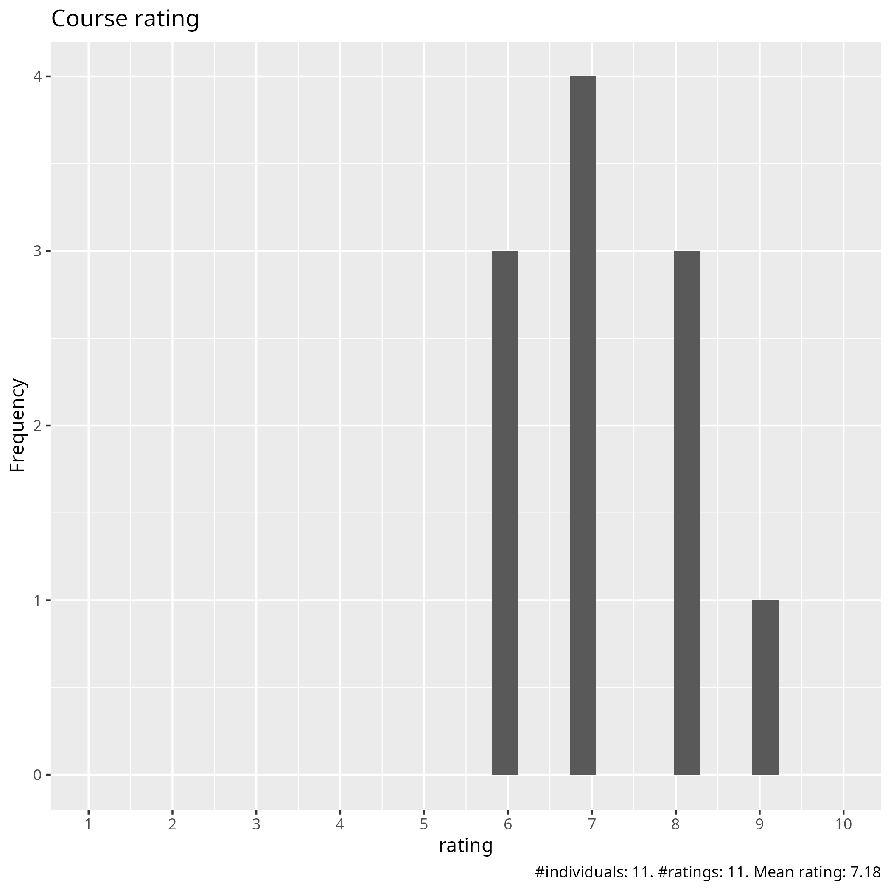
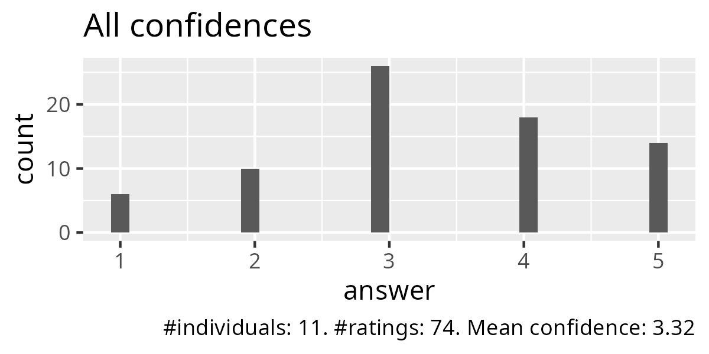
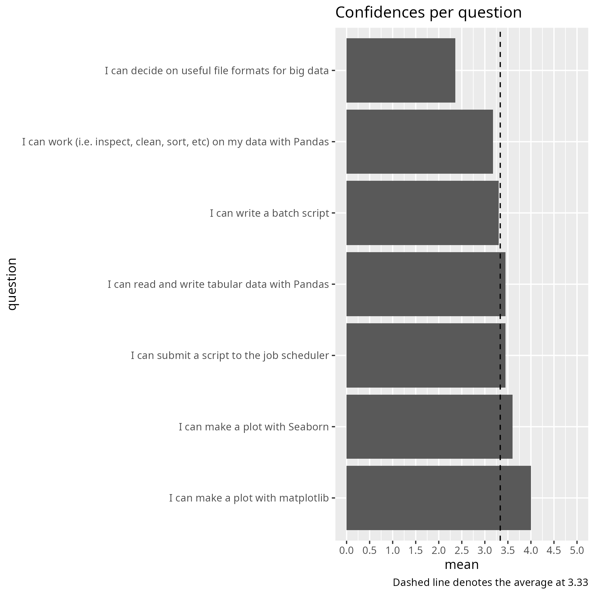
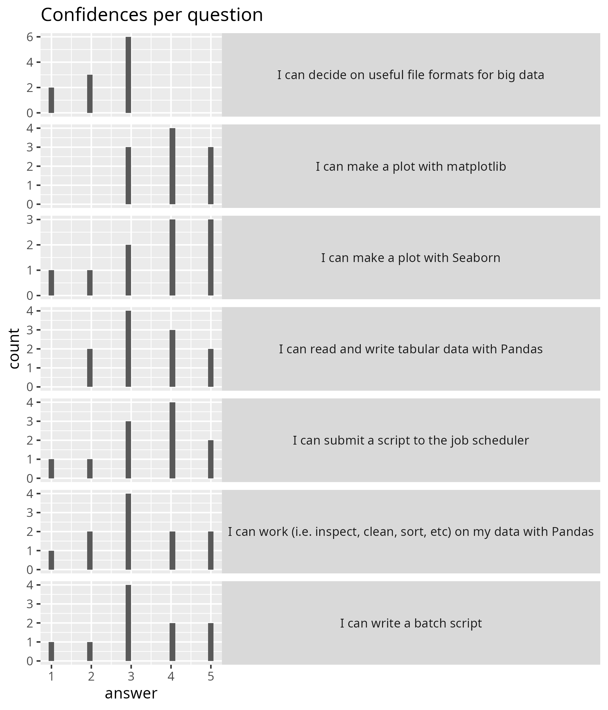
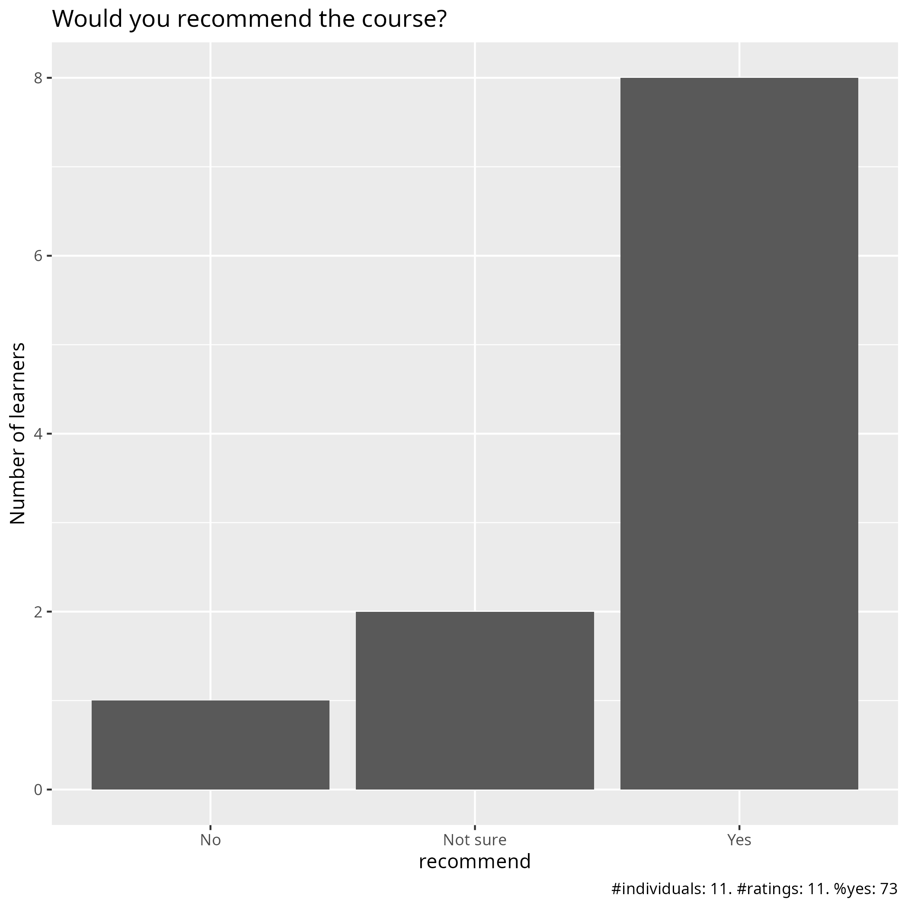

# Evaluation

- Date: 2026-04-23
- Day: 3

## Survey at end

- [Evaluation results (csv)](survey_end.csv)
- [Evaluation results (xlsx)](survey_end.xlsx)
- [Analysis script](analyse.R)
- [Average confidence per question (.csv)](average_confidences.csv)
- [Success score](success_score.txt): 

### [Pace](pace.txt)

- Richèl's sessions had a good pace, the rest were way too fast with too little time for exercises and too little time for breaks.
- more practice
- good
- Good, did well balancing levels across a large group
- I like the way that Richèl is teaching. He makes the concepts clear and you can follow his instructions and learn. However, I cannot follow the class when Bjorn is teaching, I feel very lost.
- The overall pace was OK
- Pace seems to be OK, it's probably me who is slower than the pace :)

### [Future topics](future_topics.txt)

- We did not even get to practice what is already in the course properly
- GNNs
- More information about how analyze big data such as genomic or transcriptomic data.

### [Other comments](comments.txt)

- more cases, like, an oom killed job , how to seff it and solve the issue to run it properly
- Use Richèl's teaching style for all topics. Keep the amount of content in the course as it is, but spread it over 5 days instead of 4 days. There's simply way too much to go through, way to many potential technical difficulties that take time, and way too little time to do exercises to actually absorb all the content and enjoy the learning process. And I would suggest that the course on how to connect and work in an HPC environment be moved to before this course during the same semester, so that people don't have to deal with having to learn that at the same time. Right now the "Online training events for new users: NAISS Introduction training days" course is after this course during the semester, which makes little sense considering that its contents should be a prerequisite for this course.
- Where should we improve? materials, exercises, and structure
- For me personally, the time spent interacting with the cluster and getting familiarised was the most useful. This is personaly though an I'm not sure whether this would be the case across the board.
- Today (day3), the topics were more of what I expected from an Introduction to Python and Using Python in an HPC environment course. The morning session about pandas, matplotlib and seaborn was interesting, as well as the big data with python. I will probably use Dask in the future so it was a good explanation of how Dask works. I still don't understand the time spent talking about bash and sending jobs. We could use that time learning and using common python packages in an HPC cluster.
- It think that we need more documentation about Dardel. Also, we need more hands-ons and demonstrations.
- I feel some exercises are not in "step-by-step" format that makes difficult to complete it.

## [Any other feedback](any_other_feedback.csv)

This was to the hastily-added Google Form:

- Really good course. Good balance between Python and the cluster.
  Getting familiar with the cluster was more relevant to me,
  but other aspects of the course were still well taught irrespective.
- I think the afternoon was rather too compact and not much time to actually
  practice anything.
  I would first maybe make sure that everyone can get the different
  modules/packages installed.
  I spent most of my time just trying to do that instead of completing
  the practical parts....
  Again like yesterday, not clear what the lecture is about really
- I still cannot login to ThinLinc even after yesterday's objective problem.
  That makes big gaps in doing exercises.
