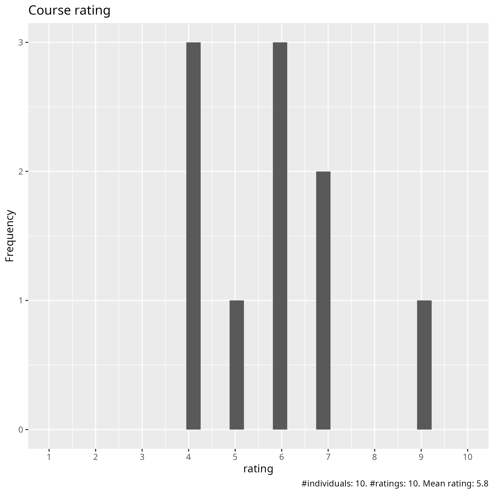
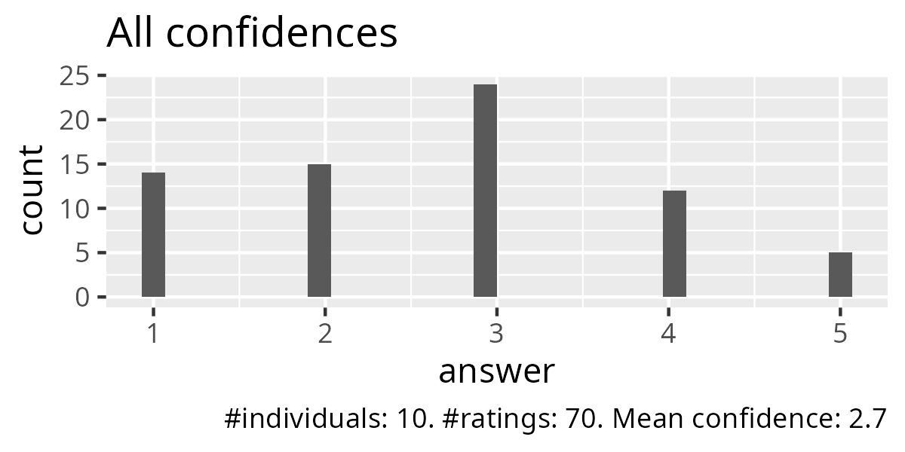
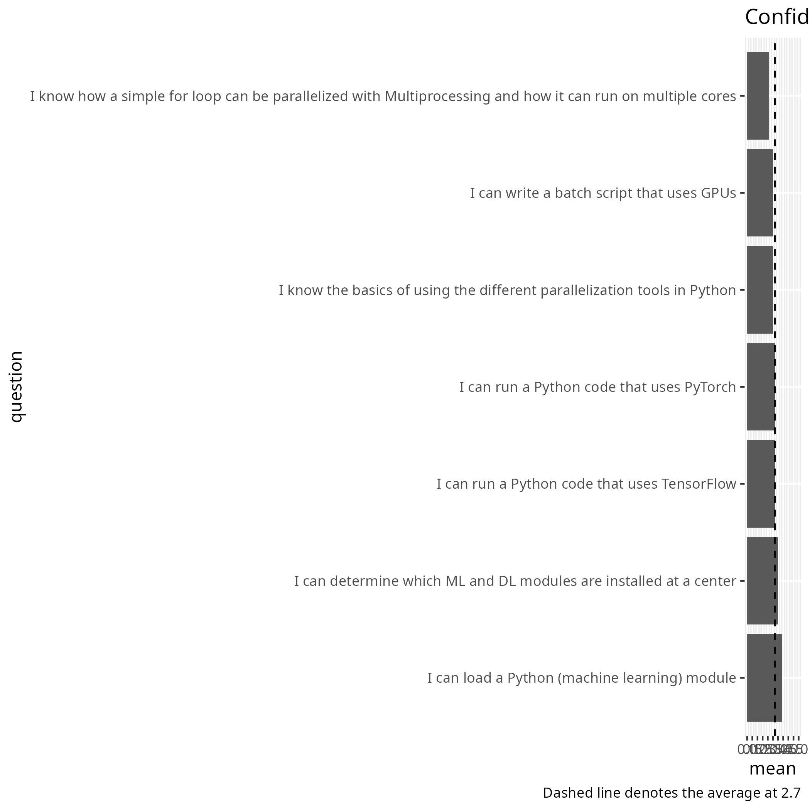
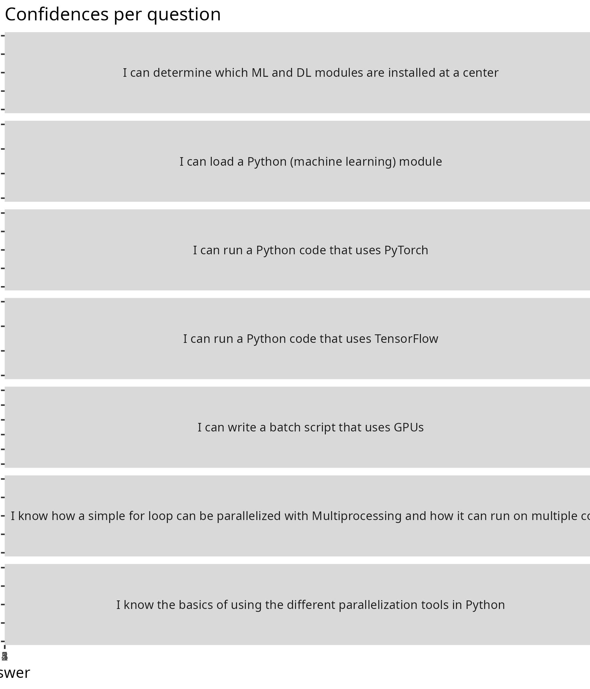

# Evaluation

- Date: 2026-04-24
- Day: 4

## Survey at end

- [Evaluation results (csv)](evaluation_results.csv)
- [Evaluation results (xlsx)](evaluation_results.xlsx)
- [Analysis script](analyse.R)
- [Average confidence per question (.csv)](average_confidences.csv)
- [Success score](success_score.txt): 54%

### [Pace](pace.txt)

- Too fast.
- Generally good. I think the time given to setup virtual environments and solve any dependency issues when going through the examples was insufficient. Obviously the teachers have these setup in advanced which is fine, but it still takes a minute to setup a new one if for example the modules from the previous examples are incompatible with those needed for a subsequent one. Overall not a massive issue and I managed to catch up, but is was doing this rather than listening at points which wasn't optimal.
- Rather packed
- Overall, it is OK, but it may be too fast for beginners, even though it is meant to be an introduction.
- Pace is OK.
- the pace of teaching agreed with the material which was more advanced than the previous days
- ok i think

### [Future topics](future_topics.txt)

- Pace maybe
- more on gpus and ml
- install ondemand on all clusters i don't want to use batch

### [Other comments](comments.txt)

- Remove day 4 from the course and insert it into an intermediate or advanced "Python in an HPC environment" course. The course attendees need more time to practice the skills learned during days 1-3 instead.  Pedro's teaching style was good, slow and methodical, and thereby easy to follow. The only thing I would ask Pedro to do is speak up a bit more or change his microphone settings, as it was hard to hear what he was saying.  Jayant's sections need shorter lectures with less content in each and exercises more often in between. Overall, while I think that the course has some good parts and some teachers were very good and pedagogical, the course still goes too fast for the most part, assumes that attendees know more prerequisites than they actually need in order to attend, and several of the teachers need to improve their teaching skills. If these issues are fixed, the course would, in my opinion, be very much improved.
- Generally very good. For me personally, the content and exercises related to interaction with the cluster were of more interest than the pure python parts. Improvement, just the point I made above about allowing a bit more time to setup the examples (venvs, module loading, checking compatibility etc). Organisation was great, I signed up late (past the deadline) and was still added to the project so better than I could reasonably expect. Teachers were all good, although Richèl stood out (positively).
- N/a
- I do like the course materials; they are easy to follow at one’s own pace.
- ML/DL section could be as additional reading that could allow to release more time for exercises/training sessions in other chapters. ML/DL exercises were too complicated. Exercises on-the-go (5-, 10-minutes) in the middle of the lectures are a bit stressful: it would be better for learning to discuss in the break out rooms with peers as was done on previous days.
- I think the course has potential, but it could benefit from more interaction with the students. In a Zoom course, it is difficult to stay focused listening to the same person for more than 10–15 minutes (let alone 45–60, as in some sessions), especially if the instructor is basically reading from the course material.  Another suggestion would be to create connected exercises instead of just running scripts. The lectures could be divided into small exercises all related to the same script (where, in every exercise, the students add a new block of code). Then, the final exercise would involve running the whole script using all the concepts from that section and previous ones.  Finally, I would suggest removing the section on how to connect to the HPC clusters. Since this is a course about Python and Python in HPC clusters, connecting to the cluster should be a prerequisite; alternatively, it could be sent as a pre-course exercise before the program starts. The course should remain focused on Python and its application within HPC clusters.
- The course jumps pretty quickly from basic Python on day one to advanced machine learning by the last day. It can work well for beginners at the start, and more experienced people will likely get the most out of the final day
- I didn't fill the other evaluations and day4 i watched as videos so i will comment for all days here: Pedro has some amazing material and is a great lecturer but i am not intrested in parallel programming. Bjorn was mostly ok but maybe a bit fast (packages). Rachel should have more advanced material, we are smarter than he thinks. Brigitte i didn't get through the sessions as batch is not intresting but i need it until you install ondemand everywhere. Also the day4 recordings was not up until sunday!!!!! Jayant ok good presentations
