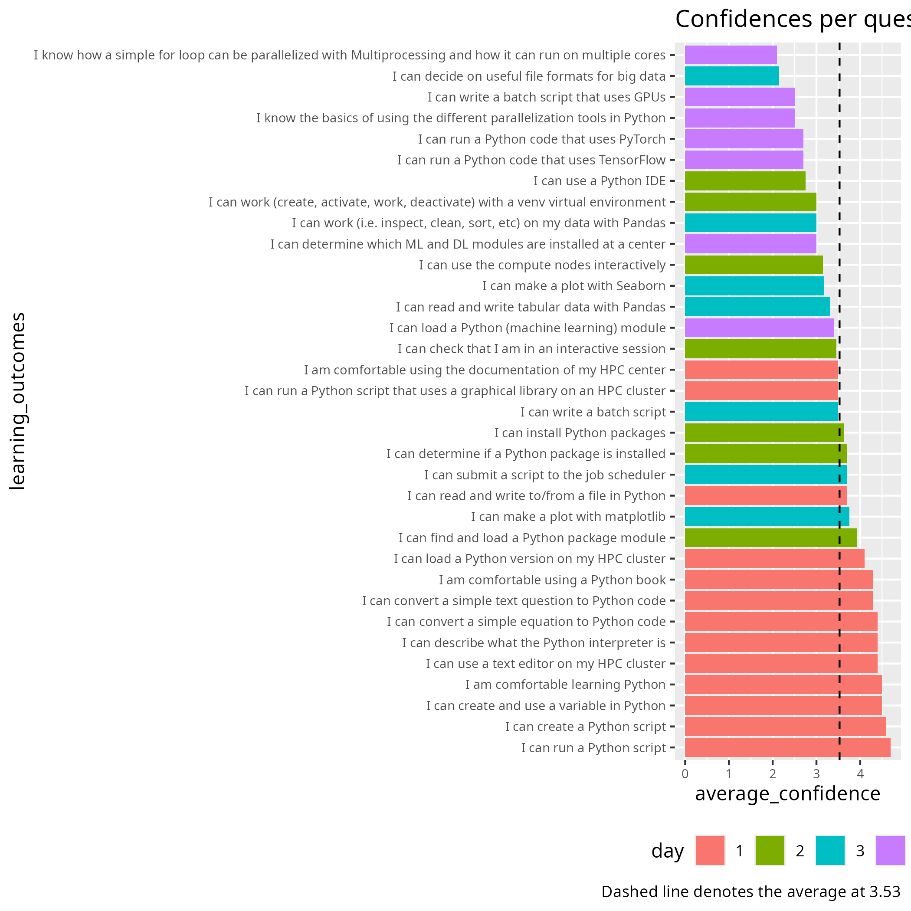
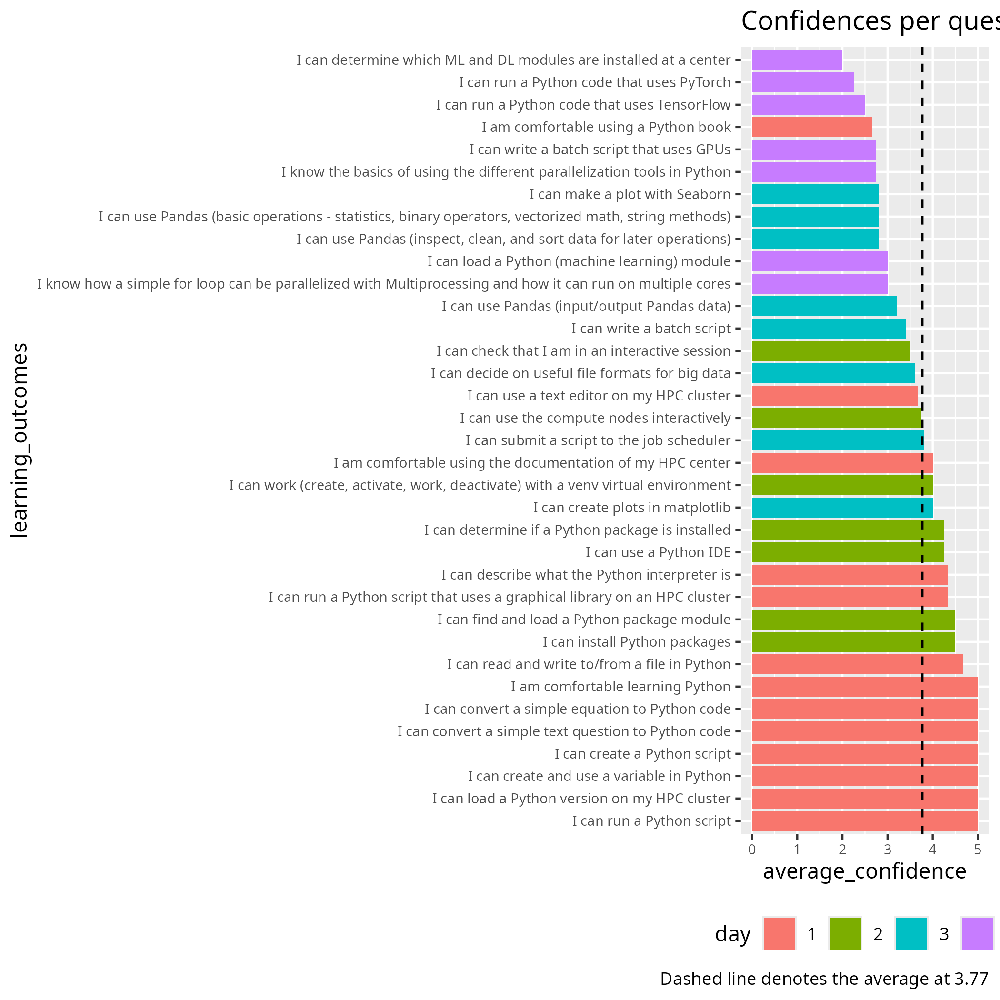

# Whole course

- Days 1-4
- Dates: 2026-04-20, 2026-04-22, 2026-04-23, 2026-04-24
- Author: Richel

## Self-rated confidence again proves useless

The average confidences per course, colored by course day:

There is a trend that self-rated confidence is highest at day 1
and then goes most down. I am unhappy about the confidences
of day 3 of my sessions and I will remove the optional learning
outcome from the evaluation.

Let's compare to the previous course:

From that, I see no obvious difference.
To me, this again shows that the self-assessed confidences are unrelated
to course quality (e.g. the review paper `[Yates et al., 2022]`,
where no relation is claimed between self-assessment
and the actual skill being taught,
hence being used to assess teaching).

## Other feedback

I have already
[reflected on feedback from day 3](../../reflections/20260423/README.md).

Here I add the feedback from other days that is relevant to me:

### Day 2

- I didn't like the way in which they have taught during day 2.
- big step up from day 1
- Proper instructions and more time for breakout rooms
  where we can talk to an instructor for help....
- A big difference from day 1.
  Sorry, but it needs to be improved a lot
- Day 2 was much more disorganised and less pedagogical than day 1.

Days 1 and 2 are different. Some of these mention a preference for day 1.

### Day 4

- Overall, [the pace] is OK, but it may be too fast for beginners,
  even though it is meant to be an introduction.
- Overall, while I think that the course has some good parts and some teachers
  were very good and pedagogical, the course still goes too fast
  for the most part, assumes that attendees know more prerequisites
  than they actually need in order to attend,
  and several of the teachers need to improve their teaching skills.
- Teachers were all good, although Richèl stood out (positively).
- I think the course has potential, but it could benefit from more
  interaction with the students.
- Finally, I would suggest removing the section on how to connect
  to the HPC clusters.
  Since this is a course about Python and Python in HPC clusters,
  connecting to the cluster should be a prerequisite;
  alternatively, it could be sent as a pre-course exercise
  before the program starts.
  The course should remain focused on Python
  and its application within HPC clusters.
- Richel should have more advanced material,
  we are smarter than he thinks.

Here seems to be some topics:

- Q1: Who is the course aimed at: beginners of more experienced users?
- Q2: Which prerequisites does the course have and do we **not** teach
  what is assumed in those prerequisites?
- Q3: How much Python should we teach (i.e. beyond HPC Python)?

My answers:

- A1: I follow the pace of the learners. This means I am beginner-friendly.
- A2: I am quite strict in what I do teach and I do assume the prerequisites
  being fulfilled
- A3: As minimal as possible: the goal is to get things to work in an HPC
  environment

## Listen to feedback from learners

My question:

Should we listen to feedback from the learners when they recommend
practice that are opposite of what the literature states?

My answer:

No. When we know that an advice goes against the literature, we should
follow the literature instead. Would we be in doubt, then checking the
literature is a great next step.

## Actually listen to feedback from learners

Here is some feedback from [the May 2023 evaluations](../../evaluations/20230523/evaluation_20230523.csv):

- Please be prepared and make it more hands-on.
- More exercises for us to try
- More exercises all over
- more time for code-along and on-your-own to try it
- longer time to do the exercises

This means already since May 2023 the learners ask for more time for
exercises. Are they really being listened to? Or is this a matter
of teaching practice that states that lecturing is better than exercises?

## Listen to feedback from teachers

There has never been a teacher giving proper feedback about the course.
I would like that.

I have had an observer this course for Day 1.
It helped me grow.

## My conclusion

The course has many different teachers, with different ideas about
what good teaching is. That is fine, as we do our own thing in our lessons.
This does make it less useful to evaluate as a team.
Me, I see no use of this, but I will observe how that goes.

## My observations from evaluation

As far as I interpret it, all suggestions were ignored, except
adding an extra day. 
To me, this again confirms my feeling that
I feel we do not need to bother our learners
with evaluations, as we do not listen to them anyways.

This does match with some of the literature, for example:

> There is, therefore, no evidence that the use of the questionnaire was
> making any contribution to improving the overall quality of teaching
> and learning of the departments, at least as perceived by the
> students `[Kember et al., 2002]`

On the other hand, [this example survey (PDF)](example_survey.pdf),
which is discussed at a page dedicated to student feedback at
[the university of Minnesota's 'Teaching for Learning Center'](https://tlc.missouri.edu/review-of-teaching/evaluating-teaching/student-feedback/).
seems to have some literature behind it:

- The class was clearly organized
- I knew what was expected of me in this class
- I received feedback on class assignments that was helpful
- The instructor encouraged students to play an active role in the class
- The instructor prompted students to ask questions
- I was encouraged to communicate with my instructor outside of class
- I had opportunities to solve problems in this class
- The class allowed me to think creatively about issues in the field
- I can apply knowledge and information from this class to my life
- This class has helped me develop the skills necessary to work effectively
  with people from various backgrounds
- My instructor saw cultural and personal differences as assets
- My instructor respected the expression of diverse ideas
- The instructor effectively facilitated interactions among students
- In-class activities and/or interactions with classmates contributed to my learning.
- Would you recommend this class to other students regarding...?
  - class content
  - class structure (e.g., organization, pacing)
  - positive learning environment
  - instructor's teaching skill/style
  - fairness of grading

## References

- `[Kember et al., 2002]` Kember, David, Doris YP Leung, and KyP Kwan.
  "Does the use of student feedback questionnaires improve the overall
  quality of teaching?." Assessment & Evaluation in Higher
  Education 27.5 (2002): 411-425.
- `[Yates et al., 2022]` Yates, Natasha, Suzanne Gough, and Victoria Brazil.
  "Self-assessment: with all its limitations, why are we still measuring
  and teaching it? Lessons from a scoping review."
  Medical Teacher 44.11 (2022): 1296-1302.
